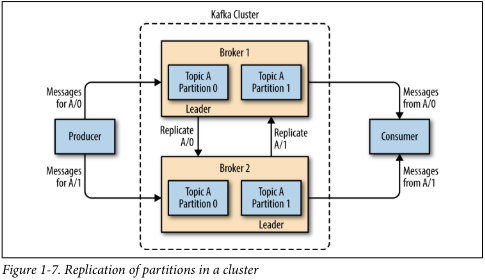

## Publish/Subscribe Messaging

Trước khi thảo luận chi tiết về Apache Kafka, điều quan trọng là chúng ta phải hiểu khái niệm về publish/subscribe 
messaging và tại sao nó lại quan trọng. Publish/subscribe messaging là một pattern mà sender (publisher) của một mẩu dữ 
liệu (message) không hướng nó cụ thể đến một receiver. Thay vào đó, publisher phân loại message theo một cách nào đó, và
receiver (subscriber) sẽ subscribe để nhận các loại message nhất định. Các hệ thống pub/sub thường có một broker, một 
điểm trung tâm nơi các message được publish, để hỗ trợ cho quá trình này.

#### How It Starts

Nhiều trường hợp sử dụng cho publish/subscribe bắt đầu theo cùng một cách: với một message queue đơn giản hoặc kênh giao
tiếp giữa các quy trình (interprocess communication channel). Ví dụ, bạn tạo một ứng dụng cần gửi thông tin giám sát 
(monitoring information) đến một nơi nào đó, vì vậy bạn viết một kết nối trực tiếp từ ứng dụng của mình đến một ứng dụng 
hiển thị các chỉ số (metrics) của bạn trên bảng điều khiển (dashboard), và đẩy các chỉ số qua kết nối đó, như thấy trong 
Hình 1-1.

Đây là một giải pháp đơn giản cho một vấn đề đơn giản, hoạt động tốt khi bạn mới bắt đầu với việc giám sát. Không lâu 
sau, bạn quyết định muốn phân tích các chỉ số của mình trong một khoảng thời gian dài hơn, và điều đó không hoạt động tốt
trên bảng điều khiển. Bạn bắt đầu một dịch vụ mới có thể nhận các chỉ số, lưu trữ chúng và phân tích chúng. Để hỗ trợ việc
này, bạn sửa đổi ứng dụng của mình để ghi các chỉ số vào cả hai hệ thống. Đến lúc này, bạn có thêm ba ứng dụng khác đang 
tạo ra các chỉ số, và tất cả chúng đều thực hiện các kết nối tương tự đến hai dịch vụ này. Đồng nghiệp của bạn nghĩ rằng 
sẽ là một ý tưởng tốt nếu thực hiện polling chủ động của các dịch vụ để cảnh báo, vì vậy bạn thêm một máy chủ trên mỗi 
ứng dụng để cung cấp các chỉ số khi được yêu cầu. Sau một thời gian, bạn có nhiều ứng dụng hơn đang sử dụng các máy chủ 
đó để lấy các chỉ số cá nhân và sử dụng chúng cho nhiều mục đích khác nhau. Kiến trúc này có thể trông giống như Hình 1-2, 
với các kết nối thậm chí còn khó theo dõi hơn.

Khoản nợ kỹ thuật được tích lũy ở đây là rõ ràng, vì vậy bạn quyết định trả lại một phần trong số đó. Bạn thiết lập một 
ứng dụng duy nhất nhận các chỉ số từ tất cả các ứng dụng bên ngoài, và cung cấp một máy chủ để truy vấn những chỉ số đó
cho bất kỳ hệ thống nào cần chúng. Điều này làm giảm độ phức tạp của kiến trúc xuống còn tương tự như Hình 1-3. Chúc mừng 
bạn, bạn đã xây dựng được một hệ thống nhắn tin publish-subscribe!

#### Individual Queue Systems

Cùng lúc bạn đang đối mặt với vấn đề về các chỉ số, một trong những đồng nghiệp của bạn đã thực hiện công việc tương tự
với các log messages. Một đồng nghiệp khác đang làm việc về việc theo dõi hành vi người dùng trên trang web frontend và
cung cấp thông tin đó cho các nhà phát triển đang làm về machine learning, cũng như tạo một số báo cáo cho ban quản lý.
Tất cả các bạn đều đã theo một con đường tương tự là xây dựng các hệ thống tách rời (decouple) các publishers của thông 
tin khỏi các subscribers đến thông tin đó. Hình 1-4 minh họa một cơ sở hạ tầng như vậy, với ba hệ thống pub/sub riêng biệt.

Điều này chắc chắn tốt hơn nhiều so với việc sử dụng các kết nối point-to-point (như trong Hình 1-2), nhưng vẫn có rất 
nhiều sự trùng lặp. Công ty của bạn đang duy trì nhiều hệ thống để xếp hàng dữ liệu, tất cả đều có những lỗi và giới hạn
riêng. Bạn cũng biết rằng sẽ có nhiều trường hợp sử dụng hệ thống nhắn tin sẽ xuất hiện sớm. Điều bạn muốn có là một hệ 
thống trung tâm duy nhất cho phép xuất bản các loại dữ liệu chung, hệ thống này sẽ phát triển cùng với sự phát triển của 
doanh nghiệp.

## Enter Kafka

Apache Kafka là một hệ thống nhắn tin publish/subscribe được thiết kế để giải quyết vấn đề này. Nó thường được mô tả như 
một “distributed commit log” hoặc gần đây hơn là một “distributed streaming platform.” Một commit log của hệ thống tệp
hoặc cơ sở dữ liệu được thiết kế để cung cấp một bản ghi bền vững của tất cả các giao dịch để chúng có thể được phát lại 
nhằm xây dựng trạng thái của hệ thống một cách nhất quán. Tương tự, dữ liệu trong Kafka được lưu trữ một cách bền vững, 
theo thứ tự và có thể được đọc một cách xác định. Ngoài ra, dữ liệu có thể được phân phối trong hệ thống để cung cấp thêm 
bảo vệ chống lại sự cố, cũng như cơ hội đáng kể để mở rộng hiệu suất.

#### Messages and Batches

Đơn vị dữ liệu trong Kafka được gọi là message. Nếu bạn đến với Kafka từ nền tảng cơ sở dữ liệu, bạn có thể coi nó tương
tự như một hàng hoặc một bản ghi. Một message đơn giản chỉ là một mảng byte đối với Kafka, vì vậy dữ liệu chứa trong đó 
không có định dạng hoặc ý nghĩa cụ thể nào đối với Kafka. Một message có thể có một bit metadata tùy chọn, được gọi là key.
Key cũng là một mảng byte và, giống như message, không có ý nghĩa cụ thể nào đối với Kafka. Keys được sử dụng khi các
message được viết vào các partition một cách có kiểm soát hơn. Cách đơn giản nhất là tạo một hash nhất quán của key, và 
sau đó chọn số partition cho message đó bằng cách lấy kết quả của hash modulo tổng số partition trong topic. Điều này đảm 
bảo rằng các message có cùng key luôn được viết vào cùng một partition. Keys sẽ được thảo luận chi tiết hơn trong Chương 3.

Để đạt hiệu quả, các message được viết vào Kafka theo các batch. Một batch chỉ là một tập hợp các message, tất cả đều
được sản xuất đến cùng một topic và partition. Mỗi lượt di chuyển qua mạng cho từng message riêng lẻ sẽ dẫn đến chi phí 
quá cao, và việc gom các message lại thành một batch giảm thiểu điều này. Tất nhiên, đây là sự đánh đổi giữa độ trễ và
thông lượng: các batch càng lớn, càng nhiều message có thể được xử lý mỗi đơn vị thời gian, nhưng thời gian để một message 
riêng lẻ truyền đi càng lâu. Các batch cũng thường được nén, cung cấp truyền tải và lưu trữ dữ liệu hiệu quả hơn với chi 
phí là một số năng lượng xử lý.

#### Schemas

Trong khi các message là những mảng byte không rõ ràng đối với Kafka, việc áp đặt cấu trúc bổ sung hoặc schema lên nội
dung message để dễ hiểu hơn là điều được khuyến nghị. Có nhiều tùy chọn cho schema của message, tùy thuộc vào nhu cầu cụ 
thể của ứng dụng của bạn. Các hệ thống đơn giản, như Javascript Object Notation (JSON) và Extensible Markup Language (XML),
dễ sử dụng và dễ đọc cho con người. Tuy nhiên, chúng thiếu các tính năng như xử lý kiểu mạnh mẽ và khả năng tương thích 
giữa các phiên bản schema. Nhiều nhà phát triển Kafka ưa chuộng sử dụng Apache Avro, một framework tuần tự hóa ban đầu 
được phát triển cho Hadoop. Avro cung cấp một định dạng tuần tự hóa nhỏ gọn; các schema tách biệt khỏi payload của message
và không yêu cầu mã được tạo khi chúng thay đổi; và xử lý kiểu dữ liệu mạnh mẽ cùng với sự tiến hóa schema, có khả năng 
tương thích cả ngược và tiến.

Một định dạng dữ liệu nhất quán là quan trọng trong Kafka, vì nó cho phép việc ghi và đọc message được tách rời nhau. 
Khi các nhiệm vụ này gắn kết chặt chẽ, các ứng dụng subscribe vào message phải được cập nhật để xử lý định dạng dữ liệu 
mới, song song với định dạng cũ. Chỉ khi đó, các ứng dụng publish message mới có thể được cập nhật để sử dụng định dạng 
mới. Bằng cách sử dụng các schema được định nghĩa rõ ràng và lưu trữ chúng trong một kho chung, các message trong Kafka 
có thể được hiểu mà không cần sự phối hợp. Các schema và việc tuần tự hóa sẽ được thảo luận chi tiết hơn trong Chương 3.

#### Topics and Partitions

Các message trong Kafka được phân loại vào các topic. Những đối tượng gần giống nhất với một topic là một bảng trong cơ 
sở dữ liệu hoặc một thư mục trong hệ thống tệp. Các topic được chia thành các partition. Quay lại với mô tả "commit log", 
mỗi partition tương đương với một log đơn lẻ. Các message được ghi vào partition này theo kiểu chỉ ghi thêm (append-only), 
và được đọc theo thứ tự từ đầu đến cuối. Lưu ý rằng do một topic thường có nhiều partition, không có đảm bảo về thứ tự thời 
gian của message trên toàn bộ topic, chỉ trong từng partition riêng lẻ. Hình 1-5 thể hiện một topic với bốn partition, 
trong đó các writes được ghi thêm vào cuối mỗi partition. Partition cũng là cách mà Kafka cung cấp tính dự phòng và khả 
năng mở rộng. Mỗi partition có thể được lưu trữ trên các máy chủ khác nhau, điều này có nghĩa là một topic duy nhất có 
thể được mở rộng ngang trên nhiều máy chủ để cung cấp hiệu suất vượt xa khả năng của một máy chủ duy nhất.

Thuật ngữ "stream" thường được sử dụng khi thảo luận về dữ liệu trong các hệ thống như Kafka. Thường thì, một stream
được coi là một topic dữ liệu duy nhất, bất kể số lượng partition. Điều này đại diện cho một dòng dữ liệu duy nhất di
chuyển từ producers đến consumers. Cách này đề cập đến các message thường gặp nhất khi thảo luận về xử lý dòng dữ liệu
(stream processing), là khi các framework - trong đó có Kafka Streams, Apache Samza và Storm - hoạt động trên các message
trong thời gian thực. Cách hoạt động này có thể được so sánh với cách các framework offline, đặc biệt là Hadoop, được
thiết kế để làm việc trên dữ liệu hàng loạt sau này. Tổng quan về xử lý dòng dữ liệu được cung cấp trong Chương 11.

#### Producers and Consumers

Các clients của Kafka là người sử dụng hệ thống, và có hai loại cơ bản: producers (nhà sản xuất) và consumers (người tiêu dùng).
Ngoài ra, còn có các API client nâng cao - Kafka Connect API cho tích hợp dữ liệu và Kafka Streams cho xử lý dòng dữ liệu.
Các client nâng cao sử dụng producers và consumers như là các khối xây dựng và cung cấp các chức năng cấp cao hơn.

Producers tạo ra các message mới. Trong các hệ thống publish/subscribe khác, chúng có thể được gọi là publishers hoặc writers.
Nói chung, một message sẽ được sản xuất vào một topic cụ thể. Mặc định, producer không quan tâm message cụ thể được viết 
vào partition nào và sẽ cân bằng message trên tất cả các partition của một topic một cách đồng đều. Trong một số trường hợp, 
producer sẽ điều hướng message đến các partition cụ thể. Việc này thường được thực hiện bằng cách sử dụng message key và 
một partitioner sẽ tạo ra một hash của key và ánh xạ nó đến một partition cụ thể. Điều này đảm bảo rằng tất cả các message 
được sản xuất với một key nhất định sẽ được viết vào cùng một partition. Producer cũng có thể sử dụng một partitioner tùy 
chỉnh tuân theo các quy tắc kinh doanh khác để ánh xạ message đến các partition. Chi tiết về producers sẽ được thảo luận 
rõ hơn trong Chương 3.

Consumers đọc các message. Trong các hệ thống publish/subscribe khác, những client này có thể được gọi là subscribers 
hoặc readers. Consumer đăng ký nhận thông tin từ một hoặc nhiều topic và đọc các message theo thứ tự chúng được sản xuất. 
Consumer theo dõi các message mà nó đã tiêu thụ bằng cách lưu trữ offset của các message. Offset là một bit metadata khác - một 
giá trị nguyên liên tục tăng dần - mà Kafka thêm vào mỗi message khi nó được sản xuất. Mỗi message trong một partition 
cụ thể có một offset duy nhất. Bằng cách lưu trữ offset của message cuối cùng đã tiêu thụ cho mỗi partition, entweder
trong Zookeeper hoặc trong Kafka itself, một consumer có thể dừng và khởi động lại mà không bị mất vị trí của nó.

Consumers hoạt động như một phần của một consumer group, đó là một hoặc nhiều consumer làm việc cùng nhau để tiêu thụ một topic.
Nhóm đảm bảo rằng mỗi partition chỉ được tiêu thụ bởi một thành viên. Trong Hình 1-6, có ba consumer trong một nhóm duy 
nhất đang tiêu thụ một topic. Hai trong số các consumer đó đang làm việc từ mỗi partition, trong khi consumer thứ ba đang 
làm việc từ hai partition. Việc ánh xạ một consumer đến một partition thường được gọi là sự sở hữu của partition bởi consumer.

Như vậy, consumers có thể mở rộng theo chiều ngang để tiêu thụ các topic có số lượng message lớn. Ngoài ra, nếu một consumer 
đơn lẻ gặp sự cố, các thành viên còn lại của nhóm sẽ cân bằng lại các partition đang được tiêu thụ để tiếp quản cho thành 
viên bị thiếu. Chi tiết về consumers và consumer groups sẽ được thảo luận rõ hơn trong Chương 4.

#### Brokers and Clusters

Một Kafka server đơn lẻ được gọi là một broker. Broker nhận các message từ producers, gán offset cho chúng và lưu các message 
vào đĩa. Nó cũng phục vụ cho các consumers bằng cách phản hồi các yêu cầu fetch cho các partition và trả về các message đã 
được lưu trữ trên đĩa. Tùy thuộc vào phần cứng cụ thể và các đặc tính hiệu suất của nó, một broker đơn lẻ có thể dễ dàng
xử lý hàng ngàn partition và hàng triệu message mỗi giây.

Các Kafka broker được thiết kế để hoạt động như một phần của một cluster. Trong một cluster các broker, một broker cũng 
sẽ hoạt động như là controller của cluster (được tự động bầu chọn từ các thành viên hoạt động của cluster). Controller 
có trách nhiệm cho các hoạt động quản trị, bao gồm phân phối các partition cho các broker và giám sát sự cố của broker.
Một partition chỉ thuộc sở hữu của một broker duy nhất trong cluster, và broker đó được gọi là leader của partition. 
Một partition có thể được phân cho nhiều broker, dẫn đến việc partition đó được sao chép (như thể hiện trong Hình 1-7). 
Điều này cung cấp tính dự phòng cho các message trong partition, sao cho broker khác có thể tiếp quản vai trò leader nếu 
broker hiện tại gặp sự cố. Tuy nhiên, tất cả các consumers và producers hoạt động trên partition đó phải kết nối đến leader. 
Các hoạt động của cluster, bao gồm sao chép partition, sẽ được thảo luận chi tiết trong Chương 6.

Một đặc điểm nổi bật của Apache Kafka là tính chất của retention, là việc lưu trữ bền vững các message trong một khoảng
thời gian nhất định. Các broker Kafka được cấu hình với một thiết lập retention mặc định cho các topic, có thể giữ các
message trong một khoảng thời gian (ví dụ như 7 ngày) hoặc cho đến khi topic đạt đến một kích thước nhất định trong byte 
(ví dụ như 1 GB). Khi các giới hạn này được đạt đến, các message sẽ hết hạn và bị xóa đi để giữ cho cấu hình retention
là một lượng dữ liệu tối thiểu có sẵn bất kỳ lúc nào. Các topic riêng lẻ cũng có thể được cấu hình với các thiết lập 
retention riêng để các message được lưu trữ chỉ trong thời gian chúng có ý nghĩa. Ví dụ, một topic theo dõi có thể được 
giữ lại trong vài ngày, trong khi các metric ứng dụng có thể chỉ được giữ lại trong vài giờ. Các topic cũng có thể được 
cấu hình như là log compacted, có nghĩa là Kafka sẽ giữ lại chỉ các message cuối cùng được sản xuất với một key cụ thể. 
Điều này có thể hữu ích cho dữ liệu loại changelog, nơi chỉ có bản cập nhật cuối cùng là quan trọng.

#### Multiple Clusters

Khi triển khai Kafka phát triển, thường có lợi thế khi có nhiều cluster. Có một số lý do tại sao điều này có thể hữu ích:
- Phân chia các loại dữ liệu
- Cô lập để đáp ứng yêu cầu bảo mật
- Nhiều trung tâm dữ liệu (phòng chống thảm họa)

Đặc biệt khi làm việc với nhiều trung tâm dữ liệu, thường cần sao chép các message giữa chúng. Điều này giúp các ứng dụng 
trực tuyến có thể truy cập vào hoạt động của người dùng ở cả hai trang web. Ví dụ, nếu người dùng thay đổi thông tin công 
khai trong hồ sơ của họ, thay đổi đó cần phải hiển thị không phụ thuộc vào trung tâm dữ liệu nào mà kết quả tìm kiếm được
hiển thị. Hoặc, dữ liệu giám sát có thể được thu thập từ nhiều địa điểm vào một vị trí trung tâm duy nhất nơi các hệ thống
phân tích và cảnh báo được lưu trữ. Cơ chế sao chép trong các cluster Kafka được thiết kế chỉ để hoạt động trong một cluster
duy nhất, không giữa nhiều cluster.

Dự án Kafka bao gồm một công cụ gọi là MirrorMaker, được sử dụng cho mục đích này. Ở cơ bản, MirrorMaker đơn giản là một 
Kafka consumer và producer được kết nối với nhau thông qua một hàng đợi. Các message được tiêu thụ từ một Kafka cluster 
và được sản xuất vào một Kafka cluster khác. Hình 1-8 thể hiện một ví dụ về kiến trúc sử dụng MirrorMaker, tổng hợp các
message từ hai cluster địa phương thành một cluster tổng hợp, và sau đó sao chép cluster đó đến các trung tâm dữ liệu khác. 
Sự đơn giản của ứng dụng này không phản ánh được sức mạnh của nó trong việc tạo ra các đường ống dữ liệu phức tạp, sẽ được
chi tiết hơn trong Chương 7.

## Why Kafka?

Có nhiều lựa chọn cho hệ thống nhắn tin publish/subscribe, vậy điều gì khiến Apache Kafka trở thành một lựa chọn tốt?

#### Multiple Producers

Kafka có khả năng xử lý một cách mượt mà nhiều producers, dù những clients đó sử dụng nhiều topics hay cùng một topic.
Điều này làm cho hệ thống trở nên lý tưởng để tổng hợp dữ liệu từ nhiều hệ thống frontend và làm cho nó nhất quán.
Ví dụ, một trang web cung cấp nội dung cho người dùng thông qua nhiều microservices có thể có một topic duy nhất cho các
lượt xem trang mà tất cả các dịch vụ có thể ghi vào bằng cùng một định dạng. Ứng dụng consumer sau đó có thể nhận được một
luồng duy nhất các lượt xem trang từ tất cả các ứng dụng trên trang mà không cần phải phối hợp tiêu thụ từ nhiều topics
khác nhau, mỗi topic cho một ứng dụng.

#### Multiple Consumers

Ngoài việc hỗ trợ nhiều producer, Kafka được thiết kế để hỗ trợ nhiều consumer đọc bất kỳ luồng tin nhắn nào mà không ảnh 
hưởng đến nhau. Điều này khác với nhiều hệ thống hàng đợi khác, nơi một khi một tin nhắn được consumer tiêu thụ, nó sẽ 
không còn khả dụng cho bất kỳ ai khác. Trong Kafka, nhiều consumer có thể hoạt động như một nhóm và chia sẻ việc xử lý 
các tin nhắn từ một luồng duy nhất. Điều này đảm bảo rằng mỗi tin nhắn chỉ được nhóm consumer xử lý một lần duy nhất.

#### Disk-Based Retention

Kafka không chỉ có thể xử lý nhiều consumer, mà việc lưu trữ tin nhắn bền vững cũng có nghĩa là các consumer không cần
phải luôn luôn làm việc theo thời gian thực. Các tin nhắn được ghi vào đĩa và sẽ được lưu trữ với các quy tắc retention 
có thể cấu hình được. Những tùy chọn này có thể được chọn trên cơ sở từng topic, cho phép các luồng tin nhắn khác nhau 
có thể có các mức retention khác nhau tùy thuộc vào nhu cầu của consumer.

Durable retention đồng nghĩa rằng nếu một consumer chậm lại do xử lý chậm hoặc tăng lượng traffic đột ngột, không có 
nguy cơ mất dữ liệu. Điều này cũng có nghĩa là có thể thực hiện bảo trì trên các consumer, tạm ngừng ứng dụng trong một 
khoảng thời gian ngắn mà không cần lo lắng về việc các tin nhắn tích tụ ở producer hoặc bị mất đi. Consumer có thể được 
dừng lại và các tin nhắn sẽ được giữ lại trong Kafka. Điều này cho phép chúng có thể khởi động lại và tiếp tục xử lý các 
tin nhắn từ nơi họ dừng lại mà không có mất mát dữ liệu.

#### Scalable

Khả năng mở rộng linh hoạt của Kafka làm cho việc xử lý bất kỳ lượng dữ liệu nào cũng trở nên dễ dàng. Người dùng có thể
bắt đầu với một broker duy nhất như là một bằng chứng thực tế, mở rộng lên một cluster phát triển nhỏ gồm ba broker,
và di chuyển vào môi trường sản xuất với một cluster lớn hơn có từ vài chục đến hàng trăm broker và mở rộng dần theo thời 
gian khi dữ liệu tăng lên. Việc mở rộng có thể được thực hiện trong khi cluster đang hoạt động trực tuyến, không ảnh hưởng 
đến sự khả dụng của toàn hệ thống. Điều này cũng có nghĩa là một cluster có nhiều broker có thể xử lý sự cố của một broker
cá nhân và tiếp tục phục vụ các client. Các cluster cần chịu đựng nhiều sự cố đồng thời hơn có thể được cấu hình với các
replication factor cao hơn. Việc sao chép (replication) sẽ được thảo luận chi tiết hơn trong Chương 6.

#### High Performance

Tất cả những tính năng này cùng đóng góp để biến Apache Kafka trở thành một hệ thống gửi/nhận tin thông báo với hiệu suất 
tuyệt vời trong điều kiện tải cao. Producer, consumer và broker đều có thể được mở rộng để xử lý các luồng tin nhắn rất 
lớn một cách dễ dàng. Điều này có thể thực hiện mà vẫn cung cấp độ trễ tin nhắn trong vòng dưới một giây từ khi sản xuất 
tin nhắn cho đến khi có sẵn cho consumer.

## The Data Ecosystem

Nhiều ứng dụng tham gia vào các môi trường mà chúng ta xây dựng để xử lý dữ liệu. Chúng ta đã xác định các đầu vào dưới 
dạng các ứng dụng tạo ra dữ liệu hoặc đưa nó vào hệ thống theo các cách khác. Chúng ta đã xác định các đầu ra dưới dạng 
các chỉ số, báo cáo và các sản phẩm dữ liệu khác. Chúng ta tạo ra các vòng lặp, với một số thành phần đọc dữ liệu từ hệ 
thống, biến đổi nó bằng cách sử dụng dữ liệu từ các nguồn khác, và sau đó đưa nó trở lại cơ sở hạ tầng dữ liệu để sử dụng 
ở những nơi khác. Điều này được thực hiện cho nhiều loại dữ liệu, mỗi loại có các đặc điểm riêng biệt về nội dung, kích 
thước và cách sử dụng.

Apache Kafka cung cấp hệ thống tuần hoàn cho hệ sinh thái dữ liệu, như được thể hiện trong Hình 1-9. Nó chuyển các tin 
nhắn giữa các thành viên khác nhau của hạ tầng, cung cấp một giao diện nhất quán cho tất cả các client. Khi kết hợp với 
một hệ thống cung cấp schema cho tin nhắn, producer và consumer không còn cần phải kết nối chặt chẽ hoặc các kết nối trực 
tiếp bất kỳ. Các thành phần có thể được thêm và loại bỏ khi các trường hợp kinh doanh được tạo ra và tan biến, và producer
không cần phải quan tâm đến việc ai đang sử dụng dữ liệu hay số lượng ứng dụng tiêu thụ.

### Use Cases

#### Activity tracking

Trường hợp sử dụng gốc ban đầu của Kafka, khi nó được thiết kế tại LinkedIn, là theo dõi hoạt động của người dùng. 
Người dùng của một trang web tương tác với các ứng dụng frontend, tạo ra các thông điệp về các hành động mà người dùng 
thực hiện. Điều này có thể là thông tin chủ động như xem trang và theo dõi click, hoặc có thể là các hành động phức tạp 
hơn như thông tin mà người dùng thêm vào hồ sơ cá nhân của họ. Các thông điệp được xuất bản vào một hoặc nhiều chủ đề (topics),
sau đó được tiêu thụ bởi các ứng dụng ở phía backend. Các ứng dụng này có thể đang tạo báo cáo, cung cấp hệ thống học máy, 
cập nhật kết quả tìm kiếm, hoặc thực hiện các hoạt động khác cần thiết để cung cấp trải nghiệm người dùng phong phú.

#### Messaging

Kafka cũng được sử dụng cho việc gửi tin nhắn, trong đó các ứng dụng cần gửi thông báo (như email) đến người dùng. 
Những ứng dụng này có thể tạo ra các thông điệp mà không cần quan tâm đến định dạng hay cách thức thực sự để gửi các thông 
điệp đó. Một ứng dụng duy nhất sau đó có thể đọc tất cả các thông điệp để gửi và xử lý chúng một cách nhất quán, bao gồm:

- Định dạng các thông điệp (còn được gọi là trang trí) với một giao diện nhìn và cảm nhận chung
- Tập hợp nhiều thông điệp vào một thông báo duy nhất để gửi đi
- Áp dụng các sở thích của người dùng về cách họ muốn nhận các thông điệp

Sử dụng một ứng dụng duy nhất cho việc này giúp tránh sự trùng lặp chức năng trong nhiều ứng dụng khác nhau, cũng như 
cho phép các hoạt động như tổng hợp mà không thể thực hiện được nếu không có Kafka.

#### Metrics and logging

Kafka cũng lý tưởng để thu thập các chỉ số và nhật ký ứng dụng và hệ thống. Đây là một trường hợp sử dụng trong đó khả 
năng có nhiều ứng dụng sản xuất cùng loại thông điệp tỏ ra rất tốt. Các ứng dụng định kỳ xuất bản các chỉ số vào một chủ
đề Kafka, và những chỉ số này có thể được tiêu thụ bởi các hệ thống để theo dõi và cảnh báo. Chúng cũng có thể được sử 
dụng trong hệ thống ngoại tuyến như Hadoop để thực hiện phân tích dài hạn, ví dụ như dự đoán tăng trưởng. Các thông điệp 
nhật ký cũng có thể được xuất bản theo cùng cách, và có thể được định tuyến đến các hệ thống tìm kiếm nhật ký chuyên dụng 
như Elastisearch hoặc các ứng dụng phân tích bảo mật. Một lợi ích khác của Kafka là khi hệ thống đích cần thay đổi 
(ví dụ như là cập nhật hệ thống lưu trữ nhật ký), không cần phải thay đổi các ứng dụng frontend hoặc cách thức tổng hợp.

#### Commit log

Vì Kafka dựa trên khái niệm của một commit log, các thay đổi cơ sở dữ liệu có thể được xuất bản vào Kafka và các ứng dụng
có thể dễ dàng theo dõi luồng này để nhận các cập nhật trực tiếp khi chúng xảy ra. Luồng changelog này cũng có thể được 
sử dụng để sao chép các cập nhật cơ sở dữ liệu đến hệ thống từ xa, hoặc để hợp nhất các thay đổi từ nhiều ứng dụng vào một 
lượt xem cơ sở dữ liệu duy nhất. Việc lưu trữ bền vững ở đây hữu ích để cung cấp một bộ đệm cho changelog, có nghĩa là nó 
có thể được phát lại trong trường hợp các ứng dụng tiêu thụ gặp sự cố. Ngoài ra, các chủ đề được lưu trữ theo kiểu log-compacted 
có thể được sử dụng để cung cấp lưu trữ lâu hơn bằng cách chỉ giữ lại một thay đổi duy nhất cho mỗi khóa.

#### Stream processing

Một lĩnh vực khác cung cấp nhiều loại ứng dụng là xử lý luồng dữ liệu. Mặc dù hầu hết các trường hợp sử dụng Kafka có 
thể được coi là xử lý luồng dữ liệu, thuật ngữ này thường được sử dụng để chỉ các ứng dụng cung cấp chức năng tương tự 
như xử lý map/reduce trong Hadoop. Hadoop thường phụ thuộc vào việc tổng hợp dữ liệu trong một khoảng thời gian dài, từ 
vài giờ đến vài ngày. Xử lý luồng dữ liệu hoạt động trên dữ liệu thời gian thực, ngay lập tức sau khi các thông điệp được
sản xuất. Các framework xử lý luồng cho phép người dùng viết các ứng dụng nhỏ để hoạt động trên các thông điệp Kafka, 
thực hiện các nhiệm vụ như đếm số liệu, phân vùng thông điệp để xử lý hiệu quả bởi các ứng dụng khác, hoặc biến đổi thông
điệp sử dụng dữ liệu từ nhiều nguồn khác nhau. Xử lý luồng dữ liệu được thảo luận chi tiết trong Chương 11.

## Kafka’s Origin

### LinkedIn’s Problem

Tương tự như ví dụ được mô tả ở đầu chương này, LinkedIn đã có một hệ thống để thu thập các số liệu hệ thống và ứng dụng 
sử dụng các bộ thu thập tùy chỉnh và các công cụ mã nguồn mở để lưu trữ và trình bày dữ liệu nội bộ. Ngoài các số liệu 
truyền thống như sử dụng CPU và hiệu suất ứng dụng, họ còn có một tính năng theo dõi yêu cầu phức tạp sử dụng hệ thống 
giám sát, có thể cung cấp nhìn sâu vào cách một yêu cầu người dùng duy nhất lan truyền qua các ứng dụng nội bộ. Tuy nhiên,
hệ thống giám sát này có nhiều điểm yếu. Điều này bao gồm việc thu thập số liệu dựa trên phương pháp bỏ phiếu, khoảng thời 
gian lớn giữa các số liệu và không có khả năng cho chủ sở hữu ứng dụng quản lý số liệu của riêng họ. Hệ thống này yêu cầu
can thiệp con người nhiều trong các nhiệm vụ đơn giản nhất và không nhất quán, với các tên số liệu khác nhau cho cùng một 
đo lường trên các hệ thống khác nhau.

Đồng thời, đã có một hệ thống được tạo ra để theo dõi thông tin hoạt động của người dùng. Đó là một dịch vụ HTTP mà các
máy chủ frontend sẽ kết nối định kỳ và gửi một lô các tin nhắn (ở định dạng XML) tới dịch vụ HTTP. Các lô này sau đó được 
chuyển sang xử lý ngoại tuyến, trong đó các tệp tin được phân tích và tổng hợp lại. Hệ thống này có nhiều điểm yếu. Định
dạng XML không đồng nhất và việc phân tích nó tốn nhiều tài nguyên tính toán. Thay đổi loại hoạt động người dùng cần được 
đồng bộ giữa frontend và xử lý ngoại tuyến, và ngay cả khi thực hiện điều này, hệ thống vẫn thường xuyên gặp sự cố do thay 
đổi cấu trúc. Việc theo dõi được xây dựng trên việc phân lô hàng giờ, do đó không thể sử dụng để thời gian thực.

Giám sát và theo dõi hoạt động người dùng không thể sử dụng cùng một dịch vụ backend. Dịch vụ giám sát quá nặng và định
dạng dữ liệu không phù hợp cho việc theo dõi hoạt động, và mô hình khảo sát cho giám sát không tương thích với mô hình đẩy 
cho việc theo dõi. Đồng thời, dịch vụ theo dõi quá dễ vỡ để sử dụng cho các chỉ số, và xử lý theo lô không phải là mô 
hình phù hợp cho giám sát và cảnh báo thời gian thực. Tuy nhiên, dữ liệu giám sát và theo dõi có nhiều đặc điểm chung, 
và việc tương quan thông tin (như cách các loại hoạt động người dùng cụ thể ảnh hưởng đến hiệu suất ứng dụng) là rất mong muốn. 
Một sự giảm sút trong các loại hoạt động người dùng cụ thể có thể chỉ ra vấn đề với ứng dụng đã phục vụ, nhưng độ trễ hàng 
giờ trong xử lý các lô hoạt động lại dẫn đến phản ứng chậm trễ đối với các vấn đề này.

Ở đầu tiên, các giải pháp sẵn có từ các mã nguồn mở đã được điều tra kỹ lưỡng để tìm một hệ thống mới cung cấp truy cập 
dữ liệu thời gian thực và mở rộng để xử lý lượng thông điệp cần thiết. Các hệ thống nguyên mẫu đã được thiết lập bằng ActiveMQ,
nhưng vào thời điểm đó nó không thể xử lý được quy mô. Đó cũng là một giải pháp dễ vỡ đối với cách LinkedIn cần sử dụng, 
với nhiều khuyết điểm trong ActiveMQ dẫn đến các nhà môi giới bị tạm ngừng. Điều này dẫn đến việc kết nối của các client 
bị chặn và can thiệp vào khả năng các ứng dụng phục vụ yêu cầu của người dùng. Quyết định được đưa ra để tiến hành với
một cơ sở hạ tầng tùy chỉnh cho đường ống dữ liệu.

### The Birth of Kafka

Đội ngũ phát triển tại LinkedIn do Jay Kreps dẫn dắt, một kỹ sư phần mềm chính trước đó đã chịu trách nhiệm phát triển
và phát hành mã nguồn mở của Voldemort, một hệ thống lưu trữ key-value phân tán. Ban đầu, đội ngũ còn bao gồm Neha Narkhede 
và sau đó là Jun Rao. Cùng nhau, họ đã bắt tay vào việc tạo ra một hệ thống thông điệp có thể đáp ứng được cả nhu cầu của
các hệ thống giám sát và theo dõi, và có khả năng mở rộng cho tương lai. Mục tiêu chính bao gồm:

- Tách rời nhà sản xuất và người tiêu thụ bằng cách sử dụng mô hình đẩy kéo (push-pull).
- Cung cấp tính bền vững cho dữ liệu thông điệp trong hệ thống thông điệp để cho phép nhiều người tiêu thụ.
- Tối ưu hóa cho khả năng xử lý lớn của các thông điệp.
- Cho phép mở rộng theo chiều ngang của hệ thống để phát triển khi dòng dữ liệu tăng lên.

Kết quả là một hệ thống thông điệp xuất bản/đăng ký có giao diện giống như các hệ thống thông điệp nhưng có lớp lưu trữ
giống hệt như hệ thống tổng hợp log. Kết hợp với việc áp dụng Apache Avro cho việc tuần tự hóa thông điệp, Kafka đã hiệu 
quả trong việc xử lý cả các chỉ số và theo dõi hoạt động người dùng ở mức hàng tỉ thông điệp mỗi ngày. Tính mở rộng của 
Kafka đã giúp cho việc sử dụng tại LinkedIn phát triển vượt quá một nghìn tỉ thông điệp được sản xuất (kể từ tháng 8 năm 2015)
và hơn một petabyte dữ liệu được tiêu thụ hàng ngày.

### Open Source

Kafka được phát hành như một dự án mã nguồn mở trên GitHub vào cuối năm 2010. Khi bắt đầu thu hút sự chú ý từ cộng đồng 
mã nguồn mở, nó đã được đề xuất và được chấp nhận làm dự án của Apache Software Foundation trong chương trình ủng hộ từ 
tháng 7 năm 2011. Apache Kafka tốt nghiệp từ chương trình ủng hộ vào tháng 10 năm 2012. Kể từ đó, Kafka liên tục được phát 
triển và đã tìm thấy một cộng đồng mạnh mẽ các đóng góp viên và cấp phát viên bên ngoài LinkedIn. Kafka hiện được sử dụng
trong một số hệ thống xử lý dữ liệu lớn nhất trên thế giới. Vào mùa thu năm 2014, Jay Kreps, Neha Narkhede và Jun Rao rời
LinkedIn để thành lập Confluent, một công ty tập trung vào cung cấp phát triển, hỗ trợ doanh nghiệp và đào tạo cho Apache Kafka. 
Hai công ty này, cùng với sự đóng góp ngày càng tăng từ cộng đồng mã nguồn mở, tiếp tục phát triển và duy trì Kafka, 
biến nó trở thành lựa chọn hàng đầu cho các đường ống dữ liệu lớn.

### The Name

Người ta thường hỏi Kafka được đặt tên như thế nào và liệu có liên quan gì đến ứng dụng hay không. Jay Kreps đã chia sẻ những lời nhận xét sau:
"Tôi nghĩ rằng vì Kafka là một hệ thống được tối ưu hóa cho việc viết, việc sử dụng tên của một nhà văn có thể là ý tưởng hợp lý. 
Tôi đã học rất nhiều môn văn học khi còn sinh viên và thích tác phẩm của Franz Kafka. Ngoài ra, tên này nghe có vẻ thú vị cho một dự án mã nguồn mở."
Vì vậy, có thể nói rằng không có mối quan hệ nhiều đến Kafka chính thức.