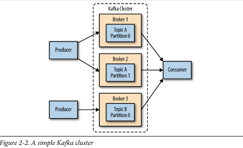

## First Things First

### Choosing an Operating System

Apache Kafka là một ứng dụng được viết bằng Java và có thể chạy trên nhiều hệ điều hành. Điều này bao gồm Windows, MacOS, Linux và các hệ điều hành khác. 
Các bước cài đặt trong chương này sẽ tập trung vào thiết lập và sử dụng Kafka trên môi trường Linux, vì đây là hệ điều hành phổ biến nhất mà Kafka được cài đặt.
Đây cũng là hệ điều hành được khuyến khích để triển khai Kafka cho mục đích sử dụng chung. Để biết thông tin về cách cài đặt Kafka trên Windows và MacOS, xin xem Phụ lục A.

### Installing Java

Trước khi cài đặt Zookeeper hoặc Kafka, bạn cần có môi trường Java đã được thiết lập và hoạt động. 
Bạn nên sử dụng phiên bản Java 8 và có thể là phiên bản được cung cấp bởi hệ điều hành của bạn hoặc tải trực tiếp từ java.com.
Mặc dù Zookeeper và Kafka có thể hoạt động với phiên bản chỉ chạy của Java (JRE), nhưng khi phát triển công cụ và ứng dụng,
có thể thuận tiện hơn khi sử dụng Java Development Kit (JDK) đầy đủ. Các bước cài đặt sẽ giả định rằng bạn đã cài đặt JDK phiên bản 8 cập nhật 51 trong đường dẫn /usr/java/jdk1.8.0_51.

### Installing Zookeeper

Apache Kafka sử dụng Zookeeper để lưu trữ siêu dữ liệu về cụm Kafka, cũng như chi tiết khách hàng tiêu thụ, như được thể
hiện trong Hình 2-1. Mặc dù có thể chạy một máy chủ Zookeeper bằng cách sử dụng các tập lệnh có trong bản phân phối Kafka,
nhưng việc cài đặt một phiên bản đầy đủ của Zookeeper từ bản phân phối là một công việc đơn giản.


Kafka đã được kiểm thử một cách cẩn thận với phiên bản ổn định 3.4.6 của Zookeeper, có thể tải về từ apache.org tại địa chỉ http://bit.ly/2sDWSgJ.

#### Standalone Server

Đoạn sau đây là một hướng dẫn giả định để cài đặt Zookeeper với cấu hình cơ bản trong thư mục /usr/local/zookeeper và lưu dữ liệu trong /var/lib/zookeeper:

```
# tar -zxf zookeeper-3.4.6.tar.gz
# mv zookeeper-3.4.6 /usr/local/zookeeper
# mkdir -p /var/lib/zookeeper
# cat > /usr/local/zookeeper/conf/zoo.cfg << EOF
> tickTime=2000
> dataDir=/var/lib/zookeeper
> clientPort=2181
> EOF
# export JAVA_HOME=/usr/java/jdk1.8.0_51
# /usr/local/zookeeper/bin/zkServer.sh start
JMX enabled by default
Using config: /usr/local/zookeeper/bin/../conf/zoo.cfg Starting zookeeper ... STARTED
#
```

Bạn có thể xác minh rằng Zookeeper đang chạy đúng chế độ standalone bằng cách kết nối tới cổng client và gửi lệnh bốn ký tự srvr:

```
# telnet localhost 2181 Trying ::1...
Connected to localhost. Escape character is '^]'. srvr
Zookeeper version: 3.4.6-1569965, built on 02/20/2014 09:09 GMT
Latency min/avg/max: 0/0/0
Received: 1
Sent: 0
Connections: 1
Outstanding: 0
Zxid: 0x0
Mode: standalone
Node count: 4
Connection closed by foreign host. #
```

#### Zookeeper ensemble

Một cụm Zookeeper được gọi là một ensemble. Do thuật toán sử dụng, được khuyến khích là ensemble nên chứa một số lẻ các 
máy chủ (ví dụ: 3, 5, vv.) vì phần lớn các thành viên trong ensemble (một quorum) phải hoạt động để Zookeeper có thể đáp 
ứng các yêu cầu. Điều này có nghĩa là trong một ensemble ba node, bạn có thể hoạt động khi thiếu một node. Với ensemble 
năm node, bạn có thể hoạt động khi thiếu hai node.

```text
**Sizing Your Zookeeper Ensemble**

Hãy cân nhắc chạy Zookeeper trong một dàn gồm năm nút. Để thực hiện các thay đổi cấu hình cho dàn, bao gồm việc 
hoán đổi một nút, bạn sẽ cần tải lại các nút từng cái một. Nếu dàn của bạn không thể chịu đựng việc có hơn một nút
bị ngưng, thì việc bảo trì sẽ làm tăng rủi ro. Ngoài ra, không khuyến nghị chạy nhiều hơn bảy nút, vì hiệu suất có 
thể bắt đầu suy giảm do bản chất của giao thức đồng thuận.
```

Để cấu hình các máy chủ Zookeeper trong một ensemble, chúng phải có một cấu hình chung liệt kê tất cả các máy chủ, và
mỗi máy chủ cần có một tệp myid trong thư mục dữ liệu chỉ định số ID của máy chủ đó. Nếu tên máy chủ trong ensemble là 
zoo1.example.com, zoo2.example.com và zoo3.example.com, tệp cấu hình có thể như sau:

```
tickTime=2000
dataDir=/var/lib/zookeeper
clientPort=2181
initLimit=5
syncLimit=2
server.1=zoo1.example.com:2888:3888
server.2=zoo2.example.com:2888:3888
server.3=zoo3.example.com:2888:3888
```

Trong cấu hình này, `initLimit` là thời gian cho phép các follower kết nối với một leader. Giá trị `syncLimit` giới hạn 
mức độ không đồng bộ của các follower so với leader. Cả hai giá trị này được tính bằng đơn vị `tickTime`, vì vậy `initLimit`
là 20 * 2000 ms, tức là 40 giây. Cấu hình cũng liệt kê từng máy chủ trong ensemble. Các máy chủ được chỉ định theo định dạng `server.X=hostname:peerPort:leaderPort`, 
với các tham số sau đây:

- `X`: Số ID của máy chủ. Giá trị này phải là một số nguyên, nhưng không cần phải dựa trên số 0 hoặc tuần tự.
- `hostname`: Tên máy chủ hoặc địa chỉ IP của máy chủ.
- `peerPort`: Cổng TCP mà các máy chủ trong ensemble sử dụng để giao tiếp với nhau.
- `leaderPort`: Cổng TCP dùng cho việc bầu chọn leader.

Các client chỉ cần kết nối qua `clientPort`, nhưng các thành viên trong ensemble phải có khả năng giao tiếp với nhau qua ba cổng này.

Ngoài tệp cấu hình chia sẻ, mỗi máy chủ phải có một tệp trong thư mục `dataDir` với tên là `myid`. Tệp này phải chứa số ID của máy chủ, phải khớp với cấu hình trong tệp cấu hình. Sau khi hoàn thành các bước này, các máy chủ sẽ khởi động và giao tiếp với nhau trong ensemble.

### Installing a Kafka Broker

Sau khi đã cấu hình Java và Zookeeper, bạn sẵn sàng để cài đặt Apache Kafka. Phiên bản hiện tại của Kafka có thể được tải về tại http://kafka.apache.org/downloads.html. Tại thời điểm in sách, phiên bản đó là 0.9.0.1 chạy trên Scala version 2.11.0.

Ví dụ sau cài đặt Kafka trong thư mục /usr/local/kafka, được cấu hình để sử dụng máy chủ Zookeeper đã khởi động trước đó và lưu trữ các đoạn nhật ký tin nhắn trong /tmp/kafka-logs:

```bash
# tar -zxf kafka_2.11-0.9.0.1.tgz
# mv kafka_2.11-0.9.0.1 /usr/local/kafka
# mkdir /tmp/kafka-logs
# export JAVA_HOME=/usr/java/jdk1.8.0_51
# /usr/local/kafka/bin/kafka-server-start.sh -daemon /usr/local/kafka/config/server.properties
```

Sau khi Kafka broker đã được khởi động, chúng ta có thể xác nhận rằng nó đang hoạt động bằng cách thực hiện một số hoạt động đơn giản với cluster như tạo một chủ đề thử nghiệm, sản xuất một số thông điệp và tiêu thụ các thông điệp đó.

Đầu tiên, tạo và xác nhận một chủ đề thử nghiệm:

```bash
# /usr/local/kafka/bin/kafka-topics.sh --create --zookeeper localhost:2181 --replication-factor 1 --partitions 1 --topic test
Created topic "test".
# /usr/local/kafka/bin/kafka-topics.sh --describe --zookeeper localhost:2181 --topic test
Topic:test    PartitionCount:1    ReplicationFactor:1    Configs:
    Topic: test    Partition: 0    Leader: 0    Replicas: 0    Isr: 0
```

Sau đó, sản xuất các thông điệp vào chủ đề thử nghiệm:

```bash
# /usr/local/kafka/bin/kafka-console-producer.sh --broker-list localhost:9092 --topic test
Test Message 1
Test Message 2
^D
```

Cuối cùng, tiêu thụ các thông điệp từ chủ đề thử nghiệm:

```bash
# /usr/local/kafka/bin/kafka-console-consumer.sh --bootstrap-server localhost:9092 --topic test --from-beginning
Test Message 1
Test Message 2
^C
Consumed 2 messages
```

Ở đây:
- Lệnh `kafka-topics.sh --create` tạo một chủ đề mới có tên là "test" với yêu cầu sao chép mức độ 1 (replication-factor 1) và một phân vùng (partitions 1).
- Lệnh `kafka-topics.sh --describe` mô tả chi tiết về chủ đề "test" đã tạo.
- Lệnh `kafka-console-producer.sh` cho phép sản xuất các thông điệp vào chủ đề "test".
- Lệnh `kafka-console-consumer.sh` tiêu thụ và hiển thị các thông điệp từ chủ đề "test".

Các thông điệp đã được sản xuất và tiêu thụ thành công từ chủ đề "test".

### Broker Configuration

Cấu hình mẫu được cung cấp cùng với bản phân phối Kafka là đủ để chạy một máy chủ đơn lẻ như một bằng chứng thực của khái niệm, nhưng nó sẽ không đủ cho hầu hết các cài đặt. Có nhiều tùy chọn cấu hình cho Kafka điều khiển tất cả các khía cạnh của thiết lập và điều chỉnh. Nhiều tùy chọn có thể để mặc định, vì chúng đối phó với các khía cạnh điều chỉnh của broker Kafka sẽ không áp dụng cho đến khi bạn có một trường hợp sử dụng cụ thể để làm việc và một trường hợp sử dụng cụ thể đòi hỏi điều chỉnh các thiết lập này.

#### General Broker

Có một số cấu hình broker mà bạn nên xem xét khi triển khai Kafka cho bất kỳ môi trường nào ngoài một broker đơn lẻ trên một máy chủ duy nhất. Các tham số này liên quan đến cấu hình cơ bản của broker và hầu hết các tham số này phải được thay đổi để chạy đúng trong một cụm với các broker khác.

##### broker.id

Mỗi broker Kafka phải có một định danh số nguyên, được thiết lập bằng cấu hình broker.id. Mặc định, số nguyên này được đặt là 0, nhưng có thể là bất kỳ giá trị nào. Quan trọng nhất là số nguyên này phải là duy nhất trong một cụm Kafka duy nhất. Việc lựa chọn số này là tùy ý, và nó có thể được di chuyển giữa các broker nếu cần thiết cho các nhiệm vụ bảo trì. Một hướng dẫn tốt là đặt giá trị này thành một điều gì đó có liên quan đến máy chủ để khi thực hiện bảo trì, việc ánh xạ số ID broker thành máy chủ không gây khó khăn. Ví dụ, nếu tên miền của bạn chứa một số duy nhất (như host1.example.com, host2.example.com, vv.), đó là một lựa chọn tốt cho giá trị broker.id.

##### port

Tập tin cấu hình mẫu khởi động Kafka với một trình nghe trên cổng TCP 9092. Có thể thiết lập thành bất kỳ cổng nào có sẵn bằng cách thay đổi tham số cấu hình cổng. Hãy nhớ rằng nếu chọn một cổng nhỏ hơn 1024, Kafka phải được khởi động với quyền root. Tuy nhiên, chạy Kafka với quyền root không phải là một cấu hình được khuyến khích.

##### zookeeper.connect

Vị trí của Zookeeper được sử dụng để lưu trữ siêu dữ liệu của broker được thiết lập bằng tham số cấu hình zookeeper.connect. Cấu hình mẫu sử dụng một Zookeeper chạy trên cổng 2181 trên máy localhost, được chỉ định là localhost:2181. Định dạng cho tham số này là một chuỗi các chuỗi hostname:port/path được phân tách bằng dấu chấm phẩy, bao gồm:

- hostname: tên máy chủ hoặc địa chỉ IP của máy chủ Zookeeper.
- port: số cổng client cho máy chủ.
- /path: một đường dẫn Zookeeper tùy chọn để sử dụng như môi trường chroot cho cụm Kafka. Nếu nó được bỏ qua, đường dẫn gốc sẽ được sử dụng.

Nếu một đường dẫn chroot được chỉ định và không tồn tại, nó sẽ được tạo ra bởi broker khi nó khởi động.

```text
**Why Use a Chroot Path**
Việc sử dụng đường dẫn chroot cho cụm Kafka thường được xem là thực hành tốt. Điều này cho phép dàn 
Zookeeper được chia sẻ với các ứng dụng khác, bao gồm cả các cụm Kafka khác, mà không gây xung đột. 
Ngoài ra, tốt nhất là chỉ định nhiều máy chủ Zookeeper (tất cả đều là một phần của cùng một dàn)
trong cấu hình này. Điều này cho phép Kafka broker kết nối với thành viên khác của dàn Zookeeper 
trong trường hợp một máy chủ bị hỏng.
```

##### log.dirs

Kafka lưu trữ tất cả các thông điệp vào đĩa, và các đoạn nhật ký này được lưu trong các thư mục được chỉ định trong cấu hình log.dirs. Đây là một danh sách các đường dẫn phân cách bằng dấu phẩy trên hệ thống cục bộ. Nếu có nhiều hơn một đường dẫn được chỉ định, broker sẽ lưu trữ các partition trên chúng theo cách "ít được sử dụng nhất", với các đoạn nhật ký của một partition được lưu trong cùng một đường dẫn. Lưu ý rằng broker sẽ đặt một partition mới vào đường dẫn có ít partition nhất hiện tại được lưu trữ trong đó, chứ không phải là đường dẫn có ít dung lượng đĩa được sử dụng nhất trong các tình huống sau:

###### num.recovery.threads.per.data.dir

Kafka sử dụng một pool luồng có thể cấu hình để xử lý các đoạn nhật ký. Hiện tại, pool luồng này được sử dụng:

- Khi khởi động bình thường, để mở các đoạn nhật ký của mỗi partition.
- Khi khởi động sau khi xảy ra lỗi, để kiểm tra và cắt ngắn các đoạn nhật ký của mỗi partition.
- Khi tắt, để đóng sạch các đoạn nhật ký.

Mặc định, chỉ có một luồng cho mỗi thư mục nhật ký được sử dụng. Vì các luồng này chỉ được sử dụng trong quá trình khởi động và tắt, nên hợp lý là cài đặt một số luồng lớn hơn để song song hóa các hoạt động. Cụ thể, khi phục hồi từ một sự cố tắt máy không đúng cách, điều này có thể làm chênh lệch nhiều giờ khi khởi động lại một broker với một số lượng partition lớn! Khi cài đặt tham số này, hãy nhớ rằng số lượng được cấu hình là cho mỗi thư mục nhật ký được chỉ định trong log.dirs. Điều này có nghĩa là nếu num.recovery.threads.per.data.dir được cài đặt là 8 và có 3 đường dẫn được chỉ định trong log.dirs, tổng cộng sẽ là 24 luồng.

###### auto.create.topics.enable

Cấu hình mặc định của Kafka chỉ định rằng broker sẽ tự động tạo một topic trong các trường hợp sau:

- Khi một producer bắt đầu ghi các tin nhắn vào topic đó.
- Khi một consumer bắt đầu đọc các tin nhắn từ topic đó.
- Khi bất kỳ client nào yêu cầu metadata cho topic.

Trong nhiều tình huống, điều này có thể là hành vi không mong muốn, đặc biệt khi không có cách nào để xác minh sự tồn tại của một topic thông qua giao thức Kafka mà không làm cho nó được tạo ra. Nếu bạn đang quản lý việc tạo topic một cách rõ ràng, bằng cách thủ công hoặc thông qua hệ thống cấp phát, bạn có thể cài đặt cấu hình auto.create.topics.enable thành false.

#### Topic Defaults

Cấu hình server của Kafka chỉ định nhiều cấu hình mặc định cho các topic được tạo ra. Một số trong những tham số này, bao gồm số lượng phân vùng và thời gian lưu trữ tin nhắn, có thể được thiết lập cho từng topic bằng các công cụ quản trị (được đề cập trong Chương 9). Các giá trị mặc định trong cấu hình server nên được đặt ở các giá trị cơ bản phù hợp cho phần lớn các topic trong cluster.

```text
**Using Per-Topic Overrides**
Trong các phiên bản trước của Kafka, có thể chỉ định các ghi đè theo chủ đề cho các cấu hình này trong cấu hình broker bằng cách sử dụng các tham số log.retention.hours.per.topic, log.retention.bytes.per.topic, và log.segment.bytes.per.topic. Các tham số này không còn được hỗ trợ nữa và các ghi đè phải được chỉ định bằng cách sử dụng các công cụ quản trị.
```

##### num.partitions

Tham số `num.partitions` quyết định số lượng phân vùng mà một chủ đề mới được tạo ra, chủ yếu khi tính năng tạo chủ đề tự động được bật (đây là cài đặt mặc định). Tham số này mặc định là một phân vùng. Hãy nhớ rằng số lượng phân vùng của một chủ đề chỉ có thể tăng, không bao giờ giảm. Điều này có nghĩa là nếu một chủ đề cần có ít phân vùng hơn `num.partitions`, cần phải cẩn thận tạo chủ đề thủ công (được thảo luận trong Chương 9).

Như đã mô tả trong Chương 1, phân vùng là cách một chủ đề được mở rộng trong một cụm Kafka, làm cho việc sử dụng số lượng phân vùng phù hợp để cân bằng tải tin nhắn trên toàn bộ cụm khi thêm các broker là rất quan trọng. Nhiều người dùng sẽ đặt số lượng phân vùng cho một chủ đề bằng hoặc là bội số của số lượng broker trong cụm. Điều này cho phép các phân vùng được phân phối đều cho các broker, điều này sẽ phân phối đều tải tin nhắn. Tuy nhiên, đây không phải là một yêu cầu bắt buộc, vì bạn cũng có thể cân bằng tải tin nhắn bằng cách có nhiều chủ đề.

```text
### Cách chọn số lượng phân vùng

Có một số yếu tố cần xem xét khi chọn số lượng phân vùng:

- **Thông lượng bạn mong đợi đạt được cho chủ đề là gì?** Ví dụ, bạn mong đợi ghi 100 KB mỗi giây hay 1 GB mỗi giây?
- **Thông lượng tối đa bạn mong đợi đạt được khi tiêu thụ từ một phân vùng là gì?** Bạn sẽ luôn có, tối đa, một người tiêu thụ đọc từ một phân vùng, vì vậy nếu bạn biết rằng người tiêu thụ chậm nhất của bạn ghi dữ liệu vào cơ sở dữ liệu và cơ sở dữ liệu này không bao giờ xử lý hơn 50 MB mỗi giây từ mỗi luồng ghi vào, thì bạn biết rằng bạn bị giới hạn ở thông lượng 60 MB khi tiêu thụ từ một phân vùng.
- **Bạn có thể thực hiện bài tập tương tự để ước tính thông lượng tối đa mỗi nhà sản xuất cho một phân vùng,** nhưng vì các nhà sản xuất thường nhanh hơn nhiều so với người tiêu thụ, thường thì bỏ qua bước này là an toàn.
- **Nếu bạn đang gửi tin nhắn đến các phân vùng dựa trên các khóa, việc thêm các phân vùng sau này có thể rất khó khăn,** vì vậy hãy tính toán thông lượng dựa trên việc sử dụng trong tương lai dự kiến của bạn, không phải việc sử dụng hiện tại.
- **Xem xét số lượng phân vùng bạn sẽ đặt trên mỗi broker và dung lượng đĩa và băng thông mạng có sẵn trên mỗi broker.**
- **Tránh ước tính quá cao, vì mỗi phân vùng sử dụng bộ nhớ và các tài nguyên khác trên broker và sẽ tăng thời gian cho các cuộc bầu chọn leader.**

Với tất cả những điều này, rõ ràng là bạn muốn có nhiều phân vùng nhưng không quá nhiều. Nếu bạn có một số ước tính về thông lượng mục tiêu của chủ đề và thông lượng dự kiến của người tiêu thụ, bạn có thể chia thông lượng mục tiêu cho thông lượng dự kiến của người tiêu thụ và từ đó suy ra số lượng phân vùng. Vì vậy, nếu tôi muốn có thể ghi và đọc 1 GB/giây từ một chủ đề, và tôi biết mỗi người tiêu thụ chỉ có thể xử lý 50 MB/giây, thì tôi biết tôi cần ít nhất 20 phân vùng. Bằng cách này, tôi có thể có 20 người tiêu thụ đọc từ chủ đề và đạt được 1 GB/giây.

Nếu bạn không có thông tin chi tiết này, kinh nghiệm của chúng tôi gợi ý rằng việc giới hạn kích thước phân vùng trên đĩa xuống dưới 6 GB mỗi ngày của thời gian giữ thường mang lại kết quả hài lòng.
```

##### log.retention.ms

Cấu hình phổ biến nhất về thời gian Kafka sẽ giữ lại tin nhắn là theo thời gian. Mặc định được chỉ định trong tệp cấu hình sử dụng tham số `log.retention.hours`, và nó được đặt là 168 giờ, hoặc một tuần. Tuy nhiên, có hai tham số khác được phép sử dụng là `log.retention.minutes` và `log.retention.ms`. Cả ba tham số này đều chỉ định cùng một cấu hình—khoảng thời gian sau đó tin nhắn có thể bị xóa—nhưng tham số được khuyến nghị sử dụng là `log.retention.ms`, vì đơn vị nhỏ hơn sẽ được ưu tiên nếu có nhiều tham số được chỉ định. Điều này sẽ đảm bảo rằng giá trị được đặt cho `log.retention.ms` luôn là giá trị được sử dụng. Nếu có nhiều tham số được chỉ định, đơn vị nhỏ hơn sẽ được ưu tiên.

```text
### Giữ lại Theo Thời gian và Thời gian Sửa đổi Cuối

Việc giữ lại theo thời gian được thực hiện bằng cách kiểm tra thời gian sửa đổi cuối cùng (mtime) trên mỗi tệp đoạn nhật ký trên đĩa. 
Dưới các hoạt động thông thường của cụm, đây là thời điểm đoạn nhật ký được đóng và đại diện cho dấu thời gian của tin nhắn cuối cùng trong tệp. 
Tuy nhiên, khi sử dụng các công cụ quản trị để di chuyển các phân vùng giữa các broker, thời gian này không chính xác và sẽ dẫn đến việc giữ lại quá mức cho các phân vùng này. 
Thông tin chi tiết hơn về vấn đề này sẽ được cung cấp trong Chương 9 khi thảo luận về việc di chuyển phân vùng.
```

##### log.retention.bytes

Một cách khác để hết hạn tin nhắn là dựa trên tổng số byte của các tin nhắn được giữ lại. Giá trị này được đặt bằng cách sử dụng tham số log.retention.bytes, và nó được áp dụng cho từng phân vùng. Điều này có nghĩa là nếu bạn có một chủ đề (topic) với 8 phân vùng, và log.retention.bytes được đặt thành 1 GB, thì lượng dữ liệu được giữ lại cho chủ đề sẽ tối đa là 8 GB. Lưu ý rằng tất cả việc giữ lại được thực hiện cho từng phân vùng riêng lẻ, không phải cho chủ đề. Điều này có nghĩa là nếu số lượng phân vùng cho một chủ đề được mở rộng, việc giữ lại cũng sẽ tăng lên nếu sử dụng log.retention.bytes.

```text
### Cấu hình Giữ lại Tin nhắn theo Kích thước và Thời gian

Nếu bạn đã xác định giá trị cho cả `log.retention.bytes` và `log.retention.ms` (hoặc một tham số khác để giữ lại theo thời gian), các tin nhắn có thể bị xóa khi một trong hai tiêu chí được đáp ứng. 
Ví dụ, nếu `log.retention.ms` được đặt thành 86400000 (1 ngày) và `log.retention.bytes` được đặt thành 1000000000 (1 GB), có thể các tin nhắn ít hơn 1 ngày tuổi sẽ bị xóa nếu tổng khối lượng tin nhắn trong suốt ngày vượt quá 1 GB. 
Ngược lại, nếu khối lượng ít hơn 1 GB, các tin nhắn có thể bị xóa sau 1 ngày ngay cả khi tổng kích thước của phân vùng ít hơn 1 GB.
```

##### log.segment.bytes

Các thiết lập giữ lại nhật ký đã được đề cập trước đó hoạt động trên các đoạn nhật ký, không phải trên từng thông điệp cá nhân. Khi các thông điệp được sản xuất vào Kafka broker, chúng được thêm vào đoạn nhật ký hiện tại cho phân vùng đó. Khi đoạn nhật ký đạt đến kích thước được chỉ định bởi tham số `log.segment.bytes`, mặc định là 1 GB, đoạn nhật ký sẽ được đóng và một đoạn mới sẽ được mở. Sau khi một đoạn nhật ký đã được đóng, nó có thể được xem xét để xóa đi. Việc đặt kích thước đoạn nhật ký nhỏ hơn có nghĩa là các tập tin phải được đóng và cấp phát thường xuyên hơn, làm giảm hiệu suất tổng thể của ghi đĩa.

Việc điều chỉnh kích thước của các đoạn nhật ký có thể quan trọng nếu các chủ đề có tỷ lệ sản xuất thấp. Ví dụ, nếu một chủ đề chỉ nhận được 100 megabyte mỗi ngày từ các thông điệp, và `log.segment.bytes` được đặt là mặc định, sẽ mất 10 ngày để điền vào một đoạn nhật ký. Do không thể xóa các thông điệp cho đến khi đoạn nhật ký được đóng, nếu `log.retention.ms` được đặt là 604800000 (1 tuần), thực tế có thể giữ lại đến 17 ngày các thông điệp cho đến khi đoạn nhật ký đã đóng hết hạn. Điều này xảy ra vì sau khi đoạn nhật ký được đóng với 10 ngày thông điệp hiện tại, đoạn nhật ký đó phải được giữ lại trong 7 ngày trước khi hết hạn dựa trên chính sách thời gian (vì đoạn không thể bị xóa cho đến khi thông điệp cuối cùng trong đoạn có thể bị xóa).

```text
### Lấy Offset theo Thời điểm

Kích thước của đoạn nhật ký cũng ảnh hưởng đến hành vi của việc lấy offset theo thời điểm. Khi yêu cầu lấy offset cho một phân vùng tại một thời điểm cụ thể, Kafka tìm tập tin đoạn nhật ký đang được ghi vào vào thời điểm đó. Để làm điều này, Kafka sử dụng thời gian tạo và sửa đổi lần cuối của tập tin, và tìm kiếm tập tin đã được tạo ra trước thời điểm chỉ định và sửa đổi sau thời điểm đó. Offset ở đầu đoạn nhật ký đó (cũng là tên tập tin) được trả về trong phản hồi.
```

##### log.segment.bytes

Một cách khác để kiểm soát việc đóng các đoạn nhật ký là sử dụng tham số log.segment.ms, chỉ định khoảng thời gian sau khi một đoạn nhật ký nên được đóng. Tương tự như các tham số log.retention.bytes và log.retention.ms, các tham số log.segment.bytes và log.segment.ms không phải là các thuộc tính độc lập. Kafka sẽ đóng một đoạn nhật ký khi đạt đến giới hạn kích thước hoặc khi đạt đến giới hạn thời gian, tuỳ thuộc vào điều nào đến trước. Mặc định, không có cài đặt cho log.segment.ms, điều này dẫn đến việc chỉ đóng các đoạn nhật ký dựa trên kích thước.

```text
### Hiệu suất Đĩa Khi Sử Dụng Giới Hạn Đoạn Nhật Ký Dựa Trên Thời Gian

Khi sử dụng giới hạn đoạn nhật ký dựa trên thời gian, điều quan trọng là cân nhắc tác động đến hiệu suất đĩa khi nhiều đoạn nhật ký được đóng cùng một lúc. Điều này có thể xảy ra khi có nhiều phân vùng không bao giờ đạt đến giới hạn kích thước cho các đoạn nhật ký, vì thời gian cho giới hạn thời gian sẽ bắt đầu khi broker khởi động và sẽ luôn thực thi vào cùng một thời điểm cho những phân vùng có lượng dữ liệu thấp này.
```

##### message.max.bytes

Broker Kafka giới hạn kích thước tối đa của một tin nhắn có thể được sản xuất, được cấu hình bằng tham số message.max.bytes, mặc định là 1000000 byte, tương đương 1 MB. Một producer cố gắng gửi một tin nhắn lớn hơn giới hạn này sẽ nhận được một lỗi từ broker và tin nhắn sẽ không được chấp nhận. Như với tất cả các kích thước byte được chỉ định trên broker, cấu hình này xử lý kích thước tin nhắn sau khi nén, có nghĩa là producer có thể gửi các tin nhắn lớn hơn rất nhiều so với giá trị message.max.bytes đã cấu hình nếu nén xuống dưới kích thước đã cấu hình.

Việc tăng kích thước tin nhắn cho phép có tác động hiệu suất đáng kể. Tin nhắn lớn sẽ làm cho các luồng broker xử lý kết nối mạng và yêu cầu mất nhiều thời gian hơn cho mỗi yêu cầu. Tin nhắn lớn cũng làm tăng kích thước ghi đĩa, ảnh hưởng đến lưu lượng I/O.

```text
### Điều Phối Cấu Hình Kích Thước Tin Nhắn

Kích thước tin nhắn được cấu hình trên broker Kafka phải được điều phối với cấu hình fetch.message.max.bytes trên các client consumer. Nếu giá trị này nhỏ hơn message.max.bytes, thì các consumer gặp phải các tin nhắn lớn hơn sẽ thất bại trong việc lấy các tin nhắn đó, dẫn đến tình huống mà consumer bị mắc kẹt và không thể tiếp tục. Quy tắc tương tự áp dụng cho cấu hình replica.fetch.max.bytes trên các broker khi được cấu hình trong một cluster.
```

### Hardware Selection

Việc lựa chọn một cấu hình phần cứng phù hợp cho một broker Kafka có thể được coi là nghệ thuật hơn là khoa học. Kafka chính nó không có yêu cầu nghiêm ngặt về cấu hình phần cứng cụ thể và sẽ hoạt động mà không gặp vấn đề trên bất kỳ hệ thống nào. Tuy nhiên, khi hiệu suất trở thành một vấn đề quan trọng, có một số yếu tố sẽ góp phần vào tổng thể hiệu suất: tốc độ và dung lượng lưu trữ đĩa, bộ nhớ, mạng và CPU. Khi đã xác định được loại hiệu suất nào là quan trọng nhất đối với môi trường của bạn, bạn sẽ có thể lựa chọn một cấu hình phần cứng tối ưu phù hợp với ngân sách của mình.

#### Disk Throughput

Hiệu suất của các producer client sẽ phụ thuộc trực tiếp vào tốc độ lưu trữ đĩa của broker được sử dụng để lưu các đoạn log. Các message của Kafka phải được ghi vào lưu trữ địa phương khi chúng được sản xuất, và hầu hết các client sẽ đợi ít nhất một broker xác nhận rằng các message đã được ghi vào lưu trữ trước khi coi gửi thành công. Điều này có nghĩa là việc ghi đĩa nhanh hơn sẽ giảm thời gian chậm của quá trình sản xuất.

Quyết định rõ ràng khi nói đến tốc độ lưu trữ đĩa là sử dụng ổ đĩa cứng quay (HDD) truyền thống hay ổ đĩa rắn (SSD). SSD có thời gian tìm kiếm và truy cập rất thấp và sẽ cung cấp hiệu suất tốt nhất. HDD, bên cạnh đó, có chi phí thấp hơn và cung cấp nhiều dung lượng hơn cho mỗi đơn vị. Bạn cũng có thể cải thiện hiệu suất của HDD bằng cách sử dụng nhiều ổ cứng hơn trong một broker, bằng cách có nhiều thư mục dữ liệu hoặc bằng cách thiết lập các ổ đĩa trong một cấu hình mảng đĩa độc lập dư thừa (RAID). Những yếu tố khác như công nghệ ổ đĩa cụ thể (ví dụ như serial attached storage hay serial ATA) cũng như chất lượng của bộ điều khiển ổ đĩa sẽ ảnh hưởng đến tốc độ lưu trữ.

#### Disk Capacity

Dung lượng là phần còn lại trong cuộc thảo luận về lưu trữ. Số lượng dung lượng đĩa cần thiết được xác định bởi lượng message cần giữ lại bất cứ lúc nào. Nếu broker dự kiến nhận 1 TB lưu lượng mỗi ngày, với giữ lại trong 7 ngày, thì broker sẽ cần tối thiểu 7 TB dung lượng lưu trữ có thể sử dụng cho các đoạn log. Bạn cũng nên tính đến ít nhất 10% phụ cấp cho các tệp tin khác, cùng với bất kỳ đệm nào bạn muốn duy trì cho sự biến động trong lưu lượng hoặc sự tăng trưởng theo thời gian.

Dung lượng lưu trữ là một trong những yếu tố cần xem xét khi thiết lập một cụm Kafka và xác định khi nào nên mở rộng nó. Tổng lưu lượng cho một cụm có thể được cân bằng qua các phân vùng của topic, cho phép các broker bổ sung dung lượng sẵn có nếu mật độ trên một broker đơn lẻ không đủ. Quyết định về lượng dung lượng đĩa cần thiết cũng sẽ được thông qua chiến lược sao chép được chọn cho cụm (được thảo luận chi tiết hơn trong Chương 6).

#### Memory

Theo chế độ hoạt động bình thường, Kafka consumer đọc từ cuối các partition, nơi mà consumer đã bắt kịp và chỉ hơn sản xuất một chút ít, nếu có. Trong tình huống này, các message mà consumer đang đọc được lưu trữ một cách tối ưu trong page cache của hệ thống, dẫn đến việc đọc nhanh hơn so với việc broker phải đọc lại các message từ đĩa. Do đó, có nhiều bộ nhớ hơn cho page cache sẽ cải thiện hiệu suất của client consumer.

Kafka không cần nhiều bộ nhớ heap được cấu hình cho Java Virtual Machine (JVM). Ngay cả một broker xử lý X message mỗi giây và tỷ lệ dữ liệu X megabit mỗi giây cũng có thể chạy với 5 GB heap. Bộ nhớ hệ thống còn lại sẽ được sử dụng bởi page cache và sẽ mang lại lợi ích cho Kafka bằng cách cho phép hệ thống cache các log segment đang sử dụng. Đây là lý do chính tại sao không nên đặt Kafka cùng với bất kỳ ứng dụng quan trọng nào khác trên cùng một hệ thống, vì chúng sẽ phải chia sẻ việc sử dụng page cache. Điều này sẽ làm giảm hiệu suất consumer cho Kafka.

#### Networking

Tốc độ lưu lượng mạng có sẵn sẽ xác định khả năng tối đa của lưu lượng mà Kafka có thể xử lý. Thường thì, tốc độ lưu lượng mạng, cùng với dung lượng lưu trữ đĩa, quyết định kích thước của các cụm Kafka. Tuy nhiên, điều này phức tạp hơn do sự mất cân bằng tự nhiên giữa việc sử dụng mạng vào và ra, được tạo ra bởi việc Kafka hỗ trợ nhiều người tiêu dùng.

Ví dụ, một producer có thể ghi 1 MB mỗi giây cho một chủ đề cụ thể, nhưng số lượng người tiêu dùng có thể tạo ra một bội số trên lưu lượng mạng ra. Ngoài ra, các hoạt động như sao chép cụm (được đề cập trong Chương 6) và sao chép (được thảo luận trong Chương 8) cũng tăng yêu cầu về mạng.

Nếu giao diện mạng trở nên bão hòa, không hiếm khi sao chép cụm sẽ bị tụt lại, điều này có thể khiến cụm Kafka trở nên dễ bị tấn công.

#### CPU

Sức mạnh xử lý không quan trọng bằng đĩa và bộ nhớ, nhưng nó sẽ ảnh hưởng đến hiệu suất tổng thể của broker một cách một phần. Lý tưởng, các client nên nén các thông điệp để tối ưu hóa mạng và sử dụng đĩa. Tuy nhiên, broker Kafka phải giải nén tất cả các lô thông điệp để xác minh checksum của từng thông điệp và gán offset. Sau đó, nó cần nén lại lô thông điệp để lưu trữ trên đĩa. Đây là nguyên nhân chính của yêu cầu về sức mạnh xử lý của Kafka. Tuy nhiên, điều này không nên là yếu tố chính trong việc chọn phần cứng.

### Kafka in the Cloud

Một cài đặt phổ biến cho Kafka là trong các môi trường điện toán đám mây, như Amazon Web Services (AWS). AWS cung cấp nhiều loại máy tính có khác nhau về CPU, bộ nhớ và đĩa, do đó các đặc tính hiệu suất của Kafka cần được ưu tiên để chọn cấu hình máy phù hợp.

Một điểm khởi đầu tốt là xác định lượng dữ liệu cần giữ lại, tiếp theo là hiệu suất cần thiết từ các producer. Nếu cần độ trễ rất thấp, có thể cần sử dụng các instance được tối ưu cho I/O có lưu trữ SSD local. Nếu không, lưu trữ tạm thời (như AWS Elastic Block Store) có thể đủ.

Khi các quyết định này được đưa ra, các lựa chọn về CPU và bộ nhớ sẵn có sẽ phù hợp với hiệu suất yêu cầu. Về mặt thực tế, điều này có nghĩa là đối với AWS, các loại instance m4 hoặc r3 thường là lựa chọn phổ biến. Instance m4 cho phép gia hạn lưu trữ lớn hơn, nhưng throughput đến đĩa sẽ thấp hơn vì nó sử dụng lưu trữ khối linh hoạt. Instance r3 có throughput tốt hơn với ổ đĩa SSD local, nhưng giới hạn lượng dữ liệu có thể giữ lại. Để có được sự kết hợp tốt nhất, cần chuyển lên các loại instance i2 hoặc d2, nhưng chúng lại có chi phí đáng kể hơn.

### Kafka Clusters

Một Kafka server đơn lẻ hoạt động tốt cho công việc phát triển cục bộ hoặc cho hệ thống proof-of-concept, nhưng có nhiều lợi ích đáng kể khi có nhiều broker được cấu hình thành một cụm, như được minh họa trong Hình 2-2. Lợi ích lớn nhất là khả năng phân phối tải trên nhiều máy chủ. Lợi ích quan trọng thứ hai là sử dụng sao chép dữ liệu để bảo vệ chống mất dữ liệu do lỗi hệ thống đơn lẻ. Sao chép cũng cho phép thực hiện công việc bảo trì trên Kafka hoặc hệ thống cơ sở dữ liệu mà vẫn duy trì tính sẵn có cho các khách hàng. Phần này tập trung vào cấu hình một cụm Kafka. Chương 6 chứa thông tin chi tiết hơn về sao chép dữ liệu.



#### How Many Brokers?

Kích thước phù hợp cho một cụm Kafka được xác định bởi nhiều yếu tố. Yếu tố đầu tiên cần xem xét là bao nhiêu dung lượng đĩa cần thiết để lưu trữ các thông điệp và bao nhiêu lưu trữ có sẵn trên một broker đơn lẻ. Nếu cụm cần lưu trữ 10 TB dữ liệu và một broker có thể lưu trữ 2 TB, thì kích thước tối thiểu của cụm là năm broker. Ngoài ra, việc sử dụng sao chép sẽ tăng yêu cầu lưu trữ ít nhất là 100%, tùy thuộc vào hệ số sao chép được chọn (xem Chương 6). Điều này có nghĩa là cùng một cụm này, được cấu hình với sao chép, bây giờ cần chứa ít nhất 10 broker.

Yếu tố khác cần xem xét là khả năng của cụm để xử lý các yêu cầu. Ví dụ, khả năng của các giao diện mạng là bao nhiêu, và liệu chúng có thể xử lý lưu lượng khách hàng nếu có nhiều người tiêu dùng dữ liệu hoặc nếu lưu lượng không đồng đều qua thời gian lưu trữ dữ liệu (ví dụ: tăng lưu lượng vào giờ cao điểm). Nếu giao diện mạng trên một broker đơn lẻ được sử dụng đến 80% công suất vào giờ cao điểm, và có hai người tiêu dùng dữ liệu đó, các tiêu dùng sẽ không thể đáp ứng được lưu lượng tăng cao vào giờ cao điểm trừ khi có hai broker. Nếu sao chép được sử dụng trong cụm, đây là một tiêu dùng dữ liệu bổ sung mà phải được tính đến. Có thể cũng nên mở rộng thêm broker trong cụm để xử lý các vấn đề hiệu suất do hiệu suất đọc/ghi đĩa thấp hơn hoặc bộ nhớ hệ thống có hạn gây ra.

#### Broker Configuration

Chỉ có hai yêu cầu trong cấu hình broker để cho phép nhiều broker Kafka tham gia vào một cụm duy nhất. Yêu cầu đầu tiên là tất cả các broker phải có cùng cấu hình cho tham số zookeeper.connect. Tham số này chỉ định tập hợp Zookeeper và đường dẫn nơi cụm lưu trữ siêu dữ liệu. Yêu cầu thứ hai là tất cả các broker trong cụm phải có giá trị duy nhất cho tham số broker.id. Nếu hai broker cố gắng tham gia cùng một cụm với cùng broker.id, broker thứ hai sẽ ghi lại một lỗi và không khởi động được. Có các tham số cấu hình khác được sử dụng khi chạy một cụm - cụ thể là các tham số điều khiển sao chép, sẽ được bàn luận trong các chương sau

#### OS Tuning

Trong khi hầu hết các bản phân phối Linux có một cấu hình sẵn cho các tham số điều chỉnh kernel mà sẽ hoạt động khá tốt cho hầu hết các ứng dụng, có một số thay đổi có thể được thực hiện để cải thiện hiệu suất cho một broker Kafka. Những thay đổi này chủ yếu xoay quanh hệ thống bộ nhớ ảo và mạng, cũng như những vấn đề cụ thể liên quan đến điểm gắn đĩa được sử dụng để lưu trữ các đoạn nhật ký.

Những tham số này thường được cấu hình trong tệp /etc/sysctl.conf, nhưng bạn nên tham khảo tài liệu của bản phân phối Linux cụ thể của bạn để biết chi tiết về cách điều chỉnh cấu hình kernel.

##### Virtual Memory

Chung quy lại, hệ thống bộ nhớ ảo của Linux sẽ tự động điều chỉnh cho phù hợp với tải công việc của hệ thống. Chúng ta có thể điều chỉnh một số thiết lập liên quan đến cách xử lý không gian swap cũng như các trang bộ nhớ dirty để tinh chỉnh cho công việc của Kafka.

Tương tự như hầu hết các ứng dụng, đặc biệt là những ứng dụng có yêu cầu về thông lượng, tốt nhất là tránh sử dụng swap bằng mọi giá (gần như). Chi phí phát sinh khi các trang bộ nhớ bị swap ra đĩa sẽ dẫn đến ảnh hưởng đáng kể đến tất cả các khía cạnh của hiệu suất trong Kafka. Ngoài ra, Kafka sử dụng rất nhiều hệ thống page cache, và nếu hệ thống bộ nhớ ảo đang swap ra đĩa, sẽ không đủ bộ nhớ được cấp phát cho page cache.

Một cách để tránh sử dụng swap là đơn giản là không cấu hình bất kỳ không gian swap nào. Việc có swap không phải là bắt buộc, nhưng nó cung cấp một lưới an toàn nếu xảy ra một sự cố nghiêm trọng trên hệ thống. Sử dụng swap có thể ngăn hệ điều hành giết chết một quy trình một cách đột ngột do tình trạng hết bộ nhớ. Vì lý do này, đề xuất là thiết lập tham số vm.swappiness với giá trị rất thấp, như là 1. Tham số này là tỷ lệ phần trăm cho biết hệ thống bộ nhớ ảo có dùng không gian swap thay vì loại bỏ các trang từ page cache. Tốt hơn là giảm kích thước của page cache hơn là swap.

```text
Tại sao không thiết lập vm.swappiness thành 0?

Trước đây, đề xuất cho tham số vm.swappiness luôn là thiết lập nó thành 0. Giá trị này từng có ý nghĩa là "không swap trừ khi có điều kiện hết bộ nhớ". Tuy nhiên, ý nghĩa của giá trị này đã thay đổi kể từ phiên bản Linux kernel 3.5-rc1, và sự thay đổi này đã được backport vào nhiều bản phân phối, bao gồm cả Red Hat Enterprise Linux từ phiên bản kernel 2.6.32-303 trở lên. Thay đổi này làm thay đổi ý nghĩa của giá trị 0 thành "không bao giờ swap dưới bất kỳ hoàn cảnh nào". Chính vì lý do này mà hiện nay đề xuất nên thiết lập giá trị là 1.
```

Cũng có lợi ích khi điều chỉnh cách kernel xử lý các trang dirty cần phải đẩy xuống đĩa. Kafka phụ thuộc vào hiệu suất I/O đĩa để cung cấp thời gian phản hồi tốt cho các nhà sản xuất. Đây cũng là lý do tại sao các đoạn nhật ký thường được đặt trên một ổ đĩa nhanh, cho dù đó là ổ đĩa đơn với thời gian phản hồi nhanh (ví dụ như SSD) hoặc một hệ thống ổ đĩa với NVRAM đáng kể để cache (ví dụ như RAID). Kết quả là số lượng các trang dirty được phép, trước khi quá trình nền đẩy chúng xuống đĩa bắt đầu ghi chúng vào đĩa, có thể được giảm xuống. Điều này được thực hiện bằng cách thiết lập giá trị vm.dirty_background_ratio thấp hơn so với mặc định là 10. Giá trị này là phần trăm tổng bộ nhớ hệ thống, và thiết lập giá trị này thành 5 là phù hợp trong nhiều tình huống. Tuy nhiên, cài đặt này không nên được thiết lập thành số 0, vì điều đó sẽ khiến kernel liên tục đẩy các trang, điều này sẽ loại bỏ khả năng của kernel để đệm ghi đĩa trước những tăng cao tạm thời trong hiệu suất thiết bị dưới đây.

Tổng số trang dirty được phép trước khi kernel bắt buộc các hoạt động đồng bộ để đẩy chúng xuống đĩa cũng có thể được tăng lên bằng cách thay đổi giá trị của vm.dirty_ratio, tăng nó lên trên mức mặc định là 20 (cũng là một phần trăm tổng bộ nhớ hệ thống). Có một phạm vi rộng các giá trị có thể cho cài đặt này, nhưng giữa 60 và 80 là một con số hợp lý. Cài đặt này đem lại một ít rủi ro, cả về lượng hoạt động đĩa chưa được đẩy xuống cũng như khả năng tạm dừng I/O lâu nếu buộc phải đẩy đồng bộ. Nếu lựa chọn một giá trị cao hơn cho vm.dirty_ratio, rất khuyến khích sử dụng sao chép trong cụm Kafka để bảo vệ chống lại những sự cố hệ thống.

Khi lựa chọn các giá trị cho những tham số này, thông thái là nên xem xét số lượng các trang dirty qua thời gian trong khi cụm Kafka đang chạy dưới tải, dù là trong môi trường sản xuất hoặc mô phỏng. Số lượng trang dirty hiện tại có thể được xác định bằng cách kiểm tra tập tin /proc/vmstat:

```
# cat /proc/vmstat | egrep "dirty|writeback"
nr_dirty 3875
nr_writeback 29
nr_writeback_temp 0
#
```

##### Disk

Ngoài việc lựa chọn phần cứng thiết bị đĩa và cấu hình RAID nếu được sử dụng, việc chọn hệ thống tập tin cho đĩa này có thể ảnh hưởng lớn đến hiệu suất. Có nhiều hệ thống tập tin khác nhau, nhưng hai lựa chọn phổ biến nhất cho hệ thống tập tin local là EXT4 (Extended File System 4) hoặc Extents File System (XFS). Gần đây, XFS đã trở thành hệ thống tập tin mặc định cho nhiều bản phân phối Linux, và điều này hoàn toàn có lý do—nó vượt trội hơn so với EXT4 đối với hầu hết các tải động tối thiểu cần điều chỉnh.

EXT4 có thể hoạt động tốt, nhưng yêu cầu sử dụng các tham số điều chỉnh được xem là không an toàn hơn. Điều này bao gồm thiết lập khoảng thời gian commit lâu hơn so với mặc định là năm để giảm thiểu việc đẩy thường xuyên hơn. EXT4 cũng giới thiệu việc trì hoãn phân bổ các block, điều này tăng nguy cơ mất dữ liệu và hỏng hệ thống tập tin trong trường hợp xảy ra sự cố hệ thống. Hệ thống tập tin XFS cũng sử dụng thuật toán trì hoãn phân bổ, nhưng nó thường an toàn hơn so với EXT4. XFS cũng có hiệu suất tốt hơn cho tải động của Kafka mà không cần điều chỉnh ngoài việc tự động điều chỉnh do hệ thống tập tin thực hiện. Nó cũng hiệu quả hơn khi ghi tập trung các ghi chép đĩa, tất cả các yếu tố này kết hợp lại mang lại hiệu suất I/O tổng thể tốt hơn.

Bất kể hệ thống tập tin nào được chọn cho điểm gắn kết chứa các đoạn log, khuyến khích nên thiết lập tùy chọn mount noatime cho điểm gắn kết đó. Metadata tập tin bao gồm ba dấu thời gian: thời gian tạo (ctime), thời gian sửa đổi lần cuối (mtime) và thời gian truy cập lần cuối (atime). Mặc định, atime được cập nhật mỗi khi một tập tin được đọc, điều này tạo ra một lượng lớn các ghi chép đĩa. Thuộc tính atime thường được coi là ít hữu ích, trừ khi một ứng dụng cần biết liệu một tập tin đã được truy cập từ khi nó được sửa đổi lần cuối (trong trường hợp đó, tùy chọn realtime có thể được sử dụng). atime không được Kafka sử dụng, vì vậy việc vô hiệu hóa nó là an toàn để thực hiện. Thiết lập noatime trên điểm gắn kết sẽ ngăn cản các cập nhật dấu thời gian này từ xảy ra, nhưng không ảnh hưởng đến việc xử lý chính xác các thuộc tính ctime và mtime.

##### Networking

Điều chỉnh các cài đặt mặc định của bộ điều chỉnh mạng Linux là phổ biến đối với bất kỳ ứng dụng nào tạo ra lượng lớn lưu lượng mạng, vì kernel mặc định không được điều chỉnh cho việc truyền dữ liệu lớn và nhanh. Thực tế, các thay đổi khuyến nghị cho Kafka cũng giống như những gì được đề xuất cho hầu hết các máy chủ web và các ứng dụng mạng khác. Điều chỉnh đầu tiên là thay đổi lượng bộ nhớ mặc định và tối đa được cấp cho bộ đệm gửi và nhận cho mỗi socket. Điều này sẽ tăng đáng kể hiệu suất cho các truyền dữ liệu lớn. Các tham số liên quan đến kích thước bộ đệm gửi và nhận mặc định cho mỗi socket là net.core.wmem_default và net.core.rmem_default, với thiết lập hợp lý cho các tham số này là 131072, tương đương 128 KiB. Các tham số cho kích thước bộ đệm gửi và nhận tối đa là net.core.wmem_max và net.core.rmem_max, với thiết lập hợp lý là 2097152, tương đương 2 MiB. Cần nhớ rằng kích thước tối đa không có nghĩa là mỗi socket sẽ được cấp bộ nhớ đệm bằng kích thước này; điều này chỉ cho phép lên đến mức đó nếu cần thiết.

Ngoài các cài đặt socket, kích thước bộ đệm gửi và nhận cho các socket TCP cũng phải được thiết lập riêng bằng các tham số net.ipv4.tcp_wmem và net.ipv4.tcp_rmem. Chúng được thiết lập bằng ba số nguyên cách nhau bằng dấu cách, chỉ định kích thước tối thiểu, mặc định và tối đa, tương ứng. Kích thước tối đa không thể lớn hơn các giá trị được chỉ định cho tất cả các socket sử dụng net.core.wmem_max và net.core.rmem_max. Một ví dụ cho cài đặt của mỗi tham số này là "4096 65536 2048000", với 4 KiB tối thiểu, 64 KiB mặc định và 2 MiB bộ đệm tối đa.

Dựa trên khối lượng công việc thực tế của Kafka brokers, bạn có thể muốn tăng kích thước tối đa để cho phép lưu trữ bộ đệm lớn hơn cho các kết nối mạng.

Có một số tham số điều chỉnh mạng khác hữu ích để thiết lập. Bật TCP window scaling bằng cách thiết lập net.ipv4.tcp_window_scaling thành 1 sẽ cho phép các client truyền dữ liệu một cách hiệu quả hơn và cho phép dữ liệu đó được lưu trữ trong bộ đệm ở phía broker. Tăng giá trị của net.ipv4.tcp_max_syn_backlog lên trên mặc định là 1024 sẽ cho phép chấp nhận một số kết nối đồng thời lớn hơn. Tăng giá trị của net.core.netdev_max_backlog lên hơn mặc định là 1000 có thể hỗ trợ trong những đợt tăng mạnh của lưu lượng mạng, đặc biệt khi sử dụng tốc độ kết nối mạng multigigabit, bằng cách cho phép nhiều gói tin được xếp hàng để kernel xử lý chúng.

### Production Concerns

Khi bạn đã sẵn sàng chuyển môi trường Kafka của mình ra khỏi giai đoạn thử nghiệm và vào hoạt động sản xuất, có vài điều nữa cần suy nghĩ để thiết lập một dịch vụ tin nhắn đáng tin cậy.

#### Garbage Collector Options

Điều chỉnh các tùy chọn thu gom rác của Java cho một ứng dụng luôn là một nghệ thuật, đòi hỏi thông tin chi tiết về cách ứng dụng sử dụng bộ nhớ và một lượng quan sát và thử nghiệm lớn. May mắn thay, điều này đã thay đổi từ Java 7 và sự giới thiệu của bộ thu gom rác Garbage First (G1). G1 được thiết kế để tự động điều chỉnh với các tải công việc khác nhau và cung cấp thời gian tạm dừng nhất quán cho việc thu gom rác suốt vòng đời của ứng dụng. Nó cũng xử lý các kích thước heap lớn một cách dễ dàng bằng cách phân đoạn heap thành các khu vực nhỏ hơn và không thu gom trên toàn bộ heap trong mỗi thời gian tạm dừng.

G1 thực hiện tất cả những điều này với một lượng cấu hình tối thiểu trong hoạt động bình thường. Có hai tùy chọn cấu hình cho G1 được sử dụng để điều chỉnh hiệu suất của nó:

**MaxGCPauseMillis**
Tùy chọn này xác định thời gian tạm dừng ưu tiên cho mỗi chu kỳ thu gom rác. Đây không phải là giới hạn tối đa cố định — G1 có thể và sẽ vượt quá thời gian này nếu cần thiết. Giá trị mặc định là 200 mili giây. Điều này có nghĩa là G1 sẽ cố gắng lập lịch tần suất của các chu kỳ GC, cũng như số lượng khu vực được thu gom trong mỗi chu kỳ, sao cho mỗi chu kỳ sẽ mất khoảng 200ms.

**InitiatingHeapOccupancyPercent**
Tùy chọn này xác định phần trăm của tổng heap có thể sử dụng trước khi G1 bắt đầu một chu kỳ thu gom. Giá trị mặc định là 45. Điều này có nghĩa là G1 sẽ không bắt đầu một chu kỳ thu gom cho đến khi sau khi sử dụng 45% của heap. Điều này bao gồm cả sử dụng vùng Eden (new) và old zone tổng thể.

Broker Kafka khá hiệu quả trong việc sử dụng bộ nhớ heap và tạo đối tượng rác, vì vậy có thể thiết lập các tùy chọn này ở mức thấp hơn. Các tùy chọn điều chỉnh GC được cung cấp trong phần này đã được xem là phù hợp cho một máy chủ có 64 GB bộ nhớ, chạy Kafka với heap 5GB. Đối với MaxGCPauseMillis, broker này có thể được cấu hình với giá trị là 20 ms. Giá trị cho InitiatingHeapOccupancyPercent được đặt là 35, làm cho thu gom rác chạy sớm hơn một chút so với giá trị mặc định.

Kịch bản khởi động cho Kafka không sử dụng trình thu gom rác G1, mà mặc định sử dụng thu gom rác parallel new và concurrent mark and sweep. Việc thay đổi này dễ dàng thực hiện thông qua các biến môi trường. Sử dụng lệnh khởi động từ trước trong chương trình, chỉnh sửa như sau:

```bash
# export JAVA_HOME=/usr/java/jdk1.8.0_51
# export KAFKA_JVM_PERFORMANCE_OPTS="-server -XX:+UseG1GC -XX:MaxGCPauseMillis=20 -XX:InitiatingHeapOccupancyPercent=35 -XX:+DisableExplicitGC -Djava.awt.headless=true"
# /usr/local/kafka/bin/kafka-server-start.sh -daemon /usr/local/kafka/config/server.properties
#
```

#### Datacenter Layout

Đối với các hệ thống phát triển, vị trí vật lý của các broker Kafka trong một trung tâm dữ liệu không phải là mối quan tâm lớn, vì không ảnh hưởng nghiêm trọng nếu cụm máy chủ bị không khả dụng một phần hoặc hoàn toàn trong thời gian ngắn. Tuy nhiên, khi phục vụ lưu lượng sản xuất, thời gian chết nghĩa là mất tiền, bất kể thông qua việc mất dịch vụ cho người dùng hoặc mất dữ liệu về hành vi của người dùng. Điều này là lúc quan trọng để cấu hình sao chép trong cụm Kafka (xem Chương 6), đồng thời cũng quan trọng để xem xét vị trí vật lý của các broker trong các tủ rack trong trung tâm dữ liệu. Nếu không giải quyết trước khi triển khai Kafka, có thể cần phải chi tiêu đắt đỏ để di chuyển máy chủ xung quanh.

Broker Kafka không có hiểu biết về rack khi phân bổ các partition mới cho các broker. Điều này có nghĩa là nó không thể xem xét rằng hai broker có thể đặt trong cùng một rack vật lý, hoặc trong cùng một vùng khả dụng (nếu chạy trong dịch vụ đám mây như AWS), và do đó có thể dễ dàng phân bổ tất cả các bản sao cho một partition cho các broker chia sẻ cùng nguồn điện và kết nối mạng trong cùng một rack. Nếu rack đó gặp sự cố, các partition này sẽ không hoạt động và không thể truy cập được bởi các client. Ngoài ra, điều này có thể dẫn đến mất dữ liệu bổ sung trong quá trình phục hồi do cuộc bầu cử lãnh đạo không sạch (thêm thông tin về điều này trong Chương 6).

Thực hành tốt nhất là có mỗi broker Kafka trong một cụm được cài đặt trong một rack khác nhau, hoặc ít nhất là không chia sẻ điểm hỏng đơn lẻ cho các dịch vụ cơ sở hạ tầng như điện và mạng. Điều này thường đòi hỏi ít nhất triển khai các máy chủ sẽ chạy broker với hai kết nối nguồn điện (tới hai mạch khác nhau) và hai công tắc mạng (với một giao diện liên kết trên các máy chủ để chuyển giao không gián đoạn). Ngay cả với hai kết nối, cũng có lợi ích khi có brokers trong các rack hoàn toàn khác nhau. Từng khi, có thể cần thiết để thực hiện bảo trì vật lý trên một rack hoặc tủ yêu cầu nó offline (như di chuyển máy chủ xung quanh, hoặc đổi lại kết nối điện).


#### Colocating Applications on Zookeeper

Kafka sử dụng Zookeeper để lưu trữ thông tin metadata về các broker, các chủ đề và các partition. Ghi vào Zookeeper chỉ được thực hiện khi có thay đổi về thành viên của các nhóm tiêu thụ hoặc khi có thay đổi về cụm Kafka chính nó. Lượng lưu lượng này là rất nhỏ, và không đủ để sử dụng một bộ Zookeeper dành riêng cho một cụm Kafka duy nhất. Trên thực tế, nhiều triển khai sẽ sử dụng một bộ Zookeeper duy nhất cho nhiều cụm Kafka (sử dụng đường dẫn chroot Zookeeper cho mỗi cụm, như đã mô tả trước đó trong chương này).

```text
**Người tiêu dùng Kafka và Zookeeper**
Trước phiên bản Apache Kafka 0.9.0.0, người tiêu dùng, ngoài các broker, sử dụng Zookeeper để lưu trữ thông tin về cấu thành của nhóm tiêu thụ,
các chủ đề mà nó đang tiêu thụ, và định kỳ commit offsets cho mỗi partition đang được tiêu thụ (để cho phép failover giữa các người tiêu thụ trong nhóm).
Với phiên bản 0.9.0.0, một giao diện tiêu dùng mới đã được giới thiệu cho phép quản lý này trực tiếp với các broker Kafka.
Đây là người tiêu dùng được thảo luận trong Chương 4.
```

Tuy nhiên, có một vấn đề liên quan đến người tiêu dùng và Zookeeper trong một số cấu hình nhất định. Người tiêu dùng có thể lựa chọn sử dụng Zookeeper hoặc Kafka để commit offsets, và họ cũng có thể cấu hình khoảng thời gian giữa các commit. Nếu người tiêu dùng sử dụng Zookeeper cho offsets, mỗi người tiêu dùng sẽ thực hiện một ghi Zookeeper sau mỗi khoảng thời gian cho mỗi partition mà nó tiêu thụ. Khoảng thời gian hợp lý cho các commit offset là 1 phút, vì đây là khoảng thời gian trong đó một nhóm tiêu thụ sẽ đọc các message trùng lặp trong trường hợp người tiêu dùng gặp sự cố. Những commit này có thể tạo ra một lượng lưu lượng Zookeeper đáng kể, đặc biệt là trong một cụm có nhiều người tiêu dùng, và điều này cần được tính đến. Có thể cần thiết phải sử dụng một khoảng thời gian commit dài hơn nếu bộ Zookeeper không thể xử lý được lưu lượng này. Tuy nhiên, được khuyến khích rằng người tiêu dùng sử dụng thư viện Kafka mới nhất nên sử dụng Kafka để commit offsets, loại bỏ sự phụ thuộc vào Zookeeper.

Ngoài việc sử dụng một bộ Zookeeper duy nhất cho nhiều cụm Kafka, không khuyến khích chia sẻ bộ này với các ứng dụng khác nếu có thể tránh được. Kafka nhạy cảm với độ trễ và timeout của Zookeeper, và một gián đoạn trong giao tiếp với bộ Zookeeper sẽ khiến các broker hoạt động không đoán trước được. Điều này có thể dễ dàng khiến nhiều broker bị ngắt kết nối cùng lúc nếu họ mất kết nối với Zookeeper, dẫn đến các partition bị offline. Nó cũng gây áp lực lên điều khiển cụm, có thể dẫn đến lỗi tinh vi sau khi sự cố đã qua, chẳng hạn như khi cố gắng thực hiện tắt điều khiển kiểm soát của một broker một cách kiểm soát.

Các ứng dụng khác có thể tạo áp lực lên bộ Zookeeper, entiher qua sử dụng nặng hoặc các hoạt động không đúng cách, nên được phân tách vào bộ Zookeeper riêng của chúng.