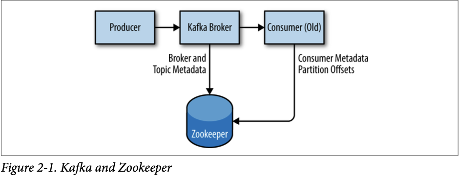

## First Things First

### Choosing an Operating System

Apache Kafka là một ứng dụng được viết bằng Java và có thể chạy trên nhiều hệ điều hành. Điều này bao gồm Windows, MacOS, Linux và các hệ điều hành khác. 
Các bước cài đặt trong chương này sẽ tập trung vào thiết lập và sử dụng Kafka trên môi trường Linux, vì đây là hệ điều hành phổ biến nhất mà Kafka được cài đặt.
Đây cũng là hệ điều hành được khuyến khích để triển khai Kafka cho mục đích sử dụng chung. Để biết thông tin về cách cài đặt Kafka trên Windows và MacOS, xin xem Phụ lục A.

### Installing Java

Trước khi cài đặt Zookeeper hoặc Kafka, bạn cần có môi trường Java đã được thiết lập và hoạt động. 
Bạn nên sử dụng phiên bản Java 8 và có thể là phiên bản được cung cấp bởi hệ điều hành của bạn hoặc tải trực tiếp từ java.com.
Mặc dù Zookeeper và Kafka có thể hoạt động với phiên bản chỉ chạy của Java (JRE), nhưng khi phát triển công cụ và ứng dụng,
có thể thuận tiện hơn khi sử dụng Java Development Kit (JDK) đầy đủ. Các bước cài đặt sẽ giả định rằng bạn đã cài đặt JDK phiên bản 8 cập nhật 51 trong đường dẫn /usr/java/jdk1.8.0_51.

### Installing Zookeeper

Apache Kafka sử dụng Zookeeper để lưu trữ siêu dữ liệu về cụm Kafka, cũng như chi tiết khách hàng tiêu thụ, như được thể
hiện trong Hình 2-1. Mặc dù có thể chạy một máy chủ Zookeeper bằng cách sử dụng các tập lệnh có trong bản phân phối Kafka,
nhưng việc cài đặt một phiên bản đầy đủ của Zookeeper từ bản phân phối là một công việc đơn giản.



Kafka đã được kiểm thử một cách cẩn thận với phiên bản ổn định 3.4.6 của Zookeeper, có thể tải về từ apache.org tại địa chỉ http://bit.ly/2sDWSgJ.

#### Standalone Server

Đoạn sau đây là một hướng dẫn giả định để cài đặt Zookeeper với cấu hình cơ bản trong thư mục /usr/local/zookeeper và lưu dữ liệu trong /var/lib/zookeeper:

```
# tar -zxf zookeeper-3.4.6.tar.gz
# mv zookeeper-3.4.6 /usr/local/zookeeper
# mkdir -p /var/lib/zookeeper
# cat > /usr/local/zookeeper/conf/zoo.cfg << EOF
> tickTime=2000
> dataDir=/var/lib/zookeeper
> clientPort=2181
> EOF
# export JAVA_HOME=/usr/java/jdk1.8.0_51
# /usr/local/zookeeper/bin/zkServer.sh start
JMX enabled by default
Using config: /usr/local/zookeeper/bin/../conf/zoo.cfg Starting zookeeper ... STARTED
#
```

Bạn có thể xác minh rằng Zookeeper đang chạy đúng chế độ standalone bằng cách kết nối tới cổng client và gửi lệnh bốn ký tự srvr:

```
# telnet localhost 2181 Trying ::1...
Connected to localhost. Escape character is '^]'. srvr
Zookeeper version: 3.4.6-1569965, built on 02/20/2014 09:09 GMT
Latency min/avg/max: 0/0/0
Received: 1
Sent: 0
Connections: 1
Outstanding: 0
Zxid: 0x0
Mode: standalone
Node count: 4
Connection closed by foreign host. #
```

#### Zookeeper ensemble

Một cụm Zookeeper được gọi là một ensemble. Do thuật toán sử dụng, được khuyến khích là ensemble nên chứa một số lẻ các 
máy chủ (ví dụ: 3, 5, vv.) vì phần lớn các thành viên trong ensemble (một quorum) phải hoạt động để Zookeeper có thể đáp 
ứng các yêu cầu. Điều này có nghĩa là trong một ensemble ba node, bạn có thể hoạt động khi thiếu một node. Với ensemble 
năm node, bạn có thể hoạt động khi thiếu hai node.

Để cấu hình các máy chủ Zookeeper trong một ensemble, chúng phải có một cấu hình chung liệt kê tất cả các máy chủ, và
mỗi máy chủ cần có một tệp myid trong thư mục dữ liệu chỉ định số ID của máy chủ đó. Nếu tên máy chủ trong ensemble là 
zoo1.example.com, zoo2.example.com và zoo3.example.com, tệp cấu hình có thể như sau:

```
tickTime=2000
dataDir=/var/lib/zookeeper
clientPort=2181
initLimit=5
syncLimit=2
server.1=zoo1.example.com:2888:3888
server.2=zoo2.example.com:2888:3888
server.3=zoo3.example.com:2888:3888
```

Trong cấu hình này, `initLimit` là thời gian cho phép các follower kết nối với một leader. Giá trị `syncLimit` giới hạn 
mức độ không đồng bộ của các follower so với leader. Cả hai giá trị này được tính bằng đơn vị `tickTime`, vì vậy `initLimit`
là 20 * 2000 ms, tức là 40 giây. Cấu hình cũng liệt kê từng máy chủ trong ensemble. Các máy chủ được chỉ định theo định dạng `server.X=hostname:peerPort:leaderPort`, 
với các tham số sau đây:

- `X`: Số ID của máy chủ. Giá trị này phải là một số nguyên, nhưng không cần phải dựa trên số 0 hoặc tuần tự.
- `hostname`: Tên máy chủ hoặc địa chỉ IP của máy chủ.
- `peerPort`: Cổng TCP mà các máy chủ trong ensemble sử dụng để giao tiếp với nhau.
- `leaderPort`: Cổng TCP dùng cho việc bầu chọn leader.

Các client chỉ cần kết nối qua `clientPort`, nhưng các thành viên trong ensemble phải có khả năng giao tiếp với nhau qua ba cổng này.

Ngoài tệp cấu hình chia sẻ, mỗi máy chủ phải có một tệp trong thư mục `dataDir` với tên là `myid`. Tệp này phải chứa số ID của máy chủ, phải khớp với cấu hình trong tệp cấu hình. Sau khi hoàn thành các bước này, các máy chủ sẽ khởi động và giao tiếp với nhau trong ensemble.

### Installing a Kafka Broker

Sau khi đã cấu hình Java và Zookeeper, bạn sẵn sàng để cài đặt Apache Kafka. Phiên bản hiện tại của Kafka có thể được tải về tại http://kafka.apache.org/downloads.html. Tại thời điểm in sách, phiên bản đó là 0.9.0.1 chạy trên Scala version 2.11.0.

Ví dụ sau cài đặt Kafka trong thư mục /usr/local/kafka, được cấu hình để sử dụng máy chủ Zookeeper đã khởi động trước đó và lưu trữ các đoạn nhật ký tin nhắn trong /tmp/kafka-logs:

```bash
# tar -zxf kafka_2.11-0.9.0.1.tgz
# mv kafka_2.11-0.9.0.1 /usr/local/kafka
# mkdir /tmp/kafka-logs
# export JAVA_HOME=/usr/java/jdk1.8.0_51
# /usr/local/kafka/bin/kafka-server-start.sh -daemon /usr/local/kafka/config/server.properties
```

Sau khi Kafka broker đã được khởi động, chúng ta có thể xác nhận rằng nó đang hoạt động bằng cách thực hiện một số hoạt động đơn giản với cluster như tạo một chủ đề thử nghiệm, sản xuất một số thông điệp và tiêu thụ các thông điệp đó.

Đầu tiên, tạo và xác nhận một chủ đề thử nghiệm:

```bash
# /usr/local/kafka/bin/kafka-topics.sh --create --zookeeper localhost:2181 --replication-factor 1 --partitions 1 --topic test
Created topic "test".
# /usr/local/kafka/bin/kafka-topics.sh --describe --zookeeper localhost:2181 --topic test
Topic:test    PartitionCount:1    ReplicationFactor:1    Configs:
    Topic: test    Partition: 0    Leader: 0    Replicas: 0    Isr: 0
```

Sau đó, sản xuất các thông điệp vào chủ đề thử nghiệm:

```bash
# /usr/local/kafka/bin/kafka-console-producer.sh --broker-list localhost:9092 --topic test
Test Message 1
Test Message 2
^D
```

Cuối cùng, tiêu thụ các thông điệp từ chủ đề thử nghiệm:

```bash
# /usr/local/kafka/bin/kafka-console-consumer.sh --bootstrap-server localhost:9092 --topic test --from-beginning
Test Message 1
Test Message 2
^C
Consumed 2 messages
```

Ở đây:
- Lệnh `kafka-topics.sh --create` tạo một chủ đề mới có tên là "test" với yêu cầu sao chép mức độ 1 (replication-factor 1) và một phân vùng (partitions 1).
- Lệnh `kafka-topics.sh --describe` mô tả chi tiết về chủ đề "test" đã tạo.
- Lệnh `kafka-console-producer.sh` cho phép sản xuất các thông điệp vào chủ đề "test".
- Lệnh `kafka-console-consumer.sh` tiêu thụ và hiển thị các thông điệp từ chủ đề "test".

Các thông điệp đã được sản xuất và tiêu thụ thành công từ chủ đề "test".

### Broker Configuration

Cấu hình mẫu được cung cấp cùng với bản phân phối Kafka là đủ để chạy một máy chủ đơn lẻ như một bằng chứng thực của khái niệm, nhưng nó sẽ không đủ cho hầu hết các cài đặt. Có nhiều tùy chọn cấu hình cho Kafka điều khiển tất cả các khía cạnh của thiết lập và điều chỉnh. Nhiều tùy chọn có thể để mặc định, vì chúng đối phó với các khía cạnh điều chỉnh của broker Kafka sẽ không áp dụng cho đến khi bạn có một trường hợp sử dụng cụ thể để làm việc và một trường hợp sử dụng cụ thể đòi hỏi điều chỉnh các thiết lập này.

#### General Broker

Có một số cấu hình broker mà bạn nên xem xét khi triển khai Kafka cho bất kỳ môi trường nào ngoài một broker đơn lẻ trên một máy chủ duy nhất. Các tham số này liên quan đến cấu hình cơ bản của broker và hầu hết các tham số này phải được thay đổi để chạy đúng trong một cụm với các broker khác.

##### broker.id

Mỗi broker Kafka phải có một định danh số nguyên, được thiết lập bằng cấu hình broker.id. Mặc định, số nguyên này được đặt là 0, nhưng có thể là bất kỳ giá trị nào. Quan trọng nhất là số nguyên này phải là duy nhất trong một cụm Kafka duy nhất. Việc lựa chọn số này là tùy ý, và nó có thể được di chuyển giữa các broker nếu cần thiết cho các nhiệm vụ bảo trì. Một hướng dẫn tốt là đặt giá trị này thành một điều gì đó có liên quan đến máy chủ để khi thực hiện bảo trì, việc ánh xạ số ID broker thành máy chủ không gây khó khăn. Ví dụ, nếu tên miền của bạn chứa một số duy nhất (như host1.example.com, host2.example.com, vv.), đó là một lựa chọn tốt cho giá trị broker.id.

##### port

Tập tin cấu hình mẫu khởi động Kafka với một trình nghe trên cổng TCP 9092. Có thể thiết lập thành bất kỳ cổng nào có sẵn bằng cách thay đổi tham số cấu hình cổng. Hãy nhớ rằng nếu chọn một cổng nhỏ hơn 1024, Kafka phải được khởi động với quyền root. Tuy nhiên, chạy Kafka với quyền root không phải là một cấu hình được khuyến khích.

##### zookeeper.connect

Vị trí của Zookeeper được sử dụng để lưu trữ siêu dữ liệu của broker được thiết lập bằng tham số cấu hình zookeeper.connect. Cấu hình mẫu sử dụng một Zookeeper chạy trên cổng 2181 trên máy localhost, được chỉ định là localhost:2181. Định dạng cho tham số này là một chuỗi các chuỗi hostname:port/path được phân tách bằng dấu chấm phẩy, bao gồm:

- hostname: tên máy chủ hoặc địa chỉ IP của máy chủ Zookeeper.
- port: số cổng client cho máy chủ.
- /path: một đường dẫn Zookeeper tùy chọn để sử dụng như môi trường chroot cho cụm Kafka. Nếu nó được bỏ qua, đường dẫn gốc sẽ được sử dụng.

Nếu một đường dẫn chroot được chỉ định và không tồn tại, nó sẽ được tạo ra bởi broker khi nó khởi động.

##### log.dirs

Kafka lưu trữ tất cả các thông điệp vào đĩa, và các đoạn nhật ký này được lưu trong các thư mục được chỉ định trong cấu hình log.dirs. Đây là một danh sách các đường dẫn phân cách bằng dấu phẩy trên hệ thống cục bộ. Nếu có nhiều hơn một đường dẫn được chỉ định, broker sẽ lưu trữ các partition trên chúng theo cách "ít được sử dụng nhất", với các đoạn nhật ký của một partition được lưu trong cùng một đường dẫn. Lưu ý rằng broker sẽ đặt một partition mới vào đường dẫn có ít partition nhất hiện tại được lưu trữ trong đó, chứ không phải là đường dẫn có ít dung lượng đĩa được sử dụng nhất trong các tình huống sau:

###### num.recovery.threads.per.data.dir

Kafka sử dụng một pool luồng có thể cấu hình để xử lý các đoạn nhật ký. Hiện tại, pool luồng này được sử dụng:

- Khi khởi động bình thường, để mở các đoạn nhật ký của mỗi partition.
- Khi khởi động sau khi xảy ra lỗi, để kiểm tra và cắt ngắn các đoạn nhật ký của mỗi partition.
- Khi tắt, để đóng sạch các đoạn nhật ký.

Mặc định, chỉ có một luồng cho mỗi thư mục nhật ký được sử dụng. Vì các luồng này chỉ được sử dụng trong quá trình khởi động và tắt, nên hợp lý là cài đặt một số luồng lớn hơn để song song hóa các hoạt động. Cụ thể, khi phục hồi từ một sự cố tắt máy không đúng cách, điều này có thể làm chênh lệch nhiều giờ khi khởi động lại một broker với một số lượng partition lớn! Khi cài đặt tham số này, hãy nhớ rằng số lượng được cấu hình là cho mỗi thư mục nhật ký được chỉ định trong log.dirs. Điều này có nghĩa là nếu num.recovery.threads.per.data.dir được cài đặt là 8 và có 3 đường dẫn được chỉ định trong log.dirs, tổng cộng sẽ là 24 luồng.

###### auto.create.topics.enable

Cấu hình mặc định của Kafka chỉ định rằng broker sẽ tự động tạo một topic trong các trường hợp sau:

- Khi một producer bắt đầu ghi các tin nhắn vào topic đó.
- Khi một consumer bắt đầu đọc các tin nhắn từ topic đó.
- Khi bất kỳ client nào yêu cầu metadata cho topic.

Trong nhiều tình huống, điều này có thể là hành vi không mong muốn, đặc biệt khi không có cách nào để xác minh sự tồn tại của một topic thông qua giao thức Kafka mà không làm cho nó được tạo ra. Nếu bạn đang quản lý việc tạo topic một cách rõ ràng, bằng cách thủ công hoặc thông qua hệ thống cấp phát, bạn có thể cài đặt cấu hình auto.create.topics.enable thành false.
