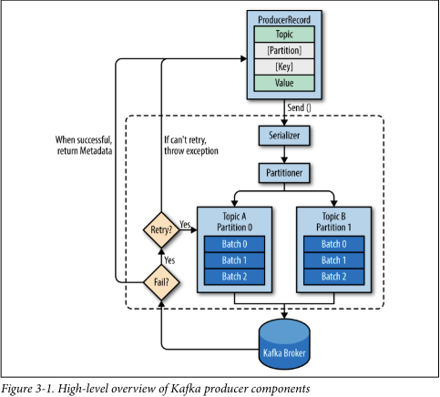
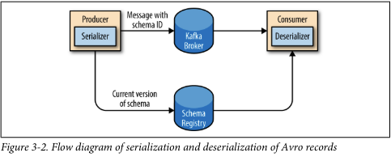

Cho dù bạn sử dụng Kafka như một hàng đợi, hệ thống truyền tin hoặc nền tảng lưu trữ dữ liệu, bạn luôn sử dụng Kafka bằng cách viết một producer ghi dữ liệu vào Kafka, một consumer đọc dữ liệu từ Kafka, hoặc một ứng dụng đảm nhận cả hai vai trò.

Ví dụ, trong một hệ thống xử lý giao dịch thẻ tín dụng, có thể có một ứng dụng khách hàng, chẳng hạn như một cửa hàng trực tuyến, chịu trách nhiệm gửi mỗi giao dịch đến Kafka ngay khi thanh toán được thực hiện. Một ứng dụng khác chịu trách nhiệm kiểm tra giao dịch này ngay lập tức với một hệ thống luật và xác định xem giao dịch có được phê duyệt hay từ chối. Phản hồi phê duyệt/từ chối có thể được ghi lại vào Kafka và phản hồi có thể lan truyền lại cửa hàng trực tuyến nơi giao dịch được khởi tạo. Một ứng dụng thứ ba có thể đọc cả hai giao dịch và trạng thái phê duyệt từ Kafka và lưu trữ chúng vào cơ sở dữ liệu, nơi các nhà phân tích có thể xem xét lại các quyết định và có thể cải thiện hệ thống luật.

Apache Kafka đi kèm với các API client tích hợp sẵn mà các nhà phát triển có thể sử dụng khi phát triển các ứng dụng tương tác với Kafka.

Trong chương này, chúng ta sẽ tìm hiểu cách sử dụng Kafka producer, bắt đầu từ tổng quan về thiết kế và các thành phần của nó. Chúng ta sẽ chỉ ra cách tạo đối tượng KafkaProducer và ProducerRecord, cách gửi các bản ghi đến Kafka và cách xử lý các lỗi mà Kafka có thể trả về. Sau đó, chúng ta sẽ xem xét các tùy chọn cấu hình quan trọng nhất được sử dụng để điều khiển hành vi của producer. Chúng ta sẽ kết thúc bằng một cái nhìn sâu hơn về cách sử dụng các phương pháp phân vùng và serializer khác nhau, và cách viết các serializer và partitioner của riêng bạn.

Trong Chương 4, chúng ta sẽ tìm hiểu về client consumer của Kafka và cách đọc dữ liệu từ Kafka.

```text
Ngoài các client tích hợp sẵn, Kafka còn có một giao thức dây chuyền nhị phân.
Điều này có nghĩa là các ứng dụng có thể đọc các thông điệp từ Kafka hoặc ghi các thông điệp vào Kafka chỉ bằng cách gửi chuỗi byte đúng đắn tới cổng mạng của Kafka. Có nhiều client thực hiện giao thức dây chuyền nhị phân của Kafka trong các ngôn ngữ lập trình khác nhau, cung cấp cách sử dụng Kafka đơn giản không chỉ trong các ứng dụng Java mà còn trong các ngôn ngữ như C++, Python, Go, và nhiều ngôn ngữ khác. Các client này không phải là một phần của dự án Apache Kafka, nhưng danh sách các client không phải Java được duy trì trên wiki của dự án. Giao thức dây chuyền và các client bên ngoài không nằm trong phạm vi của chương này.
```

## Producer Overview

Có nhiều lý do mà một ứng dụng có thể cần ghi các thông điệp vào Kafka: ghi lại các hoạt động của người dùng để kiểm tra hoặc phân tích, ghi lại các chỉ số, lưu trữ các thông điệp nhật ký, ghi lại thông tin từ các thiết bị thông minh, giao tiếp bất đồng bộ với các ứng dụng khác, đệm thông tin trước khi ghi vào cơ sở dữ liệu, và nhiều hơn thế nữa.

Những trường hợp sử dụng đa dạng này cũng đồng nghĩa với các yêu cầu đa dạng: liệu mỗi thông điệp có quan trọng không, hay chúng ta có thể chấp nhận mất thông điệp? Chúng ta có thể chấp nhận sự trùng lặp thông điệp một cách ngẫu nhiên không? Có bất kỳ yêu cầu nào về độ trễ hoặc thông lượng nghiêm ngặt mà chúng ta cần hỗ trợ không?

Trong ví dụ xử lý giao dịch thẻ tín dụng mà chúng ta đã giới thiệu trước đó, ta có thể thấy rằng việc không bao giờ mất một thông điệp nào và không trùng lặp thông điệp nào là rất quan trọng. Độ trễ nên thấp nhưng có thể chấp nhận được độ trễ lên đến 500ms, và thông lượng nên rất cao — chúng ta dự đoán xử lý lên đến một triệu thông điệp mỗi giây.

Một trường hợp sử dụng khác có thể là lưu trữ thông tin click từ một trang web. Trong trường hợp đó, có thể chấp nhận mất một số thông điệp hoặc một số trùng lặp; độ trễ có thể cao miễn là không ảnh hưởng đến trải nghiệm người dùng. Nói cách khác, chúng ta không quan tâm nếu mất vài giây để thông điệp đến Kafka, miễn là trang web tải ngay lập tức sau khi người dùng nhấp vào một liên kết. Thông lượng sẽ phụ thuộc vào mức độ hoạt động dự kiến trên trang web của chúng ta.

Những yêu cầu khác nhau sẽ ảnh hưởng đến cách bạn sử dụng API producer để ghi các thông điệp vào Kafka và cấu hình bạn sử dụng.

Mặc dù các API producer rất đơn giản, có một chút điều gì đó xảy ra dưới nắp của producer khi chúng ta gửi dữ liệu. Hình 3-1 cho thấy các bước chính liên quan đến việc gửi dữ liệu đến Kafka.



Chúng ta bắt đầu sản xuất các thông điệp vào Kafka bằng cách tạo một ProducerRecord, trong đó phải bao gồm chủ đề mà chúng ta muốn gửi bản ghi đến và giá trị của nó. Tùy chọn, chúng ta cũng có thể chỉ định một khóa và/hoặc một phân vùng. Sau khi gửi ProducerRecord, điều đầu tiên mà producer làm là tuần tự hóa các đối tượng khóa và giá trị thành ByteArray để chúng có thể được gửi qua mạng.

Tiếp theo, dữ liệu được gửi đến bộ phân vùng. Nếu chúng ta đã chỉ định một phân vùng trong ProducerRecord, bộ phân vùng sẽ không làm gì cả và đơn giản trả về phân vùng mà chúng ta đã chỉ định. Nếu chúng ta không chỉ định, bộ phân vùng sẽ chọn một phân vùng cho chúng ta, thường dựa trên khóa của ProducerRecord. Khi đã chọn một phân vùng, producer biết chắc chắn rằng bản ghi sẽ được gửi đến chủ đề và phân vùng nào. Sau đó, nó thêm bản ghi vào một lô bản ghi sẽ được gửi đến cùng một chủ đề và phân vùng đó. Một luồng xử lý riêng biệt có trách nhiệm gửi các lô bản ghi đó đến các broker Kafka phù hợp.

Khi broker nhận được các thông điệp, nó sẽ gửi lại một phản hồi. Nếu các thông điệp được ghi thành công vào Kafka, nó sẽ trả về một đối tượng RecordMetadata với thông tin về chủ đề, phân vùng và vị trí (offset) của bản ghi trong phân vùng. Nếu broker không thể ghi các thông điệp, nó sẽ trả về một lỗi. Khi producer nhận được một lỗi, nó có thể thử gửi lại thông điệp vài lần nữa trước khi từ bỏ và trả về một lỗi.

## Constructing a Kafka Producer

Bước đầu tiên khi viết các thông điệp vào Kafka là tạo một đối tượng producer với các thuộc tính mà bạn muốn chuyển đến producer. Một producer Kafka có ba thuộc tính bắt buộc sau:

**bootstrap.servers**
Danh sách các cặp host:port của các broker mà producer sẽ sử dụng để thiết lập kết nối ban đầu đến cụm Kafka. Danh sách này không cần phải bao gồm tất cả các broker, vì producer sẽ nhận được nhiều thông tin hơn sau kết nối ban đầu. Tuy nhiên, nên đưa ít nhất hai broker vào danh sách này để khi một broker bị ngừng hoạt động, producer vẫn có thể kết nối với cụm.

**key.serializer**
Tên của một lớp sẽ được sử dụng để tuần tự hóa các khóa của các bản ghi mà chúng ta sẽ sản xuất đến Kafka. Các broker Kafka mong đợi các mảng byte làm khóa và giá trị của các thông điệp. Tuy nhiên, giao diện producer cho phép, bằng cách sử dụng các loại tham số hóa, bất kỳ đối tượng Java nào cũng có thể được gửi như một khóa và giá trị. Điều này làm cho mã nguồn rất dễ đọc, nhưng nó cũng có nghĩa là producer phải biết cách chuyển đổi các đối tượng này thành mảng byte. key.serializer nên được thiết lập thành tên của một lớp thực hiện giao diện org.apache.kafka.common.serialization.Serializer. Producer sẽ sử dụng lớp này để tuần tự hóa đối tượng khóa thành một mảng byte. Gói Kafka client bao gồm ByteArraySerializer (không làm nhiều), StringSerializer và IntegerSerializer, vì vậy nếu sử dụng các loại thông thường, không cần phải triển khai serializer riêng của bạn. Thiết lập key.serializer là bắt buộc ngay cả khi bạn chỉ định gửi giá trị.

**value.serializer**
Tên của một lớp sẽ được sử dụng để tuần tự hóa các giá trị của các bản ghi mà chúng ta sẽ sản xuất đến Kafka. Tương tự như bạn thiết lập key.serializer thành tên của một lớp sẽ tuần tự hóa đối tượng khóa tin nhắn thành một mảng byte, bạn thiết lập value.serializer thành một lớp sẽ tuần tự hóa đối tượng giá trị tin nhắn.

Đoạn mã sau đây cho thấy cách tạo một producer mới chỉ bằng cách thiết lập các tham số bắt buộc và sử dụng giá trị mặc định cho các thiết lập còn lại:

```java
private Properties kafkaProps = new Properties();
kafkaProps.put("bootstrap.servers", "broker1:9092,broker2:9092");
kafkaProps.put("key.serializer", "org.apache.kafka.common.serialization.StringSerializer");
kafkaProps.put("value.serializer", "org.apache.kafka.common.serialization.StringSerializer");
producer = new KafkaProducer<String, String>(kafkaProps);
```

Chúng ta bắt đầu bằng một đối tượng Properties.

Vì chúng ta dự định sử dụng chuỗi cho cả khóa và giá trị của thông điệp, nên chúng ta sử dụng StringSerializer tích hợp sẵn.

Ở đây, chúng ta tạo một producer mới bằng cách thiết lập các loại khóa và giá trị thích hợp và truyền đối tượng Properties.

Với giao diện đơn giản như vậy, rõ ràng rằng hầu hết các điều khiển về hành vi producer đều được thực hiện bằng cách thiết lập các thuộc tính cấu hình chính xác. Tài liệu Apache Kafka bao gồm tất cả các tùy chọn cấu hình, và chúng ta sẽ đi qua những tùy chọn quan trọng sau trong chương này.

Khi chúng ta khởi tạo một producer, đến lúc bắt đầu gửi các thông điệp. Có ba phương pháp chính để gửi các thông điệp:

- Fire-and-forget (Gửi và quên):
  Chúng ta gửi một thông điệp đến máy chủ và không quan tâm nếu nó đến thành công hay không. Hầu hết các trường hợp, nó sẽ đến thành công, vì Kafka có tính sẵn sàng cao và producer sẽ tự động thử lại việc gửi thông điệp. Tuy nhiên, một số thông điệp sẽ bị mất khi sử dụng phương pháp này.

- Gửi đồng bộ:
  Chúng ta gửi một thông điệp, phương thức send() trả về một đối tượng Future, và chúng ta sử dụng get() để đợi future và xem xem send() có thành công hay không.

- Gửi bất đồng bộ:
  Chúng ta gọi phương thức send() với một hàm callback, được kích hoạt khi nhận được phản hồi từ broker Kafka.

Trong các ví dụ tiếp theo, chúng ta sẽ thấy cách gửi thông điệp bằng các phương pháp này và cách xử lý các loại lỗi khác nhau có thể xảy ra.

Mặc dù tất cả các ví dụ trong chương này đều là đơn luồng, một đối tượng producer có thể được sử dụng bởi nhiều luồng để gửi các thông điệp. Bạn có thể bắt đầu với một producer và một luồng. Nếu bạn cần tăng hiệu suất, bạn có thể thêm nhiều luồng sử dụng cùng một producer. Khi điều này không còn tăng hiệu suất nữa, bạn có thể thêm nhiều producer vào ứng dụng để đạt được hiệu suất cao hơn.

## Sending a Message to Kafka

Cách đơn giản nhất để gửi một thông điệp là như sau:
```java
ProducerRecord<String, String> record = new ProducerRecord<>("CustomerCountry", "Precision Products", "France");
try {
    producer.send(record);
} catch (Exception e) {
    e.printStackTrace();
}
```

Producer (người sản xuất) chấp nhận các đối tượng ProducerRecord, vì vậy chúng ta bắt đầu bằng cách tạo một đối tượng ProducerRecord.
ProducerRecord có nhiều hàm tạo, chúng ta sẽ thảo luận về các hàm tạo này sau. Ở đây, chúng ta sử dụng một hàm tạo yêu cầu tên của chủ đề mà chúng ta đang gửi dữ liệu tới, luôn luôn là một chuỗi, và khóa và giá trị mà chúng ta đang gửi tới Kafka, trong trường hợp này cũng là các chuỗi. Các loại của khóa và giá trị phải phù hợp với bộ giải mã và nhà sản xuất của chúng tôi.
Chúng tôi sử dụng phương thức send() của đối tượng producer để gửi ProducerRecord. Như chúng ta đã thấy trong biểu đồ kiến trúc producer trong Hình 3-1, thông điệp sẽ được đặt trong bộ đệm và sẽ được gửi đến broker trong một luồng riêng biệt. Phương thức send() trả về một đối tượng Future của Java với RecordMetadata, nhưng vì chúng tôi đơn giản là bỏ qua giá trị được trả về, chúng tôi không biết được thông điệp đã được gửi thành công hay không. Phương pháp gửi thông điệp này có thể được sử dụng khi thả một thông điệp mà không cần thông báo. Điều này thường không phải là trường hợp trong các ứng dụng sản xuất.
Mặc dù chúng tôi bỏ qua các lỗi có thể xảy ra trong quá trình gửi các thông điệp đến các broker Kafka hoặc trong chính các broker đó, chúng tôi vẫn có thể gặp phải một ngoại lệ nếu producer gặp phải lỗi trước khi gửi thông điệp đến Kafka. Các lỗi này có thể là SerializationException khi không thể trình bày thông điệp, BufferExhaustedException hoặc TimeoutException nếu bộ đệm đầy, hoặc InterruptException nếu luồng gửi bị gián đoạn.

### Sending a Message Synchronously

Cách đơn giản nhất để gửi một thông điệp đồng bộ là như sau:
```java
ProducerRecord<String, String> record = new ProducerRecord<>("CustomerCountry", "Precision Products", "France");
try {
    producer.send(record).get();
} catch (Exception e) {}
```

Ở đây, chúng ta sử dụng Future.get() để chờ phản hồi từ Kafka. Phương thức này sẽ ném ra một ngoại lệ nếu thông điệp không được gửi thành công đến Kafka. Nếu không có lỗi nào xảy ra, chúng ta sẽ nhận được một đối tượng RecordMetadata mà chúng ta có thể sử dụng để lấy offset mà thông điệp đã được ghi vào.
Nếu có bất kỳ lỗi nào xảy ra trước khi gửi dữ liệu đến Kafka, trong quá trình gửi, nếu các broker Kafka trả về các ngoại lệ không thể thử lại hoặc nếu chúng ta đã cạn kiệt số lần thử lại có sẵn, chúng ta sẽ gặp phải một ngoại lệ. Trong trường hợp này, chúng ta chỉ in ra bất kỳ ngoại lệ nào chúng ta gặp phải.

KafkaProducer có hai loại lỗi. Các lỗi có thể thử lại là những lỗi có thể được giải quyết bằng cách gửi lại thông điệp. Ví dụ, một lỗi kết nối có thể được giải quyết vì kết nối có thể được thiết lập lại. Một lỗi "không có nhà lãnh đạo" có thể được giải quyết khi một nhà lãnh đạo mới được bầu chọn cho phân vùng. KafkaProducer có thể được cấu hình để tự động thử lại các lỗi này, vì vậy mã ứng dụng sẽ nhận được các ngoại lệ có thể thử lại chỉ khi số lần thử lại đã cạn kiệt và lỗi không được giải quyết. Một số lỗi sẽ không được giải quyết bằng cách thử lại. Ví dụ, "kích thước thông điệp quá lớn." Trong những trường hợp này, KafkaProducer sẽ không cố gắng thử lại và sẽ trả về ngoại lệ ngay lập tức.

### Sending a Message Asynchronously

Here's the continuation of the translation:

```java
private class DemoProducerCallback implements Callback {
    @Override
    public void onCompletion(RecordMetadata recordMetadata, Exception e) {
        if (e != null) {
            e.printStackTrace();
        }
    }
}
```
```java
ProducerRecord<String, String> record = new ProducerRecord<>("CustomerCountry", "Biomedical Materials", "USA");
producer.send(record, new DemoProducerCallback());
```

Để sử dụng callback, bạn cần một lớp implement interface `org.apache.kafka.clients.producer.Callback`, với một phương thức duy nhất là `onCompletion()`.

Nếu Kafka trả về một lỗi, `onCompletion()` sẽ có một ngoại lệ khác null. Ở đây chúng tôi "xử lý" nó bằng cách in ra, nhưng mã sản xuất có thể có các chức năng xử lý lỗi mạnh mẽ hơn.

Các bản ghi vẫn giống như trước.

Và chúng tôi chuyển một đối tượng Callback khi gửi bản ghi.

## Configuring Producers

Cho đến nay, chúng ta đã thấy rất ít các tham số cấu hình cho các producer — chỉ là URI `bootstrap.servers` bắt buộc và các serializer.

Producer có một số lượng lớn các tham số cấu hình; hầu hết được ghi chép trong tài liệu của Apache Kafka và nhiều tham số có các giá trị mặc định hợp lý nên không cần thiết phải điều chỉnh từng tham số. Tuy nhiên, một số tham số có ảnh hưởng đáng kể đến việc sử dụng bộ nhớ, hiệu suất và độ tin cậy của các producer. Chúng ta sẽ xem xét những tham số đó ở đây.

#### acks

Tham số `acks` kiểm soát số lượng bản sao phân vùng phải nhận được bản ghi trước khi producer có thể coi việc ghi là thành công. Tùy chọn này có ảnh hưởng đáng kể đến khả năng mất tin nhắn. Có ba giá trị được phép cho tham số `acks`:

- Nếu `acks=0`, producer sẽ không chờ phản hồi từ broker trước khi cho rằng tin nhắn đã được gửi thành công. Điều này có nghĩa là nếu có điều gì đó sai sót và broker không nhận được tin nhắn, producer sẽ không biết và tin nhắn sẽ bị mất. Tuy nhiên, vì producer không chờ phản hồi từ server, nó có thể gửi tin nhắn nhanh nhất có thể theo hỗ trợ của mạng, vì vậy cài đặt này có thể được sử dụng để đạt được thông lượng rất cao.

- Nếu `acks=1`, producer sẽ nhận được phản hồi thành công từ broker ngay khi bản sao lãnh đạo nhận được tin nhắn. Nếu tin nhắn không thể được ghi vào lãnh đạo (ví dụ: nếu lãnh đạo bị sập và một lãnh đạo mới chưa được bầu chọn), producer sẽ nhận được phản hồi lỗi và có thể thử gửi lại tin nhắn, tránh được khả năng mất dữ liệu. Tin nhắn vẫn có thể bị mất nếu lãnh đạo bị sập và một bản sao không có tin nhắn này được bầu chọn làm lãnh đạo mới (thông qua bầu chọn lãnh đạo không sạch). Trong trường hợp này, thông lượng phụ thuộc vào việc chúng ta gửi tin nhắn đồng bộ hay không đồng bộ. Nếu mã khách hàng của chúng ta chờ phản hồi từ server (bằng cách gọi phương thức `get()` của đối tượng Future được trả về khi gửi tin nhắn), nó sẽ tăng độ trễ đáng kể (ít nhất là một vòng lặp mạng). Nếu khách hàng sử dụng callback, độ trễ sẽ được ẩn, nhưng thông lượng sẽ bị giới hạn bởi số lượng tin nhắn đang bay (tức là, số lượng tin nhắn mà producer sẽ gửi trước khi nhận được phản hồi từ server).

- Nếu `acks=all`, producer sẽ nhận được phản hồi thành công từ broker một khi tất cả các bản sao đồng bộ đã nhận được tin nhắn. Đây là chế độ an toàn nhất vì bạn có thể đảm bảo rằng hơn một broker đã nhận được tin nhắn và tin nhắn sẽ tồn tại ngay cả trong trường hợp bị sập. Tuy nhiên, độ trễ chúng ta đã thảo luận trong trường hợp `acks=1` sẽ còn cao hơn, vì chúng ta sẽ chờ đợi nhiều hơn chỉ một broker để nhận được tin nhắn.

#### buffer.memory

Tham số này đặt lượng bộ nhớ mà producer sẽ sử dụng để đệm các tin nhắn chờ được gửi đến các broker. Nếu tin nhắn được gửi bởi ứng dụng nhanh hơn so với tốc độ có thể được chuyển đến server, producer có thể hết không gian và các lệnh gọi `send()` bổ sung sẽ bị chặn hoặc ném ra một ngoại lệ, dựa trên tham số `block.on.buffer.full` (được thay thế bằng `max.block.ms` trong phiên bản 0.9.0.0, cho phép chặn trong một khoảng thời gian nhất định và sau đó ném ra một ngoại lệ).

#### compression.type

Mặc định, các tin nhắn được gửi đi không nén. Tham số này có thể được đặt thành `snappy`, `gzip`, hoặc `lz4`, trong trường hợp đó, các thuật toán nén tương ứng sẽ được sử dụng để nén dữ liệu trước khi gửi đến các broker. Nén Snappy được phát minh bởi Google để cung cấp tỷ lệ nén tốt với chi phí CPU thấp và hiệu suất tốt, vì vậy nó được khuyến nghị trong các trường hợp mà cả hiệu suất và băng thông đều quan trọng. Nén Gzip sẽ thường sử dụng nhiều CPU và thời gian hơn nhưng kết quả là tỷ lệ nén tốt hơn, vì vậy nó được khuyến nghị trong các trường hợp băng thông mạng bị hạn chế hơn. Bằng cách bật nén, bạn giảm thiểu việc sử dụng mạng và lưu trữ, điều này thường là một điểm nghẽn khi gửi tin nhắn đến Kafka.

#### retries

Khi producer nhận được một thông báo lỗi từ server, lỗi có thể là tạm thời (ví dụ: thiếu leader cho một partition). Trong trường hợp này, giá trị của tham số `retries` sẽ kiểm soát số lần producer sẽ thử gửi lại thông báo trước khi từ bỏ và thông báo cho client về sự cố. Theo mặc định, producer sẽ chờ 100ms giữa các lần thử lại, nhưng bạn có thể kiểm soát điều này bằng cách sử dụng tham số `retry.backoff.ms`. Chúng tôi khuyên bạn nên kiểm tra thời gian phục hồi từ một broker bị crash (tức là thời gian cho đến khi tất cả các partition có leader mới) và đặt số lần thử lại cùng với khoảng thời gian giữa chúng sao cho tổng thời gian dành cho việc thử lại lâu hơn thời gian mà Kafka cluster cần để phục hồi từ sự cố—nếu không, producer sẽ từ bỏ quá sớm. Không phải tất cả các lỗi đều sẽ được producer thử lại. Một số lỗi không phải là tạm thời và sẽ không gây ra việc thử lại (ví dụ: lỗi “message too large”). Nói chung, vì producer xử lý việc thử lại cho bạn, nên không cần thiết phải xử lý việc thử lại trong logic ứng dụng của bạn. Bạn nên tập trung nỗ lực vào việc xử lý các lỗi không thể thử lại hoặc các trường hợp mà các lần thử lại đã hết.

#### batch.size

Khi nhiều bản ghi được gửi đến cùng một partition, producer sẽ gom chúng lại thành từng batch. Tham số này điều khiển lượng bộ nhớ theo byte (không phải số lượng message!) sẽ được sử dụng cho mỗi batch. Khi batch đầy, tất cả các message trong batch đó sẽ được gửi đi. Tuy nhiên, điều này không có nghĩa là producer sẽ đợi cho đến khi batch đầy đủ. Producer sẽ gửi đi các batch bán đầy, thậm chí cả batch chỉ có một message. Do đó, đặt kích thước batch quá lớn sẽ không gây ra độ trễ trong việc gửi message; nó chỉ sử dụng nhiều bộ nhớ hơn cho các batch. Đặt kích thước batch quá nhỏ sẽ làm tăng overhead vì producer sẽ cần gửi các message thường xuyên hơn.

#### linger.ms

`linger.ms` điều khiển thời gian chờ để chờ thêm các message trước khi gửi batch hiện tại. KafkaProducer gửi một batch các message khi batch hiện tại đầy hoặc khi đã đạt đến giới hạn `linger.ms`. Theo mặc định, producer sẽ gửi các message ngay khi có luồng gửi sẵn sàng, ngay cả khi chỉ có một message trong batch. Bằng cách đặt `linger.ms` lớn hơn 0, chúng ta chỉ dẫn producer đợi vài mili giây để thêm các message vào batch trước khi gửi chúng tới các brokers. Điều này làm tăng độ trễ nhưng cũng tăng throughput (do gửi nhiều message cùng một lúc, giảm overhead cho mỗi message).

#### client.id

Điều này có thể là bất kỳ chuỗi nào và sẽ được các broker sử dụng để nhận diện các message được gửi từ client. Nó được sử dụng trong logging và metrics, và để áp đặt các hạn ngạch.

#### max.in.flight.requests.per.connection

Điều này kiểm soát số lượng message mà producer sẽ gửi tới server mà không nhận được phản hồi. Đặt giá trị này cao có thể làm tăng việc sử dụng bộ nhớ và cải thiện throughput, nhưng đặt quá cao có thể làm giảm throughput do quá trình batching trở nên không hiệu quả hơn. Đặt giá trị này là 1 sẽ đảm bảo rằng các message sẽ được ghi vào broker theo thứ tự chúng được gửi đi, ngay cả khi có retries xảy ra.

#### timeout.ms, request.timeout.ms, and metadata.fetch.timeout.ms

Các tham số này điều khiển thời gian mà producer sẽ chờ đợi phản hồi từ server khi gửi dữ liệu (request.timeout.ms) và khi yêu cầu metadata như các leader hiện tại cho các partition chúng ta đang ghi dữ liệu vào (metadata.fetch.timeout.ms). Nếu timeout đến mà không nhận được phản hồi, producer sẽ thử gửi lại hoặc phản hồi với một lỗi (qua exception hoặc callback gửi). Tham số timeout.ms điều khiển thời gian mà broker sẽ chờ đợi các in-sync replicas để xác nhận message để đáp ứng cấu hình acks—broker sẽ trả về một lỗi nếu thời gian timeout qua mà không có sự xác nhận cần thiết từ replicas.

#### max.block.ms

Tham số này điều khiển thời gian mà producer sẽ chặn (block) khi gọi hàm send() và khi yêu cầu metadata một cách rõ ràng thông qua partitionsFor(). Các phương thức này sẽ chặn khi bộ đệm gửi của producer đầy hoặc khi metadata không có sẵn. Khi đạt đến giới hạn max.block.ms, một timeout exception sẽ được ném ra.

#### max.request.size

Thiết lập này điều khiển kích thước của một yêu cầu produce được gửi bởi producer. Nó giới hạn cả kích thước của message lớn nhất có thể được gửi và số lượng message mà producer có thể gửi trong một yêu cầu. Ví dụ, với kích thước yêu cầu tối đa mặc định là 1 MB, message lớn nhất bạn có thể gửi là 1 MB hoặc producer có thể gom 1,000 message mỗi message có kích thước 1 KB vào một yêu cầu duy nhất. Ngoài ra, broker cũng có giới hạn riêng về kích thước của message lớn nhất mà nó sẵn lòng chấp nhận (message.max.bytes). Thường thì nên đặt các cấu hình này sao cho phù hợp với nhau, để producer sẽ không cố gắng gửi các message có kích thước mà broker sẽ từ chối.

#### receive.buffer.bytes and send.buffer.bytes

Đó là các kích thước của bộ đệm gửi (send) và nhận (receive) TCP được sử dụng bởi các socket khi ghi và đọc dữ liệu. Nếu những giá trị này được đặt là -1, hệ điều hành sẽ sử dụng các giá trị mặc định của nó. Đây là một ý tưởng tốt khi nâng cao các giá trị này khi producer hoặc consumer giao tiếp với các broker ở một trung tâm dữ liệu khác vì các liên kết mạng đó thường có độ trễ cao và băng thông thấp hơn.

```text
**Đảm bảo thứ tự**
Apache Kafka bảo toàn thứ tự của các message trong một partition. Điều này có nghĩa là nếu các message được gửi từ producer theo một thứ tự cụ thể, broker sẽ ghi chúng vào partition theo thứ tự đó và tất cả các consumer cũng sẽ đọc chúng theo thứ tự đó. Đối với một số use case, việc bảo toàn thứ tự là rất quan trọng. Chẳng hạn, có sự khác biệt lớn giữa việc gửi $100 vào tài khoản và sau đó rút tiền ra, và ngược lại! Tuy nhiên, đối với một số use case, việc bảo toàn thứ tự không quá nhạy cảm.

Đặt tham số retries không phải là không và max.in.flights.requests.per.session lớn hơn một có nghĩa là có thể broker sẽ không ghi thành công batch message đầu tiên, thành công ghi batch thứ hai (đã ở trạng thái inflight), và sau đó retry batch đầu tiên và thành công, có thể làm đảo ngược thứ tự.

Thường thì, việc đặt số retries là không phải là một lựa chọn trong một hệ thống đáng tin cậy, vì vậy nếu việc đảm bảo thứ tự là quan trọng, chúng tôi khuyên bạn nên đặt in.flight.requests.per.session=1 để đảm bảo rằng trong khi một batch message đang retry, các message bổ sung sẽ không được gửi đi (bởi vì điều này có thể làm đảo ngược thứ tự đúng). Điều này sẽ hạn chế nghiêm trọng throughput của producer, vì vậy chỉ sử dụng khi thứ tự là quan trọng.
```

## Serializers

Như đã thấy trong các ví dụ trước đó, cấu hình producer bao gồm các serializer bắt buộc.

Chúng ta đã biết cách sử dụng serializer mặc định cho chuỗi. Kafka cũng bao gồm các serializer cho số nguyên và mảng Byte, nhưng điều này không đáp ứng hầu hết các trường hợp sử dụng. Cuối cùng, bạn sẽ muốn có khả năng serialize các bản ghi phổ quát hơn.

Chúng ta sẽ bắt đầu bằng cách chỉ ra cách viết serializer của riêng bạn và sau đó giới thiệu Avro serializer là sự lựa chọn được khuyến khích.

### Custom Serializers

Khi đối tượng mà bạn cần gửi tới Kafka không phải là một chuỗi đơn giản hoặc số nguyên, bạn có hai lựa chọn: sử dụng một thư viện serialization phổ quát như Avro, Thrift, hoặc Protobuf để tạo các bản ghi, hoặc tạo một serialization tùy chỉnh cho các đối tượng bạn đang sử dụng. Chúng tôi rất khuyến khích sử dụng thư viện serialization phổ quát.

Để hiểu cách serializer hoạt động và tại sao nên sử dụng thư viện serialization, hãy xem xét những gì cần thiết để viết một custom serializer của riêng bạn.

Giả sử thay vì chỉ ghi lại tên khách hàng, bạn tạo ra một lớp đơn giản để biểu diễn thông tin khách hàng:

```java
public class Customer {
    private int customerID;
    private String customerName;

    public Customer(int ID, String name) {
        this.customerID = ID;
        this.customerName = name;
    }

    public int getID() {
        return customerID;
    }

    public String getName() {
        return customerName;
    }
}
```

Bây giờ giả sử chúng ta muốn tạo một custom serializer cho lớp này. Nó sẽ có dạng như sau:

```java
import org.apache.kafka.common.errors.SerializationException;
import org.apache.kafka.common.serialization.Serializer;

import java.nio.ByteBuffer;
import java.util.Map;

public class CustomerSerializer implements Serializer<Customer> {

    @Override
    public void configure(Map<String, ?> configs, boolean isKey) {
        // không có gì để cấu hình
    }

    @Override
    /**
     * Chúng ta đang serialize Customer như sau:
     * - 4 byte int biểu diễn customerId
     * - 4 byte int biểu diễn độ dài của customerName trong số byte UTF-8 (0 nếu name là Null)
     * - N byte biểu diễn customerName trong UTF-8
     */
    public byte[] serialize(String topic, Customer data) {
        try {
            byte[] serializedName;
            int stringSize;
            if (data == null)
                return null;
            else {
                if (data.getName() != null) {
                    serializedName = data.getName().getBytes("UTF-8");
                    stringSize = serializedName.length;
                } else {
                    serializedName = new byte[0];
                    stringSize = 0;
                }
            }

            ByteBuffer buffer = ByteBuffer.allocate(4 + 4 + stringSize);
            buffer.putInt(data.getID());
            buffer.putInt(stringSize);
            buffer.put(serializedName);

            return buffer.array();
        } catch (Exception e) {
            throw new SerializationException("Lỗi khi serialize Customer thành byte[] " + e);
        }
    }

    @Override
    public void close() {
        // không có gì để đóng
    }
}
```

Bằng cách cấu hình producer với CustomerSerializer này, bạn có thể định nghĩa ProducerRecord<String, Customer>, gửi dữ liệu Customer và truyền đối tượng Customer trực tiếp cho producer. Ví dụ này khá đơn giản, nhưng bạn có thể thấy mã nguồn rất dễ bị hỏng. Nếu chúng ta có quá nhiều khách hàng ví dụ, và cần thay đổi customerID thành Long, hoặc nếu chúng ta quyết định thêm một trường startDate vào Customer, chúng ta sẽ có một vấn đề nghiêm trọng trong việc duy trì sự tương thích giữa các message cũ và mới. Gỡ lỗi về các vấn đề tương thích giữa các phiên bản khác nhau của serializers và deserializers khá thách thức — bạn cần so sánh các mảng byte thô. Điều làm cho tình hình trở nên tồi tệ hơn nữa, nếu nhiều nhóm trong cùng một công ty kết thúc viết dữ liệu Customer vào Kafka, họ sẽ cần phải sử dụng cùng các serializers và sửa đổi mã vào cùng một thời điểm.

Vì những lý do này, chúng tôi khuyên bạn nên sử dụng các serializers và deserializers đã có như JSON, Apache Avro, Thrift, hoặc Protobuf. Trong phần tiếp theo, chúng tôi sẽ mô tả về Apache Avro và sau đó chỉ ra cách để serialize các bản ghi Avro và gửi chúng tới Kafka.

### Serializing Using Apache Avro

Apache Avro là một định dạng serialization dữ liệu độc lập ngôn ngữ. Dự án này được Doug Cutting tạo ra để cung cấp một cách để chia sẻ các tệp dữ liệu với một đám đông lớn. Dữ liệu Avro được mô tả trong một schema độc lập ngôn ngữ. Schema thường được mô tả trong JSON và serialization thường là đến các tệp nhị phân, mặc dù Avro cũng hỗ trợ serialization đến JSON.

Avro cho rằng schema phải có mặt khi đọc và viết các tệp, thường bằng cách nhúng schema trong chính các tệp đó.

Một trong những tính năng thú vị nhất của Avro, và điều làm cho nó phù hợp trong hệ thống nhắn tin như Kafka, là khi ứng dụng đang ghi các message chuyển sang một schema mới, các ứng dụng đang đọc dữ liệu vẫn có thể tiếp tục xử lý các message mà không cần thay đổi hoặc cập nhật gì.

Giả sử schema ban đầu là:

```json
{
  "namespace": "customerManagement.avro",
  "type": "record",
  "name": "Customer",
  "fields": [
    {"name": "id", "type": "int"},
    {"name": "name", "type": "string"},
    {"name": "faxNumber", "type": ["null", "string"], "default": "null"}
  ]
}
```

Các trường id và name là bắt buộc, trong khi trường faxNumber là tùy chọn và mặc định là null.

Tiếp tục dịch đoạn sau:

Chúng ta đã sử dụng schema này trong vài tháng và tạo ra vài terabytes dữ liệu trong định dạng này. Bây giờ giả sử rằng chúng ta quyết định trong phiên bản mới, chúng ta sẽ nâng cấp lên thế kỷ 21 và sẽ không bao gồm trường số fax nữa mà thay vào đó sử dụng trường email.

Schema mới sẽ là:

```json
{
  "namespace": "customerManagement.avro",
  "type": "record",
  "name": "Customer",
  "fields": [
    {"name": "id", "type": "int"},
    {"name": "name", "type": "string"},
    {"name": "email", "type": ["null", "string"], "default": "null"}
  ]
}
```

Bây giờ, sau khi nâng cấp lên phiên bản mới, các bản ghi cũ sẽ chứa "faxNumber" và các bản ghi mới sẽ chứa "email". Trong nhiều tổ chức, việc nâng cấp được thực hiện chậm rãi và kéo dài trong nhiều tháng. Vì vậy, chúng ta cần xem xét làm thế nào để các ứng dụng trước khi nâng cấp vẫn sử dụng số fax và các ứng dụng sau khi nâng cấp sử dụng email có thể xử lý tất cả các sự kiện trong Kafka.

Ứng dụng đọc dữ liệu sẽ chứa các lời gọi tới các phương thức tương tự như getName(), getId(), và getFaxNumber(). Nếu nó gặp một message được viết với schema mới, getName() và getId() sẽ tiếp tục hoạt động mà không cần sửa đổi, nhưng getFaxNumber() sẽ trả về null vì message sẽ không chứa số fax.

Giả sử bây giờ chúng ta nâng cấp ứng dụng đọc dữ liệu của mình và không còn có phương thức getFaxNumber() nữa mà thay vào đó là getEmail(). Nếu nó gặp một message được viết với schema cũ, getEmail() sẽ trả về null vì những message cũ không chứa địa chỉ email.

Ví dụ này minh họa lợi ích của việc sử dụng Avro: ngay cả khi chúng ta thay đổi schema trong các message mà không cần thay đổi tất cả các ứng dụng đọc dữ liệu, không có ngoại lệ hoặc lỗi phá vỡ xảy ra và không cần phải cập nhật đắt đỏ cho dữ liệu hiện có.

Tuy nhiên, có hai lưu ý đặc biệt trong tình huống này:
- Schema được sử dụng để ghi dữ liệu và schema mà ứng dụng đọc dữ liệu mong đợi phải tương thích. Tài liệu Avro bao gồm các quy tắc tương thích.
- Deserializer sẽ cần truy cập vào schema đã được sử dụng khi ghi dữ liệu, ngay cả khi nó khác với schema mà ứng dụng truy cập dữ liệu mong đợi. Trong các tệp Avro, schema ghi là được bao gồm trong tệp chính nó, nhưng có một cách tốt hơn để xử lý điều này cho các message Kafka. Chúng ta sẽ xem xét phương pháp đó tiếp theo.


### Using Avro Records with Kafka

Khác với các tệp Avro, trong đó việc lưu trữ toàn bộ schema trong tệp dữ liệu có một chi phí chấp nhận được, việc lưu trữ toàn bộ schema trong mỗi bản ghi thường làm tăng gấp đôi kích thước của bản ghi. Tuy nhiên, Avro vẫn yêu cầu toàn bộ schema phải có mặt khi đọc bản ghi, vì vậy chúng ta cần đặt schema ở một nơi khác. Để làm được điều này, chúng ta sử dụng một mẫu kiến trúc phổ biến và sử dụng Schema Registry. Schema Registry không phải là một phần của Apache Kafka nhưng có nhiều lựa chọn mã nguồn mở để lựa chọn. Chúng ta sẽ sử dụng Confluent Schema Registry cho ví dụ này. Bạn có thể tìm thấy mã nguồn của Schema Registry trên GitHub hoặc bạn có thể cài đặt nó như là một phần của Confluent Platform. Nếu quyết định sử dụng Schema Registry, chúng tôi khuyên bạn nên kiểm tra tài liệu hướng dẫn.

Ý tưởng là lưu trữ tất cả các schema được sử dụng để ghi dữ liệu vào Kafka trong Registry. Sau đó, chúng ta chỉ cần lưu trữ định danh của schema trong bản ghi chúng ta sản xuất vào Kafka. Các consumer sau đó có thể sử dụng định danh này để lấy bản ghi từ Schema Registry và deserialize dữ liệu. Điểm quan trọng là toàn bộ công việc này - lưu trữ schema trong registry và trích xuất khi cần thiết - được thực hiện trong các serializer và deserializer. Code sản xuất dữ liệu vào Kafka chỉ đơn giản sử dụng Avro serializer giống như sử dụng bất kỳ serializer nào khác. Hình 3-2 mô tả quy trình này.



Dưới đây là một ví dụ về cách sản xuất các đối tượng Avro được tạo ra đến Kafka (xem Tài liệu Avro để biết cách sử dụng mã code với Avro):

```java
Properties props = new Properties();
props.put("bootstrap.servers", "localhost:9092");
props.put("key.serializer", "io.confluent.kafka.serializers.KafkaAvroSerializer");
props.put("value.serializer", "io.confluent.kafka.serializers.KafkaAvroSerializer");
props.put("schema.registry.url", schemaUrl);

String topic = "customerContacts";
int wait = 500;

Producer<String, Customer> producer = new KafkaProducer<>(props);

// Chúng ta tiếp tục sản xuất các sự kiện mới cho đến khi ai đó nhấn ctrl-c
while (true) {
    Customer customer = CustomerGenerator.getNext();
    System.out.println("Khách hàng được tạo ra: " + customer.toString());
    
    ProducerRecord<String, Customer> record = new ProducerRecord<>(topic, customer.getId(), customer);
    producer.send(record);
}
```

Chúng ta sử dụng KafkaAvroSerializer để serialize các đối tượng của chúng ta với Avro. Lưu ý rằng AvroSerializer cũng có thể xử lý các nguyên thủy, đây là lý do tại sao chúng ta có thể sau này sử dụng String làm khóa bản ghi và đối tượng Customer của chúng ta làm giá trị.

schema.registry.url là một tham số mới. Đơn giản là chỉ định nơi chúng ta lưu trữ các schema. Customer là đối tượng đã được tạo ra của chúng ta. Chúng ta thông báo cho producer rằng bản ghi của chúng ta sẽ chứa Customer là giá trị.

Chúng ta cũng khởi tạo ProducerRecord với kiểu giá trị là Customer và truyền một đối tượng Customer khi tạo bản ghi mới.

Đó là tất cả. Chúng ta gửi bản ghi với đối tượng Customer của chúng ta và KafkaAvroSerializer sẽ xử lý phần còn lại.

Nếu bạn muốn sử dụng đối tượng Avro generic thay vì đối tượng Avro được tạo ra, không vấn đề gì. Trong trường hợp này, bạn chỉ cần cung cấp schema như sau:

```java
Properties props = new Properties();
props.put("bootstrap.servers", "localhost:9092");
props.put("key.serializer", "io.confluent.kafka.serializers.KafkaAvroSerializer");
props.put("value.serializer", "io.confluent.kafka.serializers.KafkaAvroSerializer");
props.put("schema.registry.url", url);

String schemaString = "{" +
    "\"namespace\": \"customerManagement.avro\"," +
    "\"type\": \"record\"," +
    "\"name\": \"Customer\"," +
    "\"fields\": [" +
    "{\"name\": \"id\", \"type\": \"int\"}," +
    "{\"name\": \"name\", \"type\": \"string\"}," +
    "{\"name\": \"email\", \"type\": [\"null\",\"string\"], \"default\":\"null\" }" +
    "]" +
"}";

Producer<String, GenericRecord> producer = new KafkaProducer<>(props);

Schema.Parser parser = new Schema.Parser();
Schema schema = parser.parse(schemaString);

int customers = 10; // for example
for (int nCustomers = 0; nCustomers < customers; nCustomers++) {
    String name = "exampleCustomer" + nCustomers;
    String email = "example" + nCustomers + "@example.com";

    GenericRecord customer = new GenericData.Record(schema);
    customer.put("id", nCustomers);
    customer.put("name", name);
    customer.put("email", email);

    ProducerRecord<String, GenericRecord> data = new ProducerRecord<>("customerContacts", name, customer);
    producer.send(data);
}

// Remember to close the producer when done
producer.close();
```

Chúng ta vẫn sử dụng cùng KafkaAvroSerializer như trước.

Và chúng ta cung cấp URI của cùng schema registry.

Nhưng bây giờ chúng ta cũng cần cung cấp schema Avro, vì nó không được cung cấp bởi đối tượng được tạo ra bởi Avro.

Loại đối tượng của chúng ta là GenericRecord của Avro, mà chúng ta khởi tạo với schema của chúng ta và dữ liệu chúng ta muốn ghi.

Sau đó giá trị của ProducerRecord đơn giản là một GenericRecord chứa schema và dữ liệu của chúng ta. Bộ serialize sẽ biết cách lấy schema từ bản ghi này, lưu trữ nó trong schema registry và serialize dữ liệu đối tượng.

## Partitions

Trong các ví dụ trước, các đối tượng ProducerRecord mà chúng ta đã tạo bao gồm tên topic, key và value. Các tin nhắn Kafka là các cặp key-value và mặc dù có thể tạo một ProducerRecord chỉ với một topic và một value, với key được đặt mặc định là null, hầu hết các ứng dụng đều sản xuất các bản ghi với key. Key phục vụ hai mục đích: chúng là thông tin bổ sung được lưu trữ cùng với tin nhắn và chúng cũng được sử dụng để quyết định tin nhắn sẽ được ghi vào partition nào của topic. Tất cả các tin nhắn có cùng key sẽ đi vào cùng một partition. Điều này có nghĩa là nếu một quá trình đang đọc chỉ một phần của các partition trong một topic (sẽ được giới thiệu chi tiết hơn trong Chương 4), tất cả các bản ghi cho một key duy nhất sẽ được đọc bởi cùng một quá trình.

Để tạo một bản ghi key-value, bạn chỉ cần tạo một ProducerRecord như sau:

```java
ProducerRecord<Integer, String> record = 
    new ProducerRecord<>("CustomerCountry", "Laboratory Equipment", "USA");
```

Khi tạo các tin nhắn với key null, bạn có thể đơn giản bỏ qua key:

```java
ProducerRecord<Integer, String> record = 
    new ProducerRecord<>("CustomerCountry", "USA");
```

Ở đây, key sẽ được đặt là null, điều này có thể chỉ ra rằng tên khách hàng bị thiếu trên một biểu mẫu.

Khi key là null và sử dụng partitioner mặc định, bản ghi sẽ được gửi đến một trong các partition có sẵn của topic một cách ngẫu nhiên. Một thuật toán round-robin sẽ được sử dụng để cân bằng các tin nhắn giữa các partition.

Nếu một key tồn tại và sử dụng partitioner mặc định, Kafka sẽ hash key (sử dụng thuật toán hash riêng của mình, do đó giá trị hash sẽ không thay đổi khi Java được nâng cấp) và sử dụng kết quả để ánh xạ tin nhắn vào một partition cụ thể. Bởi vì quan trọng là một key luôn được ánh xạ vào cùng một partition, chúng ta sử dụng tất cả các partition trong topic để tính toán ánh xạ—không chỉ là các partition có sẵn. Điều này có nghĩa là nếu một partition cụ thể không khả dụng khi bạn ghi dữ liệu vào đó, bạn có thể nhận được lỗi. Tuy nhiên, điều này khá hiếm khiến, như bạn sẽ thấy trong Chương 6 khi chúng ta thảo luận về sao chép và tính sẵn sàng của Kafka.

Ánh xạ từ key sang partition chỉ đồng nhất khi số partition trong một topic không thay đổi. Vì vậy, miễn là số partition là cố định, bạn có thể chắc chắn rằng, ví dụ, các bản ghi liên quan đến người dùng có ID 045189 sẽ luôn được ghi vào partition 34. Điều này cho phép tối ưu hóa khi đọc dữ liệu từ các partition. Tuy nhiên, ngay khi bạn thêm các partition mới vào topic, điều này không được đảm bảo nữa—các bản ghi cũ sẽ vẫn ở trong partition 34 trong khi các bản ghi mới sẽ được ghi vào partition khác. Khi việc phân partition cho các key là quan trọng, giải pháp đơn giản nhất là tạo các topic với đủ số partition (Chương 2 cung cấp các gợi ý để xác định số partition phù hợp) và không bao giờ thêm partition sau đó.

#### Implementing a custom partitioning strategy

Cho đến nay, chúng ta đã thảo luận về các đặc điểm của partitioner mặc định, đó là partitioner phổ biến nhất được sử dụng. Tuy nhiên, Kafka không giới hạn bạn chỉ có thể sử dụng hash partitioning, và đôi khi có những lý do tốt để phân phối dữ liệu khác nhau. Ví dụ, giả sử bạn là một nhà cung cấp B2B và khách hàng lớn nhất của bạn là một công ty sản xuất thiết bị cầm tay có tên là Bananas. Giả sử bạn có quá nhiều giao dịch với khách hàng "Banana" đến mức hơn 10% giao dịch hàng ngày của bạn đều là với khách hàng này. Nếu bạn sử dụng hash partitioning mặc định, các bản ghi về Banana sẽ được phân bổ vào cùng một partition với các tài khoản khác, dẫn đến một partition có kích thước gấp đôi so với các partition còn lại. Điều này có thể làm cho máy chủ bị đầy, làm chậm quá trình xử lý, v.v. Điều chúng ta thực sự muốn là để Banana có partition riêng của nó và sau đó sử dụng hash partitioning để ánh xạ các tài khoản còn lại vào các partition khác. Đây là một ví dụ về custom partitioner:

```java
import org.apache.kafka.clients.producer.Partitioner;
import org.apache.kafka.common.Cluster;
import org.apache.kafka.common.PartitionInfo;
import org.apache.kafka.common.record.InvalidRecordException;
import org.apache.kafka.common.utils.Utils;

import java.util.List;
import java.util.Map;

public class BananaPartitioner implements Partitioner {
    
    @Override
    public void configure(Map<String, ?> configs) {
        // This method can be used for configuration if needed
    }

    @Override
    public int partition(String topic, Object key, byte[] keyBytes,
                         Object value, byte[] valueBytes,
                         Cluster cluster) {
        List<PartitionInfo> partitions = cluster.partitionsForTopic(topic);
        int numPartitions = partitions.size();

        // Ensure the key is valid
        if (keyBytes == null || !(key instanceof String)) {
            throw new InvalidRecordException("We expect all messages to have customer name as key");
        }

        // Partition logic
        if (((String) key).equals("Banana")) {
            // Banana will always go to the last partition
            return numPartitions - 1;
        } else {
            // Other records will get hashed to the rest of the partitions
            return Math.abs(Utils.murmur2(keyBytes)) % (numPartitions - 1);
        }
    }

    @Override
    public void close() {
        // This method can be used to clean up resources if needed
    }
}
```

Interface Partitioner bao gồm các phương thức configure, partition và close. Ở đây, chúng ta chỉ triển khai phương thức partition, tuy nhiên thực tế nên truyền tên khách hàng đặc biệt thông qua configure thay vì mã cứng nó trong partition. Chúng ta chỉ mong đợi các key là kiểu String, vì vậy nếu không phải là trường hợp này, chúng ta sẽ ném ra ngoại lệ.

## Old Producer APIs

Trong chương này, chúng ta đã thảo luận về client producer Java là một phần của gói org.apache.kafka.clients. Tuy nhiên, Apache Kafka vẫn có hai client producer cũ hơn được viết bằng Scala, là một phần của gói kafka.producer và core module của Kafka. Các producer này được gọi là SyncProducers (tuỳ thuộc vào giá trị của tham số acks, có thể chờ server xác nhận từng message hoặc batch message trước khi gửi các message tiếp theo) và AsyncProducer (tích hợp các message trong nền, gửi chúng trong một thread riêng biệt và không cung cấp phản hồi về thành công cho client).

Bởi vì producer hiện tại hỗ trợ cả hai hành vi và cung cấp nhiều độ tin cậy và kiểm soát hơn cho nhà phát triển, chúng ta sẽ không thảo luận về các API cũ hơn này. Nếu bạn quan tâm đến việc sử dụng chúng, hãy suy nghĩ kỹ và tham khảo tài liệu Apache Kafka để biết thêm chi tiết.