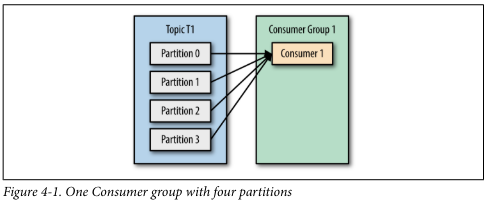
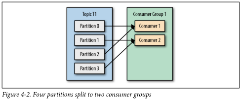
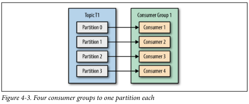
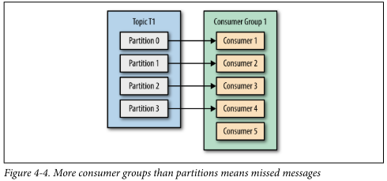
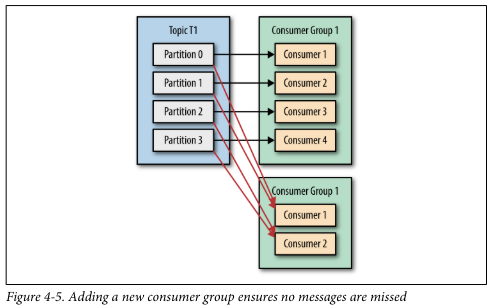
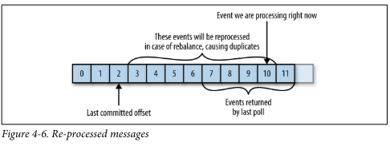
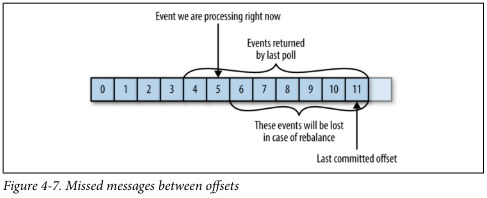

## Kafka Consumer Concepts

### Consumers and Consumer Groups

Hãy giả sử bạn có một ứng dụng cần đọc các message từ một Kafka topic, thực hiện một số kiểm tra hợp lệ và ghi kết quả vào một kho dữ liệu khác. Trong trường hợp này, ứng dụng của bạn sẽ tạo một đối tượng consumer, đăng ký đăng ký vào topic phù hợp và bắt đầu nhận các message, kiểm tra hợp lệ và ghi kết quả. Điều này có thể hoạt động tốt trong một thời gian, nhưng nếu tốc độ ghi message của các producer vào topic vượt quá tốc độ mà ứng dụng của bạn có thể kiểm tra, thì sao? Nếu bạn bị giới hạn chỉ có một consumer đọc và xử lý dữ liệu, ứng dụng của bạn có thể ngày càng tụt lại xa hơn, không thể theo kịp với tốc độ các message đến. Rõ ràng là cần phải mở rộng việc tiêu thụ từ các topic. Tương tự như nhiều producer có thể ghi vào cùng một topic, chúng ta cần cho phép nhiều consumer đọc từ cùng một topic, chia dữ liệu giữa chúng.

Consumer Kafka thường là một phần của một nhóm consumer. Khi nhiều consumer đăng ký vào một topic và thuộc cùng một nhóm consumer, mỗi consumer trong nhóm sẽ nhận các message từ một tập hợp con khác nhau của các partition trong topic. 

Hãy xem xét topic T1 có bốn partition. Giả sử chúng ta tạo một consumer mới, C1, là duy nhất trong nhóm G1, và sử dụng nó để đăng ký vào topic T1. Consumer C1 sẽ nhận tất cả các message từ bốn partition của T1. Xem hình 4-1.



Nếu chúng ta thêm một consumer khác, C2, vào nhóm G1, mỗi consumer sẽ chỉ nhận các message từ hai partition. Có lẽ các message từ partition 0 và 2 sẽ đi đến C1 và các message từ partition 1 và 3 sẽ đi đến consumer C2. Xem hình 4-2.



Nếu G1 có bốn consumer, mỗi consumer sẽ đọc các message từ một partition duy nhất. Xem hình 4-3.



Nếu chúng ta thêm nhiều consumer vào một nhóm duy nhất với một chủ đề duy nhất nhiều hơn số partition mà chúng ta có, một số consumer sẽ không hoạt động và không nhận được message nào. Xem hình 4-4.



Cách chính để mở rộng quy mô tiêu thụ dữ liệu từ một chủ đề Kafka là bằng cách thêm nhiều consumer vào một nhóm consumer. Thông thường, các Kafka consumer thực hiện các hoạt động có độ trễ cao như ghi vào cơ sở dữ liệu hoặc tính toán mất nhiều thời gian trên dữ liệu. Trong những trường hợp này, một consumer duy nhất không thể theo kịp tốc độ dữ liệu chảy vào một chủ đề, và việc thêm nhiều consumer chia sẻ tải bằng cách mỗi consumer sở hữu chỉ một phần nhỏ của các partition và các message là phương pháp chính để mở rộng quy mô. Đây là lý do tốt để tạo các chủ đề với số lượng partition lớn—nó cho phép thêm nhiều consumer hơn khi tải tăng lên. Hãy nhớ rằng không có ý nghĩa gì khi thêm nhiều consumer hơn số partition mà bạn có trong một chủ đề—một số consumer sẽ chỉ ở trạng thái không hoạt động. Chương 2 bao gồm một số gợi ý về cách chọn số lượng partition trong một chủ đề.

Ngoài việc thêm các consumer để mở rộng quy mô cho một ứng dụng duy nhất, việc có nhiều ứng dụng cần đọc dữ liệu từ cùng một chủ đề là rất phổ biến. Thực tế, một trong những mục tiêu thiết kế chính của Kafka là làm cho dữ liệu được sản xuất ra các chủ đề Kafka có sẵn cho nhiều trường hợp sử dụng khác nhau trong toàn tổ chức. Trong những trường hợp này, chúng ta muốn mỗi ứng dụng nhận được tất cả các thông điệp, thay vì chỉ một phần nhỏ. Để đảm bảo một ứng dụng nhận được tất cả các thông điệp trong một chủ đề, hãy đảm bảo rằng ứng dụng đó có nhóm consumer riêng của nó. Không giống như nhiều hệ thống nhắn tin truyền thống, Kafka có thể mở rộng quy mô đến số lượng lớn consumer và nhóm consumer mà không giảm hiệu suất.

Trong ví dụ trước, nếu chúng ta thêm một nhóm consumer mới G2 với một consumer duy nhất, consumer này sẽ nhận được tất cả các thông điệp trong chủ đề T1 bất kể G1 đang làm gì. G2 có thể có nhiều hơn một consumer, trong trường hợp đó, mỗi consumer sẽ nhận được một phần nhỏ các partition, giống như chúng tôi đã trình bày cho G1, nhưng toàn bộ G2 vẫn sẽ nhận được tất cả các thông điệp bất kể các nhóm consumer khác. Xem Hình 4-5.



Tóm lại, bạn tạo một nhóm consumer mới cho mỗi ứng dụng cần tất cả các thông điệp từ một hoặc nhiều chủ đề. Bạn thêm các consumer vào một nhóm consumer hiện có để mở rộng quy mô đọc và xử lý các thông điệp từ các chủ đề, vì vậy mỗi consumer bổ sung trong một nhóm sẽ chỉ nhận được một phần nhỏ các thông điệp.

### Consumer Groups and Partition Rebalance

Như chúng ta đã thấy trong phần trước, các consumer trong một nhóm consumer chia sẻ quyền sở hữu các phân vùng trong các chủ đề mà chúng đăng ký. Khi chúng ta thêm một consumer mới vào nhóm, nó bắt đầu tiêu thụ thông điệp từ các phân vùng trước đó được tiêu thụ bởi một consumer khác. Điều tương tự cũng xảy ra khi một consumer tắt hoặc bị crash; nó rời khỏi nhóm và các phân vùng mà nó từng tiêu thụ sẽ được tiêu thụ bởi một trong những consumer còn lại. Việc phân công lại các phân vùng cho các consumer cũng xảy ra khi các chủ đề mà nhóm consumer đang tiêu thụ bị thay đổi (ví dụ: nếu một quản trị viên thêm các phân vùng mới).

Di chuyển quyền sở hữu phân vùng từ một consumer này sang consumer khác được gọi là rebalance. Rebalances quan trọng vì chúng cung cấp cho nhóm consumer khả năng sẵn sàng cao và khả năng mở rộng (cho phép chúng ta dễ dàng và an toàn thêm và xóa các consumer), nhưng trong quá trình hoạt động bình thường, chúng khá không mong muốn. Trong quá trình rebalance, các consumer không thể tiêu thụ thông điệp, vì vậy một rebalance về cơ bản là một cửa sổ ngắn của sự không khả dụng của toàn bộ nhóm consumer. Ngoài ra, khi các phân vùng được di chuyển từ consumer này sang consumer khác, consumer mất trạng thái hiện tại của nó; nếu nó đang caching bất kỳ dữ liệu nào, nó sẽ cần làm mới các cache của mình—làm chậm ứng dụng cho đến khi consumer thiết lập lại trạng thái của mình. Trong suốt chương này, chúng ta sẽ thảo luận cách xử lý an toàn các rebalance và cách tránh những rebalance không cần thiết.

Cách các consumer duy trì thành viên trong một nhóm consumer và quyền sở hữu các phân vùng được gán cho chúng là bằng cách gửi các tín hiệu heartbeat đến một Kafka broker được chỉ định làm group coordinator (broker này có thể khác nhau cho các nhóm consumer khác nhau). Miễn là consumer gửi các tín hiệu heartbeat đều đặn, nó được coi là đang hoạt động tốt và xử lý các thông điệp từ các phân vùng của nó. Các tín hiệu heartbeat được gửi khi consumer poll (tức là lấy các bản ghi) và khi nó commit các bản ghi đã tiêu thụ.

Nếu consumer ngừng gửi các tín hiệu heartbeat đủ lâu, phiên của nó sẽ hết hạn và group coordinator sẽ coi nó là đã chết và kích hoạt một quá trình rebalance. Nếu một consumer bị crash và ngừng xử lý thông điệp, sẽ mất vài giây để group coordinator không nhận được tín hiệu heartbeat và quyết định nó đã chết và kích hoạt rebalance. Trong những giây đó, sẽ không có thông điệp nào được xử lý từ các phân vùng thuộc về consumer đã chết. Khi đóng một consumer một cách sạch sẽ, consumer sẽ thông báo cho group coordinator rằng nó đang rời khỏi, và group coordinator sẽ kích hoạt rebalance ngay lập tức, giảm thiểu khoảng trống trong quá trình xử lý. Sau này trong chương này, chúng ta sẽ thảo luận về các tùy chọn cấu hình kiểm soát tần suất heartbeat và thời gian chờ phiên, và cách thiết lập chúng để phù hợp với yêu cầu của bạn.

```text
### Quy Trình Gán Phân Vùng cho Brokers Hoạt Động Như Thế Nào?

Khi một consumer muốn tham gia vào một nhóm, nó sẽ gửi một yêu cầu JoinGroup đến group coordinator. Consumer đầu tiên tham gia nhóm sẽ trở thành group leader. Leader nhận danh sách tất cả các consumer trong nhóm từ group coordinator (danh sách này bao gồm tất cả các consumer đã gửi heartbeat gần đây và do đó được coi là đang hoạt động) và chịu trách nhiệm gán một tập hợp các phân vùng cho từng consumer. Nó sử dụng một triển khai của PartitionAssignor để quyết định các phân vùng nào sẽ được xử lý bởi consumer nào.

Kafka có hai chính sách gán phân vùng tích hợp sẵn, chúng ta sẽ thảo luận chi tiết hơn trong phần cấu hình. Sau khi quyết định việc gán phân vùng, consumer leader gửi danh sách các gán này đến GroupCoordinator, và GroupCoordinator gửi thông tin này đến tất cả các consumer. Mỗi consumer chỉ thấy gán của riêng mình — leader là tiến trình khách hàng duy nhất có danh sách đầy đủ các consumer trong nhóm và các gán của họ. Quá trình này lặp lại mỗi khi có một rebalance xảy ra.
```

## Creating a Kafka Consumer

Bước đầu tiên để bắt đầu tiêu thụ các bản ghi là tạo một instance của KafkaConsumer. Việc tạo một KafkaConsumer rất giống với việc tạo một KafkaProducer—bạn tạo một instance của Java Properties với các thuộc tính mà bạn muốn truyền cho consumer. Chúng ta sẽ thảo luận chi tiết về tất cả các thuộc tính sau trong chương này. Để bắt đầu, chúng ta chỉ cần sử dụng ba thuộc tính bắt buộc: bootstrap.servers, key.deserializer và value.deserializer.

Thuộc tính đầu tiên, bootstrap.servers, là chuỗi kết nối tới một cụm Kafka. Nó được sử dụng giống hệt như trong KafkaProducer (bạn có thể tham khảo Chương 3 để biết chi tiết về cách định nghĩa thuộc tính này). Hai thuộc tính còn lại, key.deserializer và value.deserializer, tương tự như các serializers được định nghĩa cho producer, nhưng thay vì chỉ định các lớp chuyển đổi các đối tượng Java thành mảng byte, bạn cần chỉ định các lớp có thể lấy mảng byte và chuyển đổi nó thành đối tượng Java.

Có một thuộc tính thứ tư, mặc dù không bắt buộc một cách nghiêm ngặt, nhưng hiện tại chúng ta sẽ cho rằng nó là bắt buộc. Thuộc tính này là group.id và nó xác định consumer group mà instance KafkaConsumer thuộc về. Mặc dù có thể tạo các consumer mà không thuộc bất kỳ consumer group nào, điều này là hiếm gặp, vì vậy trong hầu hết chương trình này, chúng ta sẽ giả định consumer thuộc về một nhóm.

Đoạn mã sau đây cho thấy cách tạo một KafkaConsumer:

```java
Properties props = new Properties();
props.put("bootstrap.servers", "broker1:9092,broker2:9092");
props.put("group.id", "CountryCounter");
props.put("key.deserializer",
         "org.apache.kafka.common.serialization.StringDeserializer");
props.put("value.deserializer",
         "org.apache.kafka.common.serialization.StringDeserializer");

KafkaConsumer<String, String> consumer = new KafkaConsumer<>(props);
```

Hầu hết những gì bạn thấy ở đây nên quen thuộc nếu bạn đã đọc Chương 3 về việc tạo producer. Chúng ta giả định rằng các bản ghi chúng ta tiêu thụ sẽ có các đối tượng String làm cả key và value của bản ghi. Thuộc tính mới duy nhất ở đây là group.id, là tên của consumer group mà consumer này thuộc về.

## Subscribing to Topics

Khi chúng ta tạo một consumer, bước tiếp theo là đăng ký đăng ký cho một hoặc nhiều chủ đề. Phương thức `subscribe()` nhận danh sách các chủ đề làm tham số, vì vậy việc sử dụng nó khá đơn giản:
```java
consumer.subscribe(Collections.singletonList("customerCountries"));
```
Ở đây, chúng ta tạo một danh sách có một phần tử duy nhất: tên chủ đề `"customerCountries"`.

Bạn cũng có thể gọi `subscribe` với một biểu thức chính quy. Biểu thức này có thể phù hợp với nhiều tên chủ đề và nếu có ai đó tạo một chủ đề mới có tên phù hợp, một sự cân bằng lại (rebalance) sẽ xảy ra gần như ngay lập tức và các consumer sẽ bắt đầu tiêu thụ dữ liệu từ chủ đề mới. Điều này hữu ích đối với các ứng dụng cần tiêu thụ dữ liệu từ nhiều chủ đề và có thể xử lý các loại dữ liệu khác nhau mà các chủ đề đó chứa.

Việc đăng ký đăng ký cho nhiều chủ đề bằng một biểu thức chính quy thường được sử dụng phổ biến nhất trong các ứng dụng sao chép dữ liệu giữa Kafka và hệ thống khác. Để đăng ký cho tất cả các chủ đề test, chúng ta có thể gọi:
```java
consumer.subscribe("test.*");
```

## The Poll Loop

Ở trung tâm của API consumer là một vòng lặp đơn giản để gọi máy chủ và lấy thêm dữ liệu. Sau khi consumer đã đăng ký các chủ đề, vòng lặp poll sẽ xử lý tất cả các chi tiết về phối hợp, cân bằng phân vùng, nhịp tim (heartbeats), và lấy dữ liệu, để lại cho nhà phát triển một API sạch sẽ chỉ trả về dữ liệu có sẵn từ các phân vùng được giao.

Thân chính của một consumer sẽ có dạng như sau:
```java
try {
    while (true) {
        ConsumerRecords<String, String> records = consumer.poll(100);
        for (ConsumerRecord<String, String> record : records) {
            log.debug("topic = %s, partition = %s, offset = %d, customer = %s, country = %s\n",
                      record.topic(), record.partition(), record.offset(), record.key(), record.value());
            
            int updatedCount = 1;
            if (custCountryMap.containsValue(record.value())) {
                updatedCount = custCountryMap.get(record.value()) + 1;
            }
            custCountryMap.put(record.value(), updatedCount);
            
            JSONObject json = new JSONObject(custCountryMap);
            System.out.println(json.toString(4));
        }
    }
} finally {
    consumer.close();
}
```
Đây thực sự là một vòng lặp vô hạn. Các consumer thường là các ứng dụng chạy lâu dài liên tục gọi Kafka để lấy thêm dữ liệu. Chúng ta sẽ chỉ ra sau trong chương cách thoát khỏi vòng lặp một cách sạch sẽ và đóng consumer.

Đây là dòng quan trọng nhất trong chương. Giống như cá mập phải liên tục di chuyển hoặc chúng sẽ chết, các consumer phải liên tục gọi Kafka hoặc chúng sẽ bị coi là chết và các phân vùng chúng đang tiêu thụ sẽ được chuyển sang một consumer khác trong nhóm để tiếp tục tiêu thụ. Tham số chúng ta truyền vào `poll()` là một khoảng thời gian timeout và điều khiển thời gian chờ của `poll()` nếu không có dữ liệu trong bộ đệm của consumer. Nếu thiết lập là 0, `poll()` sẽ trả về ngay lập tức; nếu không, nó sẽ đợi số milliseconds được chỉ định để dữ liệu từ broker có sẵn.

`poll()` trả về một danh sách các bản ghi. Mỗi bản ghi chứa thông tin về chủ đề và phân vùng mà bản ghi đến từ, offset của bản ghi trong phân vùng, và dữ liệu và giá trị của bản ghi. Thông thường, chúng ta muốn lặp qua danh sách này và xử lý từng bản ghi một cách độc lập. Phương thức `poll()` cũng nhận một tham số timeout, xác định thời gian mà `poll()` sẽ mất để trả về, có hoặc không có dữ liệu. Giá trị này thường được điều khiển bởi nhu cầu ứng dụng về phản hồi nhanh — bạn muốn đưa điều khiển trở lại cho luồng thực thi poll một cách nhanh chóng.

Việc xử lý thường kết thúc bằng việc ghi kết quả vào một kho dữ liệu hoặc cập nhật một bản ghi đã lưu trữ. Ở đây, mục tiêu là duy trì số lượng khách hàng từng quốc gia, do đó chúng ta cập nhật một bảng băm và in kết quả dưới dạng JSON. Một ví dụ thực tế hơn có thể lưu trữ kết quả cập nhật vào một kho dữ liệu.

Luôn luôn gọi `close()` để đóng consumer trước khi thoát. Điều này sẽ đóng kết nối mạng và socket. Nó cũng sẽ kích hoạt một cân bằng lại ngay lập tức thay vì chờ người điều phối nhóm phát hiện ra rằng consumer đã ngừng gửi nhịp tim và có thể bị coi là đã chết, điều này sẽ mất thời gian hơn và do đó dẫn đến một khoảng thời gian lâu hơn mà các consumer không thể tiêu thụ tin nhắn từ một số phân vùng.

Vòng lặp poll không chỉ đơn giản là lấy dữ liệu mà còn thực hiện nhiều công việc khác. Lần đầu tiên bạn gọi poll() với một consumer mới, nó có trách nhiệm tìm GroupCoordinator, tham gia vào consumer group và nhận phân bổ phân vùng. Nếu một sự cân bằng lại được kích hoạt, nó cũng sẽ được xử lý bên trong vòng lặp poll. Và tất nhiên, những nhịp tim để duy trì sự sống của consumer được gửi từ bên trong vòng lặp poll. Vì lý do này, chúng ta cố gắng đảm bảo rằng bất kỳ xử lý nào chúng ta thực hiện giữa các lần lặp là nhanh chóng và hiệu quả.

```text
An toàn luồng (Thread Safety)

Bạn không thể có nhiều consumer thuộc cùng một nhóm trong cùng một luồng và bạn cũng không thể có nhiều luồng sử dụng một consumer một cách an toàn. Quy tắc là một consumer cho mỗi luồng. Để chạy nhiều consumer trong cùng một nhóm trong một ứng dụng, bạn cần chạy mỗi consumer trong một luồng riêng của nó. Việc bọc logic consumer trong một đối tượng riêng và sau đó sử dụng ExecutorService của Java để khởi động nhiều luồng mỗi luồng với một consumer của riêng nó là rất hữu ích. Blog của Confluent có một hướng dẫn chi tiết về cách thực hiện điều đó.
```

## Configuring Consumers

Cho đến nay, chúng ta đã tập trung vào việc học API consumer, nhưng chỉ tập trung vào vài thuộc tính cấu hình—chỉ các thuộc tính bắt buộc như bootstrap.servers, group.id, key.deserializer và value.deserializer. Tất cả các cấu hình consumer được tài liệu Apache Kafka ghi chú chi tiết. Hầu hết các tham số có các giá trị mặc định hợp lý và không cần phải thay đổi, nhưng một số có ảnh hưởng đến hiệu suất và sẵn sàng của các consumer. Hãy xem qua một số thuộc tính quan trọng hơn.

#### fetch.min.bytes

Thuộc tính này cho phép consumer chỉ định số lượng tối thiểu dữ liệu mà nó muốn nhận từ broker khi lấy các bản ghi. Nếu một broker nhận được yêu cầu lấy các bản ghi từ consumer nhưng số lượng bản ghi mới nhận được ít hơn min.fetch.bytes, broker sẽ đợi cho đến khi có nhiều tin nhắn hơn có sẵn trước khi gửi các bản ghi lại cho consumer. Điều này giảm tải trên cả consumer và broker vì họ cần xử lý ít thông điệp trao đổi trong những trường hợp mà các chủ đề không có nhiều hoạt động mới (hoặc vào các giờ có hoạt động thấp trong ngày). Bạn nên thiết lập tham số này cao hơn mặc định nếu consumer sử dụng quá nhiều CPU khi không có nhiều dữ liệu có sẵn, hoặc giảm tải trên các broker khi bạn có một số lượng lớn các consumer.

#### fetch.max.wait.ms

Bằng cách thiết lập fetch.min.bytes, bạn cho Kafka biết để đợi cho đến khi có đủ dữ liệu để gửi trước khi phản hồi cho consumer. fetch.max.wait.ms cho phép bạn điều khiển thời gian đợi tối đa. Theo mặc định, Kafka sẽ đợi tối đa là 500 ms. Điều này dẫn đến độ trễ tối đa là 500 ms trong trường hợp không có đủ dữ liệu truyền vào chủ đề Kafka để đáp ứng số lượng tối thiểu dữ liệu trả về.

Nếu bạn muốn giới hạn độ trễ tiềm năng (thường do SLA kiểm soát độ trễ tối đa của ứng dụng), bạn có thể thiết lập fetch.max.wait.ms thành giá trị thấp hơn. Nếu bạn thiết lập fetch.max.wait.ms là 100 ms và fetch.min.bytes là 1 MB, Kafka sẽ nhận yêu cầu fetch từ consumer và sẽ phản hồi với dữ liệu khi nó có 1 MB dữ liệu để trả về hoặc sau 100 ms, tùy thuộc vào điều gì xảy ra trước.

#### max.partition.fetch.bytes

Thuộc tính này điều khiển số byte tối đa mà máy chủ sẽ trả về cho mỗi phân vùng. Mặc định là 1 MB, có nghĩa là khi KafkaConsumer.poll() trả về ConsumerRecords, đối tượng record sẽ sử dụng tối đa max.partition.fetch.bytes cho mỗi phân vùng được giao cho consumer. Vì vậy, nếu một chủ đề có 20 phân vùng và bạn có 5 consumer, mỗi consumer sẽ cần có 4 MB bộ nhớ để lưu trữ ConsumerRecords. Trong thực tế, bạn sẽ muốn cấp phát thêm bộ nhớ vì mỗi consumer sẽ cần xử lý nhiều phân vùng hơn nếu các consumer khác trong nhóm gặp sự cố.

max.partition.fetch.bytes phải lớn hơn kích thước tin nhắn lớn nhất mà một broker sẽ chấp nhận (xác định bởi thuộc tính max.message.size trong cấu hình broker), hoặc broker có thể có các tin nhắn mà consumer sẽ không thể tiêu thụ, trong trường hợp này consumer sẽ treo khi cố gắng đọc chúng. Một lưu ý quan trọng khác khi thiết lập max.partition.fetch.bytes là thời gian mà consumer mất để xử lý dữ liệu. Như bạn nhớ, consumer phải gọi poll() đều đặn để tránh timeout session và cân bằng lại sau đó. Nếu lượng dữ liệu mà một lần gọi poll() trả về rất lớn, consumer có thể mất nhiều thời gian để xử lý, điều này có nghĩa là nó sẽ không kịp đến lượt lặp tiếp theo của vòng lặp poll để tránh timeout session. Nếu điều này xảy ra, hai lựa chọn là giảm max.partition.fetch.bytes hoặc tăng timeout session.

#### session.timeout.ms

Thời gian mà một consumer có thể mất kết nối với các brokers mà vẫn được coi là sống mặc định là 3 giây. Nếu hơn session.timeout.ms mà không có consumer gửi nhịp tim tới nhà phân chia nhóm, consumer sẽ được coi là đã chết và nhà phân chia nhóm sẽ kích hoạt một cân bằng lại của nhóm consumer để phân phối lại các phân vùng từ consumer đã chết sang các consumer khác trong nhóm. Thuộc tính này có mối liên hệ mật thiết với heartbeat.interval.ms. heartbeat.interval.ms điều khiển tần suất mà phương thức poll() của KafkaConsumer sẽ gửi một nhịp tim tới nhà phân chia nhóm, trong khi session.timeout.ms điều khiển thời gian mà một consumer có thể không gửi nhịp tim.

Do đó, hai thuộc tính này thường được điều chỉnh cùng nhau—heartbeat.interval.ms phải thấp hơn session.timeout.ms và thường được thiết lập là một phần ba giá trị timeout. Vì vậy nếu session.timeout.ms là 3 giây, heartbeat.interval.ms nên là 1 giây. Thiết lập session.timeout.ms thấp hơn mặc định sẽ cho phép nhóm consumer phát hiện và phục hồi từ sự cố sớm hơn, nhưng cũng có thể gây ra cân bằng lại không mong muốn do các consumer mất nhiều thời gian hơn để hoàn thành vòng lặp poll hoặc thu gom rác. Thiết lập session.timeout.ms cao hơn sẽ giảm khả năng cân bằng lại ngẫu nhiên, nhưng cũng có nghĩa là sẽ mất nhiều thời gian để phát hiện sự cố thực sự.

#### auto.offset.reset

Thuộc tính này điều khiển hành vi của consumer khi nó bắt đầu đọc một phân vùng mà nó không có offset đã commit hoặc nếu offset đã commit mà nó có là không hợp lệ (thường là do consumer đã tắt trong một khoảng thời gian dài đến mức bản ghi với offset đó đã bị xóa khỏi broker). Mặc định là "latest," có nghĩa là nếu thiếu offset hợp lệ, consumer sẽ bắt đầu đọc từ các bản ghi mới nhất (các bản ghi được ghi sau khi consumer bắt đầu chạy). Tùy chọn thay thế là "earliest," có nghĩa là nếu thiếu offset hợp lệ, consumer sẽ đọc tất cả dữ liệu trong phân vùng, bắt đầu từ đầu của phân vùng.

#### enable.auto.commit

Chúng ta đã thảo luận về các tùy chọn khác nhau cho việc commit offset trong chương trước đây. Tham số này điều khiển liệu consumer sẽ commit offset tự động hay không, và mặc định là true. Đặt giá trị là false nếu bạn muốn kiểm soát khi nào offset được commit, điều này cần thiết để giảm thiểu các bản sao và tránh mất dữ liệu. Nếu bạn đặt enable.auto.commit là true, thì bạn cũng có thể muốn kiểm soát tần suất commit offset bằng cách sử dụng auto.commit.interval.ms.

#### partition.assignment.strategy

Chúng ta đã học được rằng các phân vùng được phân bổ cho các consumer trong một nhóm consumer. PartitionAssignor là một lớp, với đầu vào là danh sách các consumer và các chủ đề chúng đã đăng ký, quyết định xem phân vùng nào sẽ được phân bổ cho từng consumer. Mặc định, Kafka có hai chiến lược phân bổ sau:

**Range**
- Phân bổ một tập con liên tiếp của các phân vùng từ mỗi chủ đề mà consumer đăng ký. Ví dụ, nếu các consumer C1 và C2 đăng ký hai chủ đề T1 và T2, mỗi chủ đề có ba phân vùng, thì C1 sẽ được phân bổ phân vùng 0 và 1 từ các chủ đề T1 và T2, trong khi C2 sẽ được phân bổ phân vùng 2 từ các chủ đề đó. Do mỗi chủ đề có số lượng phân vùng không đồng đều và phân bổ được thực hiện độc lập cho mỗi chủ đề, consumer đầu tiên sẽ nhận nhiều phân vùng hơn consumer thứ hai. Điều này xảy ra khi sử dụng phân bổ theo Range và số lượng consumer không chia hết cho số lượng phân vùng của mỗi chủ đề.

**RoundRobin**
- Lấy tất cả các phân vùng từ tất cả các chủ đề mà consumer đã đăng ký và phân bổ chúng cho các consumer theo thứ tự tuần tự, từng phân vùng một. Ví dụ, nếu C1 và C2 đã sử dụng phân bổ theo RoundRobin, C1 sẽ có phân vùng 0 và 2 từ chủ đề T1 và phân vùng 1 từ chủ đề T2. C2 sẽ có phân vùng 1 từ chủ đề T1 và phân vùng 0 và 2 từ chủ đề T2. Nói chung, nếu tất cả các consumer đều đăng ký vào các chủ đề giống nhau (một kịch bản rất phổ biến), phân bổ theo RoundRobin sẽ làm cho tất cả các consumer có số lượng phân vùng tương đương (hoặc chênh lệch tối đa là 1 phân vùng).

Thuộc tính **partition.assignment.strategy** cho phép bạn chọn chiến lược phân bổ phân vùng. Mặc định là **org.apache.kafka.clients.consumer.RangeAssignor**, thực hiện chiến lược Range như đã mô tả ở trên. Bạn có thể thay thế nó bằng **org.apache.kafka.clients.consumer.RoundRobinAssignor**. Một tùy chọn nâng cao hơn là tự triển khai chiến lược phân bổ của riêng bạn, trong trường hợp đó **partition.assignment.strategy** sẽ trỏ tới tên của lớp bạn triển khai.

#### client.id

Đây có thể là bất kỳ chuỗi nào và sẽ được các broker sử dụng để nhận diện các thông điệp gửi từ client. Chuỗi này được sử dụng trong các bản ghi nhật ký và số liệu thống kê, cũng như để quản lý hạn ngạch (quotas).

#### max.poll.records

Điều này điều khiển số lượng tối đa các bản ghi mà một lần gọi hàm poll() sẽ trả về. Điều này hữu ích để kiểm soát lượng dữ liệu mà ứng dụng của bạn cần xử lý trong vòng lặp polling.

#### receive.buffer.bytes and send.buffer.bytes

Đây là kích thước của bộ đệm gửi và nhận TCP được sử dụng bởi các socket khi ghi và đọc dữ liệu. Nếu thiết lập là -1, hệ điều hành sẽ sử dụng các giá trị mặc định của nó. Việc tăng giá trị này có thể là ý tưởng tốt khi các producer hoặc consumer giao tiếp với các broker ở một trung tâm dữ liệu khác, bởi vì các liên kết mạng đó thường có độ trễ cao và băng thông thấp.

## Commits and Offsets

Mỗi khi chúng ta gọi hàm `poll()`, nó sẽ trả về các bản ghi đã được ghi vào Kafka mà các consumer trong nhóm của chúng ta chưa đọc. Điều này có nghĩa là chúng ta có một cách để theo dõi những bản ghi nào đã được một consumer trong nhóm đọc. Như đã thảo luận trước đó, một trong những đặc điểm độc đáo của Kafka là nó không theo dõi các xác nhận từ consumer như nhiều hàng đợi JMS. Thay vào đó, nó cho phép consumer sử dụng Kafka để theo dõi vị trí (offset) của họ trong mỗi partition.

Chúng ta gọi hành động cập nhật vị trí hiện tại trong partition là commit. Vậy một consumer commit một offset như thế nào? Nó sản xuất một thông điệp đến Kafka, tới một chủ đề đặc biệt __consumer_offsets, với offset đã commit cho mỗi partition. Miễn là tất cả các consumer của bạn đang hoạt động và chạy trơn tru, điều này sẽ không có ảnh hưởng gì. Tuy nhiên, nếu một consumer bị hỏng hoặc một consumer mới tham gia vào nhóm consumer, điều này sẽ kích hoạt một sự cân bằng lại (rebalance). Sau khi cân bằng lại, mỗi consumer có thể được gán một tập hợp partition mới so với cái mà nó đã xử lý trước đó. Để biết từ đâu tiếp tục công việc, consumer sẽ đọc offset đã commit mới nhất của mỗi partition và tiếp tục từ đó.

Nếu offset đã commit nhỏ hơn offset của thông điệp cuối cùng mà client đã xử lý, các thông điệp giữa offset cuối cùng đã xử lý và offset đã commit sẽ được xử lý hai lần. Xem Hình 4-6.



Nếu offset đã commit lớn hơn offset của thông điệp cuối cùng mà client thực sự đã xử lý, tất cả các thông điệp giữa offset cuối cùng đã xử lý và offset đã commit sẽ bị bỏ lỡ bởi nhóm consumer. Xem Hình 4-7.



Rõ ràng, việc quản lý các offset có ảnh hưởng lớn đến ứng dụng khách. API KafkaConsumer cung cấp nhiều cách khác nhau để commit các offset:

#### Automatic Commit

Cách dễ nhất để commit các offset là cho phép consumer thực hiện việc đó thay bạn. Nếu bạn cấu hình `enable.auto.commit=true`, thì cứ mỗi năm giây, consumer sẽ commit offset lớn nhất mà client của bạn nhận được từ `poll()`. Khoảng thời gian năm giây là mặc định và được kiểm soát bởi thiết lập `auto.commit.interval.ms`. Giống như mọi thứ khác trong consumer, các commit tự động được điều khiển bởi vòng lặp `poll()`. Mỗi khi bạn gọi `poll()`, consumer sẽ kiểm tra xem có đến lúc commit hay chưa, và nếu có, nó sẽ commit các offset mà nó đã trả về trong lần `poll()` trước.

Tuy nhiên, trước khi sử dụng tùy chọn tiện lợi này, điều quan trọng là phải hiểu các hậu quả có thể xảy ra. Hãy xem xét rằng, theo mặc định, các commit tự động xảy ra mỗi năm giây. Giả sử rằng chúng ta đang ở ba giây sau lần commit gần nhất và một sự cân bằng lại (rebalance) được kích hoạt. Sau khi cân bằng lại, tất cả các consumer sẽ bắt đầu tiêu thụ từ offset cuối cùng đã commit. Trong trường hợp này, offset đã cũ ba giây, do đó tất cả các sự kiện xuất hiện trong ba giây đó sẽ được xử lý hai lần. Có thể cấu hình khoảng thời gian commit để commit thường xuyên hơn và giảm thời gian trong đó các bản ghi sẽ bị trùng lặp, nhưng không thể hoàn toàn loại bỏ chúng.

Với việc tự động commit được bật, một lần gọi `poll()` sẽ luôn commit offset cuối cùng trả về bởi `poll()` trước đó. Nó không biết những sự kiện nào thực sự đã được xử lý, vì vậy điều quan trọng là luôn xử lý tất cả các sự kiện trả về bởi `poll()` trước khi gọi `poll()` lần nữa. (Giống như `poll()`, `close()` cũng commit các offset tự động.) Điều này thường không phải là vấn đề, nhưng hãy chú ý khi bạn xử lý các ngoại lệ hoặc thoát khỏi vòng lặp `poll()` sớm. Các commit tự động tiện lợi, nhưng chúng không cung cấp đủ kiểm soát cho các nhà phát triển để tránh các thông điệp bị trùng lặp.

#### Commit Current Offset

Hầu hết các nhà phát triển kiểm soát tốt hơn thời điểm commit các offset — vừa để loại bỏ khả năng bỏ lỡ các thông điệp, vừa để giảm số lượng thông điệp bị trùng lặp trong quá trình cân bằng lại. API consumer cung cấp tùy chọn commit offset hiện tại vào thời điểm phù hợp với nhà phát triển ứng dụng hơn là dựa trên một bộ đếm thời gian.

Bằng cách đặt `auto.commit.offset=false`, các offset sẽ chỉ được commit khi ứng dụng chọn làm điều đó một cách rõ ràng. API commit đơn giản và đáng tin cậy nhất là `commitSync()`. API này sẽ commit offset mới nhất được trả về bởi `poll()` và trả về sau khi offset được commit, ném ra một ngoại lệ nếu commit thất bại vì lý do nào đó.

Điều quan trọng cần nhớ là `commitSync()` sẽ commit offset mới nhất được trả về bởi `poll()`, vì vậy hãy đảm bảo bạn gọi `commitSync()` sau khi đã xử lý xong tất cả các bản ghi trong tập hợp, nếu không bạn sẽ có nguy cơ bỏ lỡ các thông điệp như đã mô tả trước đó. Khi cân bằng lại được kích hoạt, tất cả các thông điệp từ đầu của batch gần đây nhất đến thời điểm cân bằng lại sẽ được xử lý hai lần.

Đây là cách chúng ta sử dụng `commitSync` để commit các offset sau khi hoàn tất xử lý batch thông điệp mới nhất:

```java
while (true) {
    ConsumerRecords<String, String> records = consumer.poll(100);
    for (ConsumerRecord<String, String> record : records) {
        System.out.printf("topic = %s, partition = %s, offset = %d, customer = %s, country = %s\n",
        record.topic(), record.partition(), record.offset(), record.key(), record.value());
    }
    try {
        consumer.commitSync();
    } catch (CommitFailedException e) {
        log.error("commit failed", e);
    }
}
```

Giả sử rằng bằng cách in nội dung của một bản ghi, chúng ta đã hoàn tất xử lý nó. Ứng dụng của bạn có thể sẽ làm nhiều điều hơn với các bản ghi — sửa đổi chúng, làm phong phú chúng, tổng hợp chúng, hiển thị chúng trên một bảng điều khiển, hoặc thông báo cho người dùng về các sự kiện quan trọng. Bạn nên xác định khi nào bạn đã "xử lý xong" một bản ghi theo trường hợp sử dụng của bạn.

Khi chúng ta đã "xử lý" xong tất cả các bản ghi trong batch hiện tại, chúng ta gọi `commitSync` để commit offset cuối cùng trong batch, trước khi poll thêm các thông điệp khác.

`commitSync` sẽ thử commit lại miễn là không có lỗi nào không thể khôi phục. Nếu điều này xảy ra, chúng ta không thể làm gì nhiều ngoài việc ghi lại lỗi.

#### Asynchronous Commit

Một nhược điểm của việc commit thủ công là ứng dụng bị chặn cho đến khi broker phản hồi yêu cầu commit. Điều này sẽ hạn chế thông lượng của ứng dụng. Thông lượng có thể được cải thiện bằng cách commit ít thường xuyên hơn, nhưng khi đó chúng ta sẽ tăng số lượng bản ghi trùng lặp mà một quá trình cân bằng lại có thể tạo ra.

Một tùy chọn khác là API commit không đồng bộ. Thay vì chờ broker phản hồi yêu cầu commit, chúng ta chỉ cần gửi yêu cầu và tiếp tục:

```java
while (true) {
    ConsumerRecords<String, String> records = consumer.poll(100);
    for (ConsumerRecord<String, String> record : records) {
        System.out.printf("topic = %s, partition = %s, offset = %d, customer = %s, country = %s\n",
        record.topic(), record.partition(), record.offset(), record.key(), record.value());
    }
    consumer.commitAsync();
}
```

Commit offset cuối cùng và tiếp tục.

Nhược điểm là trong khi `commitSync()` sẽ thử lại commit cho đến khi nó thành công hoặc gặp lỗi không thể thử lại, `commitAsync()` sẽ không thử lại. Lý do nó không thử lại là vì vào thời điểm `commitAsync()` nhận được phản hồi từ server, có thể đã có một commit sau đó đã thành công. Hãy tưởng tượng rằng chúng ta đã gửi một yêu cầu commit offset 2000. Có một vấn đề giao tiếp tạm thời, vì vậy broker không bao giờ nhận được yêu cầu và do đó không bao giờ phản hồi. Trong khi đó, chúng ta đã xử lý một batch khác và thành công commit offset 3000. Nếu `commitAsync()` bây giờ thử lại commit đã thất bại trước đó, nó có thể thành công trong việc commit offset 2000 sau khi offset 3000 đã được xử lý và commit. Trong trường hợp cân bằng lại, điều này sẽ gây ra nhiều bản ghi trùng lặp hơn.

Chúng tôi đề cập đến sự phức tạp này và tầm quan trọng của thứ tự commit đúng, vì `commitAsync()` cũng cho phép bạn truyền vào một callback sẽ được kích hoạt khi broker phản hồi. Thông thường callback này được sử dụng để ghi lại các lỗi commit hoặc đếm chúng trong một metric, nhưng nếu bạn muốn sử dụng callback để thử lại, bạn cần phải nhận thức về vấn đề thứ tự commit:

```java
while (true) {
    ConsumerRecords<String, String> records = consumer.poll(100);
    for (ConsumerRecord<String, String> record : records) {
        System.out.printf("topic = %s, partition = %s, offset = %d, customer = %s, country = %s\n",
        record.topic(), record.partition(), record.offset(), record.key(), record.value());
    }
    consumer.commitAsync(new OffsetCommitCallback() {
        public void onComplete(Map<TopicPartition, OffsetAndMetadata> offsets, Exception e) {
            if (e != null)
                log.error("Commit failed for offsets {}", offsets, e);
        }
    });
}
```

Chúng ta gửi commit và tiếp tục, nhưng nếu commit thất bại, lỗi và các offset sẽ được ghi lại.

```text
Thử lại Commit Không đồng bộ
Một mẫu đơn giản để đảm bảo thứ tự commit đúng cho các lần thử lại không đồng bộ là sử dụng một số thứ tự tăng dần đơn điệu. Tăng số thứ tự mỗi lần bạn commit và thêm số thứ tự tại thời điểm commit vào callback `commitAsync`. Khi bạn chuẩn bị gửi một lần thử lại, hãy kiểm tra xem số thứ tự commit mà callback nhận được có bằng với biến instance không; nếu đúng, không có commit mới hơn và việc thử lại là an toàn. Nếu số thứ tự instance cao hơn, đừng thử lại vì một commit mới hơn đã được gửi.
```
#### Combining Synchronous and Asynchronous Commits

Thường thì, việc thất bại ngẫu nhiên trong việc commit mà không thử lại không phải là vấn đề lớn vì nếu vấn đề là tạm thời, commit sau đó sẽ thành công. Nhưng nếu chúng ta biết đó là lần commit cuối cùng trước khi đóng consumer, hoặc trước khi có một sự cân bằng lại, chúng ta muốn đảm bảo rằng commit thành công.

Do đó, một mẫu phổ biến là kết hợp `commitAsync()` với `commitSync()` ngay trước khi tắt ứng dụng. Đây là cách hoạt động của nó (chúng ta sẽ thảo luận cách commit ngay trước khi cân bằng lại khi chúng ta đến phần về nghe sự kiện cân bằng lại):

```java
try {
    while (true) {
        ConsumerRecords<String, String> records = consumer.poll(100);
        for (ConsumerRecord<String, String> record : records) {
            System.out.printf("topic = %s, partition = %s, offset = %d, customer = %s, country = %s\n",
                record.topic(), record.partition(), record.offset(), record.key(), record.value());
        }
        consumer.commitAsync();
    }
} catch (Exception e) {
    log.error("Lỗi không mong đợi", e);
} finally {
    try {
        consumer.commitSync();
    } finally {
        consumer.close();
    }
}
```

Khi mọi thứ ổn, chúng ta sử dụng `commitAsync`. Nó nhanh hơn, và nếu một lần commit thất bại, lần commit tiếp theo sẽ làm vai trò của một lần thử lại.

Nhưng nếu chúng ta đang đóng ứng dụng, không có "lần commit tiếp theo". Chúng ta gọi `commitSync()`, bởi vì nó sẽ thử lại cho đến khi thành công hoặc gặp phải lỗi không thể khôi phục được.

#### Commit Specified Offset

Chỉ commit offset mới nhất cho phép bạn commit theo tần suất bạn hoàn thành xử lý các batch. Nhưng nếu bạn muốn commit thường xuyên hơn thế? Nếu hàm poll() trả về một batch lớn và bạn muốn commit offsets giữa chừng của batch để tránh phải xử lý lại tất cả các dòng nếu có sự cân bằng lại xảy ra? Bạn không thể chỉ gọi commitSync() hoặc commitAsync() — điều này sẽ commit offset cuối cùng được trả về, mà bạn chưa xử lý.

May mắn thay, API consumer cho phép bạn gọi commitSync() và commitAsync() và truyền vào một bản đồ các partition và offsets mà bạn muốn commit. Nếu bạn đang trong quá trình xử lý một batch các bản ghi, và tin nhắn cuối cùng mà bạn nhận được từ partition 3 trong topic "customers" có offset là 5000, bạn có thể gọi commitSync() để commit offset 5000 cho partition 3 trong topic "customers". Bởi vì consumer của bạn có thể đang tiêu thụ nhiều hơn một partition, bạn sẽ cần theo dõi offsets trên tất cả chúng, điều này làm tăng độ phức tạp của mã của bạn.

Đây là cách commit các offset cụ thể như thế nào:

```java
private Map<TopicPartition, OffsetAndMetadata> currentOffsets = new HashMap<>();
int count = 0;
// ...
while (true) {
    ConsumerRecords<String, String> records = consumer.poll(100);
    for (ConsumerRecord<String, String> record : records) {
        System.out.printf("topic = %s, partition = %s, offset = %d, customer = %s, country = %s\n",
            record.topic(), record.partition(), record.offset(), record.key(), record.value());
        currentOffsets.put(new TopicPartition(record.topic(), record.partition()),
            new OffsetAndMetadata(record.offset() + 1, "no metadata"));
        if (count % 1000 == 0)
            consumer.commitAsync(currentOffsets, null);
        count++;
    }
}
```

Đây là bản đồ chúng ta sẽ sử dụng để theo dõi offset một cách thủ công.

Hãy nhớ, println là một đại diện cho bất kỳ xử lý nào bạn thực hiện với các bản ghi bạn tiêu thụ.

Sau khi đọc từng bản ghi, chúng ta cập nhật bản đồ offsets với offset của tin nhắn kế tiếp mà chúng ta dự định xử lý. Điều này là nơi chúng ta sẽ bắt đầu đọc lần sau.

Ở đây, chúng ta quyết định commit offsets hiện tại mỗi 1,000 bản ghi. Trong ứng dụng của bạn, bạn có thể commit dựa trên thời gian hoặc nội dung của các bản ghi.

Tôi chọn gọi commitAsync(), nhưng commitSync() cũng hoàn toàn hợp lệ ở đây. Tất nhiên, khi commit các offset cụ thể, bạn vẫn cần thực hiện tất cả các xử lý lỗi mà chúng ta đã thấy trong các phần trước.

## Re-balance Listeners

Như chúng tôi đã đề cập trong phần trước về việc commit offsets, một consumer sẽ muốn làm một số công việc dọn dẹp trước khi thoát và cũng trước khi cân bằng lại các partition. Nếu bạn biết rằng consumer của bạn sắp mất quyền sở hữu của một partition, bạn sẽ muốn commit offsets của sự kiện cuối cùng mà bạn đã xử lý. Nếu consumer của bạn duy trì một bộ đệm với các sự kiện mà nó chỉ xử lý đôi khi (ví dụ như bản đồ currentRecords mà chúng tôi sử dụng khi giải thích chức năng pause()), bạn sẽ muốn xử lý các sự kiện bạn tích lũy trước khi mất quyền sở hữu của partition. Có thể bạn cũng cần đóng các bộ xử lý file, kết nối cơ sở dữ liệu và những công việc tương tự.

API consumer cho phép bạn chạy mã của riêng bạn khi các partition được thêm vào hoặc loại bỏ khỏi consumer. Bạn làm điều này bằng cách truyền một ConsumerRebalanceListener khi gọi phương thức subscribe() mà chúng ta đã thảo luận trước đó. ConsumerRebalanceListener có hai phương thức bạn có thể triển khai:

```java
public void onPartitionsRevoked(Collection<TopicPartition> partitions)
```
Được gọi trước khi cân bằng lại bắt đầu và sau khi consumer ngừng tiêu thụ các tin nhắn. Đây là nơi bạn muốn commit offsets, để bất cứ ai nhận partition này sau đó sẽ biết nơi bắt đầu.

```java
public void onPartitionsAssigned(Collection<TopicPartition> partitions)
```
Được gọi sau khi các partition đã được giao lại cho broker, nhưng trước khi consumer bắt đầu tiêu thụ các tin nhắn.

Ví dụ sau sẽ chỉ ra cách sử dụng onPartitionsRevoked() để commit offsets trước khi mất quyền sở hữu của một partition. Trong phần tiếp theo, chúng tôi sẽ cho thấy một ví dụ phức tạp hơn cũng minh họa việc sử dụng onPartitionsAssigned():

```java
private Map<TopicPartition, OffsetAndMetadata> currentOffsets = new HashMap<>();

private class HandleRebalance implements ConsumerRebalanceListener {
    public void onPartitionsAssigned(Collection<TopicPartition> partitions) {
        // We don't need to do anything when partitions are assigned
        // Just start consuming messages
    }

    public void onPartitionsRevoked(Collection<TopicPartition> partitions) {
        System.out.println("Lost partitions in rebalance. Committing current offsets:" + currentOffsets);
        consumer.commitSync(currentOffsets);
    }
}

try {
    consumer.subscribe(topics, new HandleRebalance());

    while (true) {
        ConsumerRecords<String, String> records = consumer.poll(100);
        for (ConsumerRecord<String, String> record : records) {
            System.out.printf("topic = %s, partition = %s, offset = %d, customer = %s, country = %s\n",
                    record.topic(), record.partition(), record.offset(), record.key(), record.value());
            currentOffsets.put(new TopicPartition(record.topic(), record.partition()),
                    new OffsetAndMetadata(record.offset() + 1, "no metadata"));
        }
        consumer.commitAsync(currentOffsets, null);
    }
} catch (WakeupException e) {
    // ignore, we're closing
} catch (Exception e) {
    log.error("Lỗi không mong đợi", e);
} finally {
    try {
        consumer.commitSync(currentOffsets);
    } finally {
        consumer.close();
        System.out.println("Đóng consumer và hoàn tất");
    }
}
```

Chúng ta bắt đầu bằng cách triển khai một ConsumerRebalanceListener.

Trong ví dụ này, khi chúng ta nhận được một partition mới, chúng ta không cần phải làm gì cả; chỉ đơn giản bắt đầu tiêu thụ các tin nhắn.

Tuy nhiên, khi chúng ta sắp mất một partition do cân bằng lại, chúng ta cần phải commit offsets. Lưu ý rằng chúng ta đang commit các offset mới nhất mà chúng ta đã xử lý, không phải các offset mới nhất trong batch mà chúng ta vẫn đang xử lý. Điều này là vì một partition có thể bị thu hồi trong khi chúng ta vẫn đang ở giữa một batch. Chúng ta đang commit offsets cho tất cả các partition, không chỉ những partition mà chúng ta sắp mất — vì các offsets này là cho các sự kiện đã được xử lý, không có vấn đề gì với việc này. Và chúng ta sử dụng commitSync() để đảm bảo rằng các offsets được commit trước khi quá trình cân bằng lại tiếp tục.

Phần quan trọng nhất là: truyền ConsumerRebalanceListener vào phương thức subscribe() để nó sẽ được gọi bởi consumer.

## Consuming Records with Specific Offsets

Cho đến nay, chúng ta đã thấy cách sử dụng poll() để bắt đầu tiêu thụ các tin nhắn từ offset được commit cuối cùng trong mỗi partition và tiếp tục xử lý tất cả các tin nhắn theo thứ tự. Tuy nhiên, đôi khi bạn muốn bắt đầu đọc từ một offset khác.

Nếu bạn muốn bắt đầu đọc tất cả các tin nhắn từ đầu của partition, hoặc bạn muốn nhảy đến cuối của partition và bắt đầu tiêu thụ chỉ các tin nhắn mới, có các API đặc biệt cho điều đó: seekToBeginning(TopicPartition tp) và seekToEnd(TopicPartition tp).

Tuy nhiên, Kafka API cũng cho phép bạn seek tới một offset cụ thể. Khả năng này có thể được sử dụng trong nhiều trường hợp khác nhau; ví dụ, để quay lại vài tin nhắn hoặc nhảy tới vài tin nhắn phía trước (ví dụ như một ứng dụng nhạy cảm về thời gian đang bị tụt hậu muốn nhảy tới các tin nhắn liên quan hơn). Trường hợp sử dụng hấp dẫn nhất cho khả năng này là khi offsets được lưu trữ trong một hệ thống khác ngoài Kafka.

Hãy nghĩ đến kịch bản phổ biến này: Ứng dụng của bạn đang đọc các sự kiện từ Kafka (ví dụ như một luồng nhấp chuột của người dùng trên một trang web), xử lý dữ liệu (ví dụ như loại bỏ các bản ghi chỉ ra các nhấp chuột từ các chương trình tự động hơn là từ người dùng), và sau đó lưu kết quả vào cơ sở dữ liệu, NoSQL store, hoặc Hadoop. Giả sử rằng chúng ta thực sự không muốn mất bất kỳ dữ liệu nào, cũng như không muốn lưu kết quả giống nhau vào cơ sở dữ liệu hai lần.

Trong các trường hợp như vậy, vòng lặp của consumer có thể nhìn như sau:

```java
while (true) {
    ConsumerRecords<String, String> records = consumer.poll(100);
    for (ConsumerRecord<String, String> record : records) {
        currentOffsets.put(new TopicPartition(record.topic(), record.partition()), record.offset());
        processRecord(record);
        storeRecordInDB(record);
        consumer.commitAsync(currentOffsets);
    }
}
```

Trong ví dụ này, chúng tôi rất cẩn thận, vì vậy chúng tôi commit offsets sau khi xử lý mỗi bản ghi. Tuy nhiên, vẫn có khả năng ứng dụng của chúng tôi sẽ bị crash sau khi bản ghi được lưu trong cơ sở dữ liệu nhưng trước khi chúng tôi commit offsets, dẫn đến việc xử lý lại bản ghi và cơ sở dữ liệu chứa các bản ghi trùng lặp.

Điều này có thể tránh được nếu có một cách để lưu cả bản ghi và offset trong một hành động atomic. Hoặc cả bản ghi và offset đều được commit, hoặc cả hai đều không được commit. Miễn là các bản ghi được viết vào cơ sở dữ liệu và các offset vào Kafka, điều này là không thể. Nhưng nếu chúng ta viết cả bản ghi và offset vào cơ sở dữ liệu, trong một giao dịch?

Vậy là chúng ta sẽ biết là chúng ta đã hoàn thành với bản ghi và offset đã được commit, hoặc chúng ta chưa hoàn thành và bản ghi sẽ được xử lý lại.

Vấn đề duy nhất bây giờ là nếu bản ghi được lưu trong cơ sở dữ liệu nhưng không có trong Kafka, làm sao consumer của chúng ta biết nơi để bắt đầu đọc khi nó được giao một partition? Đó chính là điều seek() có thể được sử dụng. Khi consumer bắt đầu hoặc khi các partition mới được giao, nó có thể tra cứu offset trong cơ sở dữ liệu và thực hiện seek() tới vị trí đó.

Đây là một ví dụ cấu trúc về cách làm việc với ConsumerRebalanceListener và seek() để đảm bảo chúng ta bắt đầu xử lý từ các offset được lưu trong cơ sở dữ liệu:

```java
public class SaveOffsetsOnRebalance implements ConsumerRebalanceListener {
    
    public void onPartitionsRevoked(Collection<TopicPartition> partitions) {
        commitDBTransaction();
    }
    
    public void onPartitionsAssigned(Collection<TopicPartition> partitions) {
        for (TopicPartition partition : partitions) {
            consumer.seek(partition, getOffsetFromDB(partition));
        }
    }
}

consumer.subscribe(topics, new SaveOffsetsOnRebalance());
consumer.poll(0);

for (TopicPartition partition : consumer.assignment()) {
    consumer.seek(partition, getOffsetFromDB(partition));
}

while (true) {
    ConsumerRecords<String, String> records = consumer.poll(100);
    
    for (ConsumerRecord<String, String> record : records) {
        processRecord(record);
        storeRecordInDB(record);
        storeOffsetInDB(record.topic(), record.partition(), record.offset());
    }
    
    commitDBTransaction();
}
```

Ở đây, chúng tôi sử dụng một phương thức ảo để commit giao dịch trong cơ sở dữ liệu. Ý tưởng là các bản ghi và offsets sẽ được chèn vào cơ sở dữ liệu khi chúng ta xử lý các bản ghi, và chỉ cần commit các giao dịch khi chúng ta sắp mất phân vùng để đảm bảo thông tin này được lưu trữ.

Chúng tôi cũng có một phương thức ảo để lấy các offsets từ cơ sở dữ liệu, và sau đó sử dụng seek() để di chuyển đến các bản ghi tương ứng khi chúng ta nhận được quyền sở hữu của các phân vùng mới.

Khi consumer bắt đầu lần đầu tiên, sau khi đăng ký cho các chủ đề, chúng tôi gọi poll() một lần để đảm bảo rằng chúng ta tham gia vào một nhóm consumer và được phân bổ các partition, và sau đó ngay lập tức sử dụng seek() để điều hướng đến offset chính xác trong các partition mà chúng ta được phân bổ.

Hãy nhớ rằng seek() chỉ cập nhật vị trí mà chúng ta đang tiêu thụ, vì vậy lần poll() tiếp theo sẽ truy xuất các thông điệp đúng. Nếu có lỗi trong seek() (ví dụ: offset không tồn tại), ngoại lệ sẽ được ném bởi poll().

Một phương thức ảo khác: lần này chúng tôi cập nhật một bảng lưu trữ các offsets trong cơ sở dữ liệu của chúng tôi. Ở đây, chúng tôi giả định rằng việc cập nhật bản ghi là nhanh chóng, vì vậy chúng tôi thực hiện cập nhật trên mỗi bản ghi, nhưng commit là chậm, vì vậy chúng tôi chỉ commit vào cuối batch. Tuy nhiên, điều này có thể được tối ưu hóa theo nhiều cách khác nhau.

Có nhiều cách khác nhau để triển khai tính năng exactly-once bằng cách lưu trữ offsets và dữ liệu trong một cửa hàng bên ngoài, nhưng tất cả đều cần sử dụng ConsumerRebalanceListener và seek() để đảm bảo rằng offsets được lưu vào đúng thời điểm và consumer bắt đầu đọc các thông điệp từ vị trí chính xác.

## But How Do We Exit?

Trước đó trong chương này, khi chúng ta thảo luận về vòng lặp poll, tôi nói với bạn không cần lo lắng về việc consumer lặp vô hạn và rằng chúng ta sẽ thảo luận về cách thoát khỏi vòng lặp một cách sạch sẽ. Vậy, hãy thảo luận về cách thoát khỏi vòng lặp một cách sạch sẽ.

Khi bạn quyết định thoát khỏi vòng lặp poll, bạn sẽ cần một luồng khác để gọi consumer.wakeup(). Nếu bạn đang chạy vòng lặp consumer trong luồng chính, điều này có thể được thực hiện từ ShutdownHook. Lưu ý rằng consumer.wakeup() là phương thức duy nhất của consumer có thể gọi an toàn từ một luồng khác. Gọi wakeup sẽ khiến cho poll() thoát với ngoại lệ WakeupException, hoặc nếu consumer.wakeup() được gọi trong khi luồng không đang chờ đợi trên poll, ngoại lệ sẽ được ném ra trong lần lặp tiếp theo khi poll() được gọi. Ngoại lệ WakeupException không cần phải được xử lý, nhưng trước khi thoát khỏi luồng, bạn phải gọi consumer.close(). Đóng consumer sẽ commit offsets nếu cần và sẽ gửi một tin nhắn đến nhà phân phối nhóm cho biết consumer đang rời khỏi nhóm. Người phân phối nhóm sẽ kích hoạt việc cân bằng lại ngay lập tức và bạn sẽ không cần phải chờ cho đến khi phiên hết hạn trước khi các partition từ consumer bạn đang đóng được phân bổ cho một consumer khác trong nhóm.

Dưới đây là đoạn mã thoát nếu consumer đang chạy trong luồng ứng dụng chính. Đoạn mã này đã được rút gọn, bạn có thể xem toàn bộ ví dụ tại http://bit.ly/2u47e9A.

```java
Runtime.getRuntime().addShutdownHook(new Thread(){
public void run(){
    System.out.println("Starting exit...");
    consumer.wakeup();
    try{
    mainThread.join();
    }catch(InterruptedException e){
    e.printStackTrace();
    }
    }
    });

    try{
    // lặp cho đến khi nhấn ctrl-c, shutdown hook sẽ dọn dẹp khi thoát
    while(true){
    ConsumerRecords<String, String> records=
    consumer.poll(1000);
    System.out.println(System.currentTimeMillis()+"
    --waiting for data...");
    for(ConsumerRecord<String, String> record:
    records){
    System.out.printf("offset = %d, key = %s,
    value=%s\n",
    record.offset(),record.key(),
    record.value());
    }
    for(TopicPartition tp:consumer.assignment())
    System.out.println("Committing offset at
    position:" +
    consumer.position(tp));
    consumer.commitSync();
    }
    }catch(WakeupException e){
    // bỏ qua trong quá trình shutdown
    }finally{
    consumer.close();
    System.out.println("Closed consumer and we are done");
    }
```

ShutdownHook chạy trong một luồng riêng biệt, do đó hành động an toàn duy nhất chúng ta có thể thực hiện là gọi wakeup để thoát khỏi vòng lặp poll.

Một luồng khác gọi wakeup sẽ khiến cho poll ném ra một WakeupException. Bạn cần bắt ngoại lệ này để đảm bảo ứng dụng của bạn không thoát một cách bất ngờ, nhưng không cần làm gì thêm với nó.

Trước khi thoát consumer, hãy đảm bảo đóng nó một cách sạch sẽ.

## Deserializers

Như đã thảo luận trong chương trước, các producer Kafka yêu cầu các serializer để chuyển đổi các đối tượng thành mảng byte trước khi gửi đến Kafka. Tương tự, các consumer Kafka cần các deserializer để chuyển đổi các mảng byte nhận từ Kafka thành các đối tượng Java. Trong các ví dụ trước đó, chúng ta chỉ giả định rằng cả khóa và giá trị của mỗi tin nhắn đều là chuỗi và chúng ta đã sử dụng StringDeserializer mặc định trong cấu hình consumer.

Trong Chương 3 về Kafka producer, chúng ta đã thấy cách serialize các loại tùy chỉnh và cách sử dụng Avro và AvroSerializers để tạo đối tượng Avro từ các định nghĩa schema và sau đó serialize chúng khi sản xuất các tin nhắn đến Kafka. Bây giờ chúng ta sẽ xem xét cách tạo deserializer tùy chỉnh cho đối tượng của bạn và cách sử dụng Avro cùng với các deserializer của nó.

Rõ ràng rằng serializer được sử dụng để sản xuất sự kiện cho Kafka phải phù hợp với deserializer sẽ được sử dụng khi tiêu thụ sự kiện. Việc serialize bằng IntSerializer và sau đó deserialize bằng StringDeserializer sẽ không thành công. Điều này có nghĩa là như một nhà phát triển, bạn cần theo dõi serializer nào đã được sử dụng để ghi dữ liệu vào từng chủ đề, và đảm bảo mỗi chủ đề chỉ chứa dữ liệu mà deserializer bạn sử dụng có thể giải mã được. Điều này là một trong những lợi ích của việc sử dụng Avro và Schema Repository cho serialize và deserialize — AvroSerializer có thể đảm bảo rằng tất cả dữ liệu được ghi vào một chủ đề cụ thể phù hợp với schema của chủ đề, có nghĩa là nó có thể được giải mã bằng deserializer và schema tương ứng. Mọi lỗi không tương thích — phía producer hoặc consumer — sẽ được phát hiện dễ dàng với một thông báo lỗi phù hợp, điều này có nghĩa là bạn sẽ không cần phải cố gắng gỡ lỗi mảng byte cho lỗi serialize.

Chúng ta sẽ bắt đầu bằng việc nhanh chóng hướng dẫn cách viết một deserializer tùy chỉnh, mặc dù đây là phương pháp ít phổ biến, và sau đó chúng ta sẽ chuyển sang một ví dụ về cách sử dụng Avro để deserialize các khóa và giá trị của các tin nhắn.

#### Custom deserializers

Hãy tiếp tục với ví dụ cùng một đối tượng tùy chỉnh mà chúng ta đã serialize trong Chương 3, và viết một deserializer cho nó:

```java
public class Customer {
    private int customerID;
    private String customerName;

    public Customer(int ID, String name) {
        this.customerID = ID;
        this.customerName = name;
    }

    public int getID() {
        return customerID;
    }

    public String getName() {
        return customerName;
    }
}
```

Deserializer tùy chỉnh sẽ có dạng như sau:

```java
import org.apache.kafka.common.errors.SerializationException;
import org.apache.kafka.common.serialization.Deserializer;
import java.nio.ByteBuffer;
import java.util.Map;

public class CustomerDeserializer implements Deserializer<Customer> {

    @Override
    public void configure(Map<String, ?> configs, boolean isKey) {
        // nothing to configure
    }

    @Override
    public Customer deserialize(String topic, byte[] data) {
        int id;
        String name;
        try {
            if (data == null)
                return null;
            if (data.length < 8)
                throw new SerializationException("Size of data received by CustomerDeserializer is shorter than expected");

            ByteBuffer buffer = ByteBuffer.wrap(data);
            id = buffer.getInt();
            int nameSize = buffer.getInt();
            byte[] nameBytes = new byte[nameSize];
            buffer.get(nameBytes);
            name = new String(nameBytes, "UTF-8");

            return new Customer(id, name);
        } catch (Exception e) {
            throw new SerializationException("Error when deserializing Customer from byte[] " + e);
        }
    }

    @Override
    public void close() {
        // nothing to close
    }
}
```

Consumer cũng cần cài đặt của lớp Customer, và cả lớp và serializer cần khớp với ứng dụng sản xuất và tiêu thụ. Trong một tổ chức lớn với nhiều consumer và producer chia sẻ quyền truy cập vào dữ liệu, điều này có thể trở thành một thử thách.

Ở đây chúng ta đang đảo ngược logic của serializer — chúng ta lấy ID và tên khách hàng từ mảng byte và sử dụng chúng để xây dựng đối tượng chúng ta cần.

Đoạn mã tiêu thụ sử dụng deserializer tùy chỉnh sẽ có dạng như sau:

```java
Properties props = new Properties();
props.put("bootstrap.servers", "broker1:9092,broker2:9092");
props.put("group.id", "CountryCounter");
props.put("key.deserializer", "org.apache.kafka.common.serialization.StringDeserializer");
props.put("value.deserializer", "org.apache.kafka.common.serialization.CustomerDeserializer");

KafkaConsumer<String, Customer> consumer = new KafkaConsumer<>(props);
consumer.subscribe(Collections.singleton("customerCountries"));

while (true) {
    ConsumerRecords<String, Customer> records = consumer.poll(Duration.ofMillis(100));
    for (ConsumerRecord<String, Customer> record : records) {
        System.out.println("current customer Id: " + record.value().getID() + " and current customer name: " + record.value().getName());
    }
}
```

Một lần nữa, cần lưu ý rằng việc triển khai một serializer và deserializer tùy chỉnh không được khuyến khích. Nó làm cho producers và consumers liên kết chặt chẽ và dễ bị lỗi. Một giải pháp tốt hơn là sử dụng định dạng tin nhắn chuẩn như JSON, Thrift, Protobuf, hoặc Avro. Bây giờ chúng ta sẽ xem cách sử dụng Avro deserializers với Kafka consumer. Để biết thêm về Apache Avro, các schema của nó và khả năng tương thích schema, hãy tham khảo lại Chương 3.

#### Using Avro deserialization with Kafka consumer

Đoạn mã tiêu thụ sử dụng KafkaAvroDeserializer để deserialize các tin nhắn Avro sẽ có dạng như sau:

```java
Properties props = new Properties();
props.put("bootstrap.servers", "broker1:9092,broker2:9092");
props.put("group.id", "CountryCounter");
props.put("key.deserializer", "org.apache.kafka.common.serialization.StringDeserializer");
props.put("value.deserializer", "io.confluent.kafka.serializers.KafkaAvroDeserializer");
props.put("schema.registry.url", schemaUrl);

String topic = "customerContacts";

KafkaConsumer<String, Customer> consumer = new KafkaConsumer<>(props);
consumer.subscribe(Collections.singletonList(topic));
System.out.println("Reading topic:" + topic);

while (true) {
    ConsumerRecords<String, Customer> records = consumer.poll(Duration.ofMillis(1000));
    for (ConsumerRecord<String, Customer> record : records) {
        System.out.println("Current customer name is: " + record.value().getName());
    }
    consumer.commitSync();
}
```

Ở đây:
- Chúng ta sử dụng KafkaAvroDeserializer để deserialize các tin nhắn Avro từ Kafka.
- Tham số schema.registry.url chỉ đơn giản là trỏ đến nơi lưu trữ các schema. Như vậy, consumer có thể sử dụng schema đã đăng ký bởi producer để deserialize tin nhắn.
- Chúng ta xác định lớp đã được tạo ra từ schema, ở đây là Customer, để làm kiểu dữ liệu cho giá trị của bản ghi.
- `record.value()` là một đối tượng Customer và chúng ta có thể sử dụng nó một cách thích hợp.

## Standalone Consumer: Why and How to Use a Consumer Without a Group

"Đã có phần thảo luận về nhóm tiêu thụ, nơi mà các partition được tự động phân bổ cho các tiêu thụ và được tự động cân bằng lại khi có tiêu thụ được thêm vào hoặc loại bỏ khỏi nhóm. Thông thường, hành vi này thích hợp với hầu hết các trường hợp, nhưng đôi khi bạn cần một cách tiếp cận đơn giản hơn nhiều. Đôi khi bạn biết rằng chỉ có một tiêu thụ duy nhất luôn cần đọc dữ liệu từ tất cả các partition trong một topic, hoặc từ một partition cụ thể trong một topic. Trong trường hợp này, không có lý do gì để sử dụng nhóm hoặc cân bằng lại—chỉ cần gán cho tiêu thụ đặc biệt topic và/hoặc các partition, tiêu thụ các thông điệp, và định kỳ commit offsets.

Khi bạn chắc chắn biết các partition mà tiêu thụ nên đọc, bạn không subscribe vào một topic—thay vào đó, bạn gán cho mình một vài partition. Một tiêu thụ có thể hoặc subscribe vào các topic (và là một phần của một nhóm tiêu thụ), hoặc gán cho mình các partition, nhưng không thể làm cả hai đồng thời.

Dưới đây là ví dụ về cách một tiêu thụ có thể gán cho mình tất cả các partition của một topic cụ thể và tiêu thụ từ chúng:

```java
List<TopicPartition> partitions = new ArrayList<>();
List<PartitionInfo> partitionInfos = null;
partitionInfos = consumer.partitionsFor("topic");
if (partitionInfos != null) {
    for (PartitionInfo partition : partitionInfos) {
        partitions.add(new TopicPartition(partition.topic(), partition.partition()));
    }
    consumer.assign(partitions);
    while (true) {
        ConsumerRecords<String, String> records = consumer.poll(Duration.ofMillis(1000));
        for (ConsumerRecord<String, String> record : records) {
            System.out.printf("topic = %s, partition = %s, offset = %d, key = %s, value = %s\n",
                    record.topic(), record.partition(), record.offset(),
                    record.key(), record.value());
        }
        consumer.commitSync();
    }
}
```

Chúng ta bắt đầu bằng cách yêu cầu cụm cho các partition có sẵn trong topic. Nếu bạn chỉ dự định tiêu thụ một partition cụ thể, bạn có thể bỏ qua phần này. Sau khi biết được các partition mà chúng ta muốn, chúng ta gọi assign() với danh sách các partition đó.

Ngoài việc không có cân bằng lại và cần phải tìm thủ công các partition, mọi thứ còn lại đều như thường. Hãy nhớ rằng nếu có ai đó thêm các partition mới vào topic, tiêu thụ sẽ không nhận được thông báo. Bạn sẽ cần xử lý điều này bằng cách kiểm tra consumer.partitionsFor() định kỳ hoặc đơn giản là khởi động lại ứng dụng mỗi khi có partition được thêm vào."

